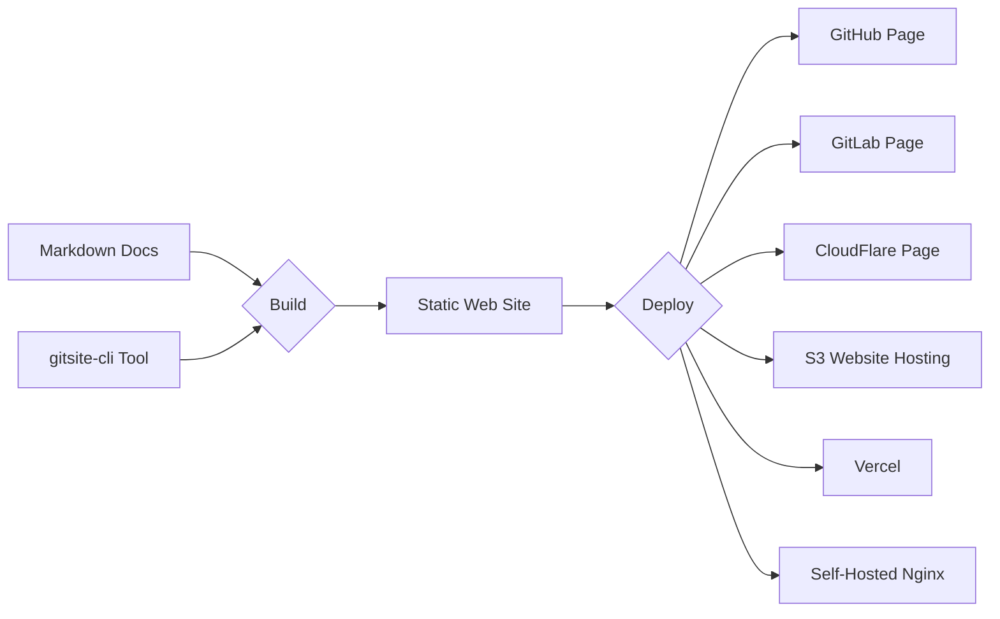

# Home

# Rapidly build modern websites from Markdown documents in Git

---

### GitSite build your well-organized Markdown documents and other resources to static web site that can be deployed simply to GitHub page, etc.

### GitSite supports Markdown documents, embedded videos, mathematical expressions, ASCII art, QR code, diagrams, and even sheet music!

# [Read User Guide »](/books/gitsite-guide/index.html)
