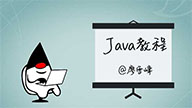
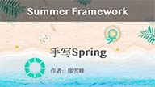
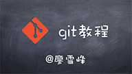

# 首页

廖雪峰的官方网站为您提供原创精品中文教程：

    <a href="books/java/index.html" class="home-book-list-item">
        

            
        

        

            Java教程
        

        

            小白的零基础Java教程，零基础迈向Java架构师！
        

    </a>
    

        <a href="books/summerframework/index.html" class="home-book-list-image">
            

                
            

            

                手写Spring
            

            

                自己动手，从零开发一个迷你版的Spring框架！
            

        </a>
    

    

        <a href="books/jerrymouse/index.html" class="home-book-list-image">
            

                
            

            

                手写Tomcat
            

            

                自己动手，从零开发一个迷你版的Tomcat服务器！
            

        </a>
    

    

        <a href="books/python/index.html" class="home-book-list-image">
            

                
            

            

                Python教程
            

            

                小白的Python新手教程，基于最新Python 3！
            

        </a>
    

    

        <a href="books/javascript/index.html" class="home-book-list-image">
            

                
            

            

                JavaScript教程
            

            

                迈向全栈工程师之路的JavaScript教程！
            

        </a>
    

    

        <a href="books/blockchain/index.html" class="home-book-list-image">
            

                
            

            

                区块链教程
            

            

                零基础入门区块链，还可以在线写代码！
            

        </a>
    

    

        <a href="books/makefile/index.html" class="home-book-list-image">
            

                
            

            

                Makefile教程
            

            

                入门Linux开发，从零开始编写Makefile！
            

        </a>
    

    

        <a href="books/sql/index.html" class="home-book-list-image">
            

                
            

            

                SQL教程
            

            

                小白的零基础SQL教程，可在线跑SQL！
            

        </a>
    

    

        <a href="books/git/index.html" class="home-book-list-image">
            

                
            

            

                Git教程
            

            

                最适合小白用户入门的浅显易懂的Git教程！
            

        </a>
    

最新发表博客文章：

