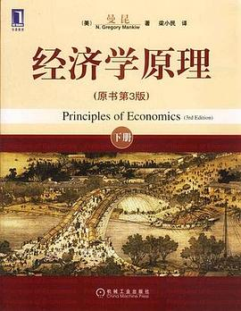

# 经济学十大原理

## 1. 人们面临交替关系

“天下没有白吃的午餐。”为了得到一件东西，通常不得不放弃另一件东西。作出决策要求我们在一个目标与另一个目标之间有所取舍。

学生面临如何分配学习时间的交替，父母在购物，旅游和储蓄间面临交替，社会面临效率与平等的交替。

名词解释：

- 效率：社会能从其稀缺资源中得到最多东西的特性。
- 平等：经济成果在社会成员中公平分配的特性。

## 2. 某种东西的成本是为了得到它而放弃的东西

很多情况下，某种行动的成本并不像乍看时那么明显。

一种东西的机会成本是为了得到这种东西所放弃的东西。

考虑上大学的决策，成本不是住房和伙食，因为即使不上大学，也要租房和吃饭。最大的成本是时间，如果把上大学的时间用于工作，能赚到的工资就是上大学最大的单项成本。

因此，很多正值上大学年龄的职业运动员如果放弃运动而上大学，可能每年少赚几百万美元，因此他们上大学的成本比普通人高得多。这也是为什么许多职业运动员一定要退役后才去上大学的原因。

名词解释：

- 机会成本：为了得到某种东西所必须放弃的东西。

## 3. 理性人考虑边际量

许多决策涉及到对现有行动计划进行微小的增量调整，经济学家把这些调整称为边际变动。

假设一架200个座位的飞机飞一次的成本是10万美元，每个座位的成本是500美元，有人会说：票价决不应低于500美元。但是当飞机即将起飞时仍有10个空座，在登机口等退票的乘客愿意支付300美元买一张票，应该卖给他吗？当然应该。如果飞机有空座，多增加一位乘客的成本微乎其微。虽然一位乘客飞行的平均成本是500美元，但是边际成本仅仅是这位额外的乘客将消费的一包花生米和一杯饮料而已。

只有一种行动的边际收益大于边际成本，一个理性决策者才会采取这项行动。

名词解释：

- 边际变动：对行动计划小的增量调整。

## 4. 人们会对激励作出反应

由于人们通过比较成本与收益作出决策，所以，当成本或收益变动时，人们的行为也会改变。这就是说，人们会对激励作出反应。

例如，当苹果价格上涨时，人们就决定少吃苹果多吃梨，因为成本高了。同时，苹果园主决定雇用更多工人并多摘苹果，因为收益也高了。

通过立法要求汽车公司必须为汽车配备安全带带来的后果：安全带降低了驾驶员的车祸代价，因此驾驶员的反应是更快更放肆地开车，结果是更多的车祸次数，但是每次车祸中驾驶员死亡的概率降低了。但是对行人有不利的影响，他们遇上了更多的车祸但没有安全带。因此，汽车安全法导致的结果是：驾驶员死亡人数变动很小，行人的死亡人数增加了。

在分析任何一种决策时，不仅应该考虑直接影响，而且还应该考虑激励发生作用的间接影响。

## 5. 贸易能使每个人状况更好

贸易使每个人可以专门从事自己最擅长的活动。通过与他人交易，人们可以按较低的价格买到各种各样的物品与劳务。

经济中每个家庭都与其他所有家庭竞争，但是把你的家庭与所有其他家庭隔绝开来并不会过得更好，如果是这样的话，你的家庭就必须自己种粮食，做衣服，盖房子。

国家和家庭一样也能从相互交易中获益。

## 6. 市场通常是组织经济活动的一种好办法

在一个市场经济中，中央计划者的决策被千百万企业和家庭的决策所取代。这些企业和家庭在市场上相互交易，价格和个人利益引导着他们的决策，他们仿佛被一只“看不见的手”所指引，引起了合意的市场结果。

价格指引这些个别决策者在大多数情况下实现了整个社会福利最大化的结果。

名词解释：

- 市场经济：当许多企业和家庭在物品与劳务市场上相互交易时通过他们的分散决策配置资源的经济。

## 7. 政府有时可以改善市场结果

政府干预经济的原因有两类：促进效率和促进平等。

经济学家用市场失灵这个词来指市场本身不能有效配置资源的情况。

市场失灵的一个可能原因是外部性。污染的例子：如果一家化工厂不承担排放烟尘的全部成本，它就会大量排放。

另一个可能原因是市场势力。假设镇里只有一口井，这口井的所有者对水的销售就有市场势力。

政府有时可以改善市场结果并不意味着它总能这样。

名词解释：

- 市场失灵：市场本身不能有效配置资源的情况。
- 外部性：一个人的行动对旁观者福利的影响。
- 市场势力：一个经济活动者对市场价格有显著影响的能力。

## 8. 一国的生活水平取决于它生产物品与劳务的能力

用什么来解释各国和不同时期中生活水平的巨大差别呢？答案之简单出人意料之外。几乎所有生活水平的变动都可以归因于各国生产率的差别：一个工人一小时所生产的物品与劳务量的差别。同样，一国的生产率增长率决定了平均收入增长率。

名词解释：

- 生产率：一个工人一小时所生产的物品与劳务量。

## 9. 当政府发行了过多货币时，物价上升

通货膨胀是经济中物价总水平的上升。

什么引起了通货膨胀？在大多数严重或持续的通货膨胀情况下，罪魁祸首结果总是相同的：货币量的增长。当一个政府创造了大量本国货币时，货币的价值下降了。

名词解释：

- 通货膨胀：经济中物价总水平的上升。

## 10. 社会面临通货膨胀与失业之间的短期交替关系

人们通常认为降低通货膨胀会引起失业暂时增加。通货膨胀与失业之间的这种交替关系被称为菲利普斯曲线。

当政府减少货币量时，它就减少了人们支出的数量。较低的支出与居高不下的价格结合在一起就减少了企业销售的物品与劳务量。销售量减少又引起企业解雇工人，就暂时增加了失业。

名词解释：

- 菲利普斯曲线：通货膨胀与失业之间的短期交替关系。
