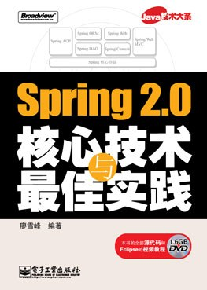

# Spring 2.0核心技术与最佳实践

书名：Spring 2.0核心技术与最佳实践

作者：廖雪峰

出版社：电子工业出版社

书号：9787121042621

出版日期：2007年6月

## 内容简介

本书注重实践而又深入理论，由浅入深且详细介绍了Spring 2.0框架的几乎全部的内容，并重点突出2.0版本的新特性。本书将为读者展示如何应用Spring 2.0框架创建灵活高效的JavaEE应用，并提供了一个真正可直接部署的完整的Web应用程序——Live在线书店。

在介绍Spring框架的同时，本书还介绍了与Spring相关的大量第三方框架，涉及领域全面，实用性强。本书另一大特色是实用性强，易于上手，以实际项目为出发点，介绍项目开发中应遵循的最佳开发模式。

本书还介绍了大量实践性极强的例子，并给出了完整的配置步骤，几乎覆盖了Spring 2.0版本的所有新特性。

本书适合有一定Java基础的读者，对JavaEE开发人员特别有帮助。本书既可以作为Spring 2.0的学习指南，也可以作为实际项目开发的参考手册。

编辑推荐：被China-Pub会员评为“2007年我最喜爱的十大技术图书”之一。

[PDF下载](spring-2.pdf)
