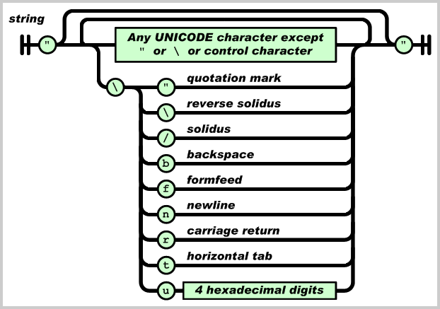
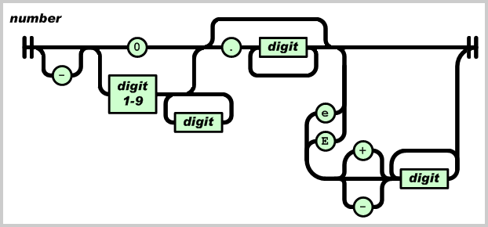

# JSON入门指南

JSON即JavaScript Object Notation，它是一种轻量级的数据交换格式，非常适合服务器与JavaScript的交互。

尽管有许多宣传关于XML如何拥有跨平台，跨语言的优势，然而，除非应用于Web Services，否则，在普通的Web应用中，开发者经常为XML的解析伤透了脑筋，无论是服务器端生成或处理XML，还是客户端用JavaScript解析XML，都常常导致复杂的代码，极低的开发效率。实际上，对于大多数Web应用来说，他们根本不需要复杂的XML来传输数据，XML的扩展性很少具有优势，许多AJAX应用甚至直接返回HTML片段来构建动态Web页面。和返回XML并解析它相比，返回HTML片段大大降低了系统的复杂性，但同时缺少了一定的灵活性。

现在，JSON为Web应用开发者提供了另一种数据交换格式。让我们来看看JSON到底是什么，同XML或HTML片段相比，JSON提供了更好的简单性和灵活性。

### JSON数据格式解析

和XML一样，JSON也是基于纯文本的数据格式。由于JSON天生是为JavaScript准备的，因此，JSON的数据格式非常简单，你可以用JSON传输一个简单的`String`，`Number`，`boolean`，也可以传输一个数组，或者一个复杂的Object对象。

`String`，`Number`和`boolean`用JSON表示非常简单。例如，用JSON表示一个简单的String`"abc"`，其格式为：

```json
"abc"
```

除了字符"，\，/和一些控制符（\b，\f，\n，\r，\t）需要编码外，其他Unicode字符可以直接输出。下图是一个String的完整表示结构：



一个Number可以根据整型或浮点数表示如下：



这与绝大多数编程语言的表示方法一致，例如：

- 12345（整数）
- -3.9e10（浮点数）

`boolean`类型表示为`true`或`false`。此外，JavaScript中的`null`被表示为`null`，注意，`true`、`false`和`null`都没有双引号，否则将被视为一个`String`。

JSON还可以表示一个数组对象，使用`[]`包含所有元素，每个元素用逗号分隔，元素可以是任意的Value，例如，以下数组包含了一个String，Number，boolean和一个null：

```json
["abc",12345,false,null]
```

Object对象在JSON中是用`{}`包含一系列无序的Key-Value键值对表示的，实际上此处的Object相当于Java中的`Map<String, Object>`，而不是Java的Class。注意Key只能用String表示。

例如，一个Address对象包含如下Key-Value：

```plain
city: Beijing
street: Chaoyang Road
postcode: 100025（整数）
```

用JSON表示如下：

```json
{
    "city" : "Beijing",
    "street" : "Chaoyang Road",
    "postcode" : 100025
}
```

其中Value也可以是另一个Object或者数组，因此，复杂的Object可以嵌套表示，例如，一个Person对象包含name和address对象，可以表示如下：

```json
{
    "name" : "Michael",
    "address" : {
        "city" : "Beijing",
        "street" : "Chaoyang Road",
        "postcode" : 100025
    }
}
```

### 用JavaScript处理JSON数据

上面介绍了如何用JSON表示数据，接下来，我们还要解决如何在服务器端生成JSON格式的数据以便发送到客户端，以及客户端如何使用JavaScript处理JSON格式的数据。

我们先讨论如何在Web页面中用JavaScript处理JSON数据。我们通过一个简单的JavaScript方法就能看到客户端如何将JSON数据表示给用户：

```javascript
function handleJson() {
    var j={
        "name" : "Michael",
        "address" : {
            "city" : "Beijing",
            "street" : "Chaoyang Road",
            "postcode" : 100025
        }
    };
    document.write(j.name);
    document.write(j.address.city);
}
```

假定服务器返回的JSON数据是上文的：

```json
{
    "name" : "Michael",
    "address" : {
        "city" : "Beijing",
        "street" : "Chaoyang Road",
        "postcode" : 100025
    }
}
```

只需将其赋值给一个JavaScript变量，就可以立刻使用该变量并更新页面中的信息了，相比XML需要从DOM中读取各种节点而言，JSON的使用非常容易。我们需要做的仅仅是发送一个AJAX请求，然后将服务器返回的JSON数据赋值给一个变量即可。有许多AJAX框架早已包含了处理JSON数据的能力，例如Prototype提供了`evalJSON()`方法，能直接将服务器返回的JSON文本变成一个JavaScript变量：

```javascript
new Ajax.Request("http://url", {
    method: "get",
    onSuccess: function(transport) {
        var json = transport.responseText.evalJSON();
        // TODO: document.write(json.xxx);
    }
});
```

### 服务器端输出JSON格式数据

下面我们讨论如何在服务器端输出JSON格式的数据。以Java为例，我们将演示将一个Java对象编码为JSON格式的文本。

将String对象编码为JSON格式时，只需处理好特殊字符即可。另外，必须用`"`而非`'`表示字符串：

```java
static String string2Json(String s) {
    StringBuilder sb = new StringBuilder(s.length()+20);
    sb.append('\"');
    for (int i=0; i<s.length(); i++) {
        char c = s.charAt(i);
        switch (c) {
        case '\"':
            sb.append("\\\"");
            break;
        case '\\':
            sb.append("\\\\");
            break;
        case '/':
            sb.append("\\/");
            break;
        case '\b':
            sb.append("\\b");
            break;
        case '\f':
            sb.append("\\f");
            break;
        case '\n':
            sb.append("\\n");
            break;
        case '\r':
            sb.append("\\r");
            break;
        case '\t':
            sb.append("\\t");
            break;
        default:
            sb.append(c);
        }
    }
    sb.append('\"');
    return sb.toString();
}
```

将`Number`表示为JSON就容易得多，利用Java的多态，我们可以处理`Integer`，`Long`，`Float`等多种`Number`格式：

```java
static String number2Json(Number number) {
    return number.toString();
}
```

`Boolean`类型也可以直接通过`toString()`方法得到JSON的表示：

```java
static String boolean2Json(Boolean bool) {
    return bool.toString();
}
```

要将数组编码为JSON格式，可以通过循环将每一个元素编码出来：

```java
static String array2Json(Object[] array) {
    if (array.length==0)
        return "[]";
    StringBuilder sb = new StringBuilder(array.length << 4);
    sb.append('[');
    for (Object o : array) {
        sb.append(toJson(o));
        sb.append(',');
        }
    // 将最后添加的','变为']':
    sb.setCharAt(sb.length()-1, ']');
    return sb.toString();
}
```

最后，我们需要将`Map<String, Object>`编码为JSON格式，因为JavaScript的Object实际上对应的是Java的`Map<String, Object>`。该方法如下：

```java
static String map2Json(Map<String, Object> map) {
    if (map.isEmpty())
        return "{}";
    StringBuilder sb = new StringBuilder(map.size() << 4);
    sb.append('{');
    Set<String> keys = map.keySet();
    for (String key : keys) {
        Object value = map.get(key);
        sb.append('\"');
        sb.append(key);
        sb.append('\"');
        sb.append(':');
        sb.append(toJson(value));
        sb.append(',');
    }
    // 将最后的','变为'}':
    sb.setCharAt(sb.length()-1, '}');
    return sb.toString();
}
```

为了统一处理任意的Java对象，我们编写一个入口方法`toJson(Object)`，能够将任意的Java对象编码为JSON格式：

```java
public static String toJson(Object o) {
    if (o==null)
        return "null";
    if (o instanceof String)
        return string2Json((String)o);
    if (o instanceof Boolean)
        return boolean2Json((Boolean)o);
    if (o instanceof Number)
        return number2Json((Number)o);
    if (o instanceof Map)
        return map2Json((Map<String, Object>)o);
    if (o instanceof Object[])
        return array2Json((Object[])o);
    throw new RuntimeException("Unsupported type: " + o.getClass().getName());
}
```

我们并未对Java对象作严格的检查。不被支持的对象（例如List）将直接抛出RuntimeException。此外，为了保证输出的JSON是有效的，`Map<String, Object>`对象的Key也不能包含特殊字符。细心的读者可能还会发现循环引用的对象会引发无限递归，例如，精心构造一个循环引用的Map，就可以检测到`StackOverflowException`：

```java
@Test(expected=StackOverflowError.class)
public void testRecurrsiveMap2Json() {
    Map<String, Object> map = new HashMap<String, Object>();
    map.put("key", map);
    JsonUtil.map2Json(map);
}
```

好在服务器处理的JSON数据最终都应该转化为简单的JavaScript对象，因此，递归引用的可能性很小。

最后，通过Servlet或MVC框架输出JSON时，需要设置正确的MIME类型（application/json）和字符编码。假定服务器使用UTF-8编码，则可以使用以下代码输出编码后的JSON文本：

```java
response.setContentType("application/json;charset=UTF-8");
response.setCharacterEncoding("UTF-8");
PrintWriter pw = response.getWriter();
pw.write(JsonUtil.toJson(obj));
pw.flush();
```

JSON已经是JavaScript标准的一部分。目前，主流的浏览器对JSON支持都非常完善。应用JSON，我们可以从XML的解析中摆脱出来，对那些应用AJAX的Web 2.0网站来说，JSON确实是目前最灵活的轻量级方案。

### 参考

Introducing JSON: [https://json.org/](https://json.org/)
