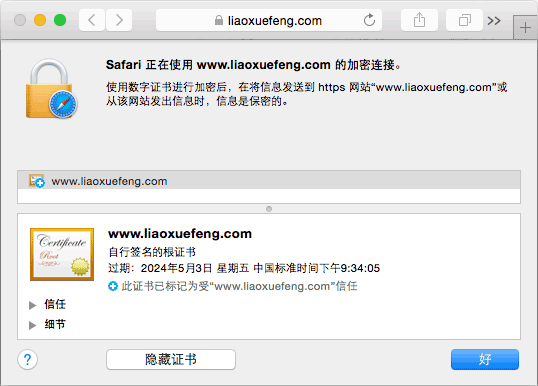

# 给Nginx配置一个自签名的SSL证书

要保证Web浏览器到服务器的安全连接，HTTPS几乎是唯一选择。HTTPS其实就是HTTP over SSL，也就是让HTTP连接建立在SSL安全连接之上。

SSL使用证书来创建安全连接。有两种验证模式：

1. 仅客户端验证服务器的证书，客户端自己不提供证书；
2. 客户端和服务器都互相验证对方的证书。

显然第二种方式安全性更高，一般用网上银行会这么搞，但是，普通的Web网站只能采用第一种方式。

客户端如何验证服务器的证书呢？服务器自己的证书必须经过某“权威”证书的签名，而这个“权威”证书又可能经过更权威的证书签名，这么一级一级追溯上去，最顶层那个最权威的证书就称为根证书。根证书直接内置在浏览器中，这样，浏览器就可以利用自己自带的根证书去验证某个服务器的证书是否有效。

如果要提供一个有效的证书，服务器的证书必须从VeriSign这样的证书颁发机构签名，这样，浏览器就可以验证通过，否则，浏览器给出一个证书无效的警告。

申请一个证书签名的费用是一年几十~几百刀不等，所以如果只是出于管理目的，可以创建自签名证书，保证管理员通过浏览器安全连接到服务器。

下面简单介绍如何创建一个自签名的SSL证书。

创建自签名证书需要安装openssl，使用以下步骤：

1. 创建Key；
2. 创建签名请求；
3. 将Key的口令移除；
4. 用Key签名证书。

为HTTPS准备的证书需要注意，创建的签名请求的CN必须与域名完全一致，否则无法通过浏览器验证。

以上步骤命令繁琐，所以我做了一个shell脚本，能一次性把证书搞定。从这里下载脚本：

[https://github.com/michaelliao/itranswarp.js/blob/master/conf/ssl/gencert.sh](https://github.com/michaelliao/itranswarp.js/blob/master/conf/ssl/gencert.sh)

运行脚本，假设你的域名是`www.test.com`，那么按照提示输入：

<pre><code>$ ./gencert.sh 
Enter your domain [www.example.com]: <span style="color:red">www.test.com</span>          
Create server key...
Generating RSA private key, 1024 bit long modulus
.................++++++
.....++++++
e is 65537 (0x10001)
Enter pass phrase for www.test.com.key: <span style="color:red">输入口令</span>
Verifying - Enter pass phrase for www.test.com.key: <span style="color:red">输入口令</span>
Create server certificate signing request...
Enter pass phrase for www.test.com.key: <span style="color:red">输入口令</span>
Remove password...
Enter pass phrase for www.test.com.origin.key: <span style="color:red">输入口令</span>
writing RSA key
Sign SSL certificate...
Signature ok
subject=/C=US/ST=Mars/L=iTranswarp/O=iTranswarp/OU=iTranswarp/CN=www.test.com
Getting Private key
TODO:
Copy www.test.com.crt to /etc/nginx/ssl/www.test.com.crt
Copy www.test.com.key to /etc/nginx/ssl/www.test.com.key
Add configuration in nginx:
server {
    ...
    ssl on;
    ssl_certificate     /etc/nginx/ssl/www.test.com.crt;
    ssl_certificate_key /etc/nginx/ssl/www.test.com.key;
}
</code></pre>

红色部分是输入，注意4次输入的口令都是一样的。

在当前目录下会创建出4个文件：

- www.test.com.crt：自签名的证书
- www.test.com.csr：证书的请求
- www.test.com.key：不带口令的Key
- www.test.com.origin.key：带口令的Key

Web服务器需要把`www.test.com.crt`发给浏览器验证，然后用`www.test.com.key`解密浏览器发送的数据，剩下两个文件不需要上传到Web服务器上。

以Nginx为例，需要在`server {...}`中配置：

```plain
server {
    ...
    ssl on;
    ssl_certificate     /etc/nginx/ssl/www.test.com.crt;
    ssl_certificate_key /etc/nginx/ssl/www.test.com.key;
}
```

如果一切顺利，打开浏览器，就可以通过HTTPS访问网站。第一次访问时会出现警告（因为我们的自签名证书不被浏览器信任），把证书通过浏览器导入到系统（Windows使用IE导入，Mac使用Safari导入）并设置为“受信任”，以后该电脑访问网站就可以安全地连接Web服务器了：



如何在应用服务器中配置证书呢？例如Tomcat，gunicorn等。正确的做法是不配置，让Nginx处理HTTPS，然后通过proxy以HTTP连接后端的应用服务器，相当于利用Nginx作为HTTPS到HTTP的安全代理，这样即利用了Nginx的HTTP/HTTPS处理能力，又避免了应用服务器不擅长HTTPS的缺点。
