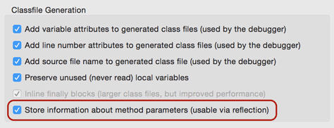

# 在Java 8中获取参数名称

在Java 8之前的版本，代码编译为class文件后，方法参数的类型是固定的，但参数名称却丢失了，这和动态语言严重依赖参数名称形成了鲜明对比。现在，Java 8开始在class文件中保留参数名，给反射带来了极大的便利。

示例：

```java
public class GetRuntimeParameterName {
    public void createUser(String name, int age, int version) {
        //
    }

    public static void main(String[] args) throws Exception {
        for (Method m : GetRuntimeParameterName.class.getMethods()) {
            System.out.println("----------------------------------------");
            System.out.println("   method: " + m.getName());
            System.out.println("   return: " + m.getReturnType().getName());
            for (Parameter p : m.getParameters()) {
                System.out.println("parameter: " + p.getType().getName() + ", " + p.getName());
            }
        }
    }
}
```

`Method.getParameters`为1.8新增方法，可以获取参数信息，包括参数名称。

上述代码输出的`createUser`参数如下：

```plain
   method: createUser
   return: void
parameter: java.lang.String, name
parameter: int, age
parameter: int, version
```

参数名称被编译进了class文件，替代了早期版本里无意义的`arg0`、`arg1`……

对于很多依赖参数名的框架，可进一步简化代码：

```java
@Path("/groups/:groupid/:userid")
public User getUser(String groupid, String userid) {
    ...
}
```

没有参数名的时代，得加上注解：

```java
@Path("/groups/:groupid/:userid")
public User getUser(@Param("groupid") String groupid, @Param("userid") String userid) {
    ...
}
```

遗憾的是，保留参数名这一选项由编译开关`javac -parameters`打开，默认是关闭的。

在Eclipse中，可以通过Compiler选项打开：



注意此功能必须把代码编译成1.8版本的class才行。
