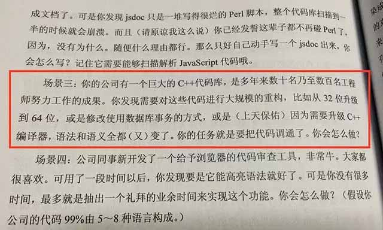
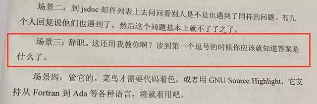

# 当你遇到一个巨大的代码库，你应该怎么办

今天我们讨论的话题是这样的：

> 场景三：你的公司有一个巨大的C++代码库，是多年来数十名乃至数百名工程师努力工作的成果。你发现需要对这些代码进行大规模的重构，比如从32位升级到64位，或是修改使用数据库事务的方式，或是（上天保佑）因为需要升级C++编译器，语法和语义全都（又）变了。你的任务就是要把代码调通了。你会怎么做?

这是一个很严肃的话题。

当你遇到场景三的问题时，你应该怎么做？

如果你是一个长期战斗在一线的软件攻城狮，请自己想想如何发挥聪明才智解决这个复杂的问题。

在你想好了最优、次优和各种备选方案后，再看看高人指点你究竟应该怎么做：

> 辞职。这还用我教你啊？读到第一个逗号的时候你应该就知道答案是什么了。

是不是有一种醍醐灌顶的赶脚？

这本毁三观的书的名字叫《程序员的呐喊》，赶紧去网上订一本吧，这对你的职业生涯将起到巨大的促进作用。

不用感谢我把你从苦海中拯救出来。

### 如果你是猎头……

还用我提醒你吗？赶紧把本文分享给你的猎物，没准他头脑一热就辞职了。小手一抖，推荐费到手！

请叫我雷锋。
