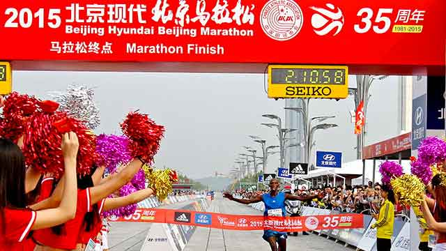
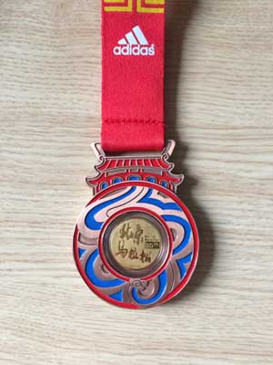

# 如何完成一个全程马拉松

有一句话说：这个世界上有两种人，一种是跑过马拉松的，一种是没有跑过马拉松的。从2015年9月20日开始，我已经正式成为第一种人了！没错，我以4小时50分的成绩跑完了北京马拉松，人生的第一个全程马拉松！

*注：封面图片是冠军成绩，贴出来表示还有巨大的进步空间*

跑过马拉松的朋友都知道，4小时50分的成绩实在是非常非常业余的水平，在北马两万六千多名完赛选手中仅排名一万四千多。不过，能够完成一个全程马拉松，对我来说，本身就是一个巨大的胜利。从小学到大学，我的体育成绩都是仅仅够上及格线，一千米绝对累得要吐血，身边的朋友都认为我是个胖子，虽然我内心是抗拒的，但是体重不会说谎。如果是5年前，我根本就不会有跑马拉松这个念头。

其实一开始我是没打算跑北马的，原因是7月份报名的时候运气不好，未能中签。直到周日比赛前两天，也就是周五晚上，一个朋友的姐夫跑不了北马，可以把名额让给我跑。虽然是替跑，但是能跑也是不错的！所以，比赛准备时间一共一天半，周六还参加了公司组织的秋游活动。

由于是第一次参加马拉松，比赛经验不是不足，而是零。参考平时跑一万米的速度，我把目标定在4个半小时。事实证明这个目标跟超英赶美一样非常不靠谱。从起跑开始，430的兔子我连影子都没看见。半路上倒是追上了500的兔子。从30公里开始，小腿开始发沉，双脚已经累得麻木了。到了35公里的补给点，实在是跑不动了，于是走了几分钟，发现水已经被前面的部队扫荡一空。最后7公里走走跑跑，最终和500的兔子一起跑到了终点。因为我的起跑时间比鸣枪时间慢了10分钟，所以完赛成绩是4小时50分。

跑完后只觉得腿累，膝盖和心脏都完全没有任何不适。除了大脚趾磨出一个水泡，肩膀晒得有点疼外，第二天感觉又满血复活，周一正常去上班。

## 那么问题来了，如何才能完成一个全程马拉松？

我从自己也能跑完马拉松这个事实证明了乔治·希恩在他著名的《跑步圣经》中说，任何人，只要坚持训练，都可以跑完马拉松！

回顾我的跑步生涯，作为一个常年战斗在IT行业的攻城师，我从2010年开始跑步，零基础起步，连1公里都跑不了！

任何事情，只要坚持，量变就会变成质变。跑步这项运动，好处就在于，你无需和别人比赛，只需比自己上周跑得更久一点，或者更快一点，慢慢地，一公里就可以变成两公里，三公里……能一口气跑5公里时，就是一个质的飞跃，接下来的10公里，15公里，20公里不再是梦想。

6月份的时候我已经可以轻松跑完21公里，也就是一个半程马拉松。这次直接挑战全程马拉松，主要原因是心情激动，头脑发热。正常情况还是不建议从半程直接升到全程，而是以5公里递增最为可靠，毕竟跑步的目的是为了保持健康，如果因为训练过猛而导致受伤就不划算了。

从1公里到42公里，5年时间，我完成了一个当初看上去根本不可能完成的目标。

如果你也想零基础挑战马拉松，其实非常简单，先从1公里甚至500米开始跑起来！

当你决定要跑步的时候，请调整出强大的内心，因为你将听到各种质疑和嘲讽的声音：

“跑步多无聊啊，为什么要跑步？”

“跑步伤膝盖，对身体很不好。”

“1公里要跑10分钟，比我走路还慢！”

“……”

我从不对这些声音作出任何回应，我只是继续跑下去，跑完半马，再跑完全马。当初走比我跑还快的人，依然没有迈出跑步的第一步，而我已经开始朝着更高的目标前进了。

最后附上北马完赛奖牌，含真金：

