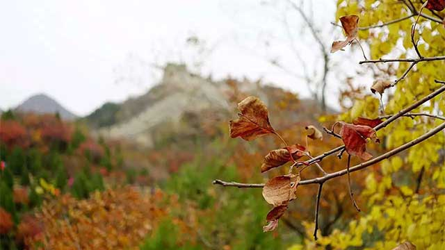
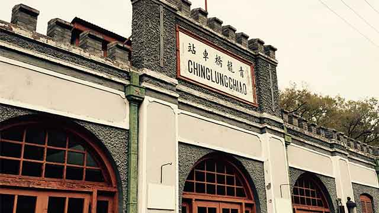

# 秋游红叶岭

北京的金秋，天高云阔，正是外出郊游最好的时节。

我们一大早驱车来到位于八达岭附近的红叶岭，这里的长城依山势而建，红叶岭其实是八达岭国家森林公园的一个观赏区，每到秋季，都吸引着大批游客前来观赏红叶。

从红叶岭的入口上山，石阶很窄，只容得一两人并排。但是山并不陡，一会儿的功夫就可爬到半山腰的观景台。漫山遍野的树林早已不再是郁郁葱葱的绿色。一阵阵略带寒意的秋风吹过，放眼望去，一片片树林已经变成红色、黄色和金色，这些缤纷颜色混织在一起，映衬着蓝天白云，组成了一幅绚丽的画卷，果然是“看万山红遍，层林尽染”。

红叶岭的入口紧邻着著名的京张铁路。从入口往里继续步行两三百米，就到了著名的青龙桥站。这里是京张铁路人字型路口的换乘站。青龙桥车站早已不再使用，但历经维护，已经成为了一处历史遗迹。

青龙桥站仍保留着十九世纪末建造时的特色，从窗户往里看，是一排排整齐的老式木椅，两边的门口挂着“男宾候车室”和“女宾候车室”的牌子，当年梳着大辫子的大清国民和穿着西服的洋人熙熙攘攘的景象仿佛仍然依稀可见。车站后方，却已是杂草丛生，丝毫看不出当年的道路来。

在车站的行车室里，竟然还站着一位铁路工作人员。他身着制服，望着窗外，究竟是注视着将要驶过的列车，还是一百多年的历史，就不得而知了。

车站外面左边的小花园里，矗立着著名的詹天佑先生的雕像。他是京张铁路的缔造者，也是清政府派出的第一批留学归国的工程师。1905年，清政府任命詹天佑主持修建第一条没有“外资”介入，由中国人自行设计建造的国产铁路。一百多年过去了，今天，京张铁路上仍然行驶着由北京西直门站发出的旅游列车。

在美国留学的詹天佑，一定被西方的近代科学技术所震撼，深知当时的中国已经远远地落后了。从詹天佑塑像的燕尾服来看，我想，他接受的恐怕不只是西方的工业技术，还有比大清王朝更先进的制度和理念。可惜的是，仅仅靠几个“开眼看世界”的知识分子，根本不足以唤醒大清帝国沉睡的国民，也无法让清朝皇室意识到帝国的落后，不仅仅是科技。最终，大清帝国仍然没有逃脱王朝覆灭的命运。

站在青龙桥站的站台上，迎着铁路，不到一百米远的山上，就是一段已经年久失修的长城。这个古代的遗迹，和近代的工程，以及我们这些拿着手机拍照的现代游客，出现在北京漫山红叶的金秋画卷中，真是别有一番风味。
