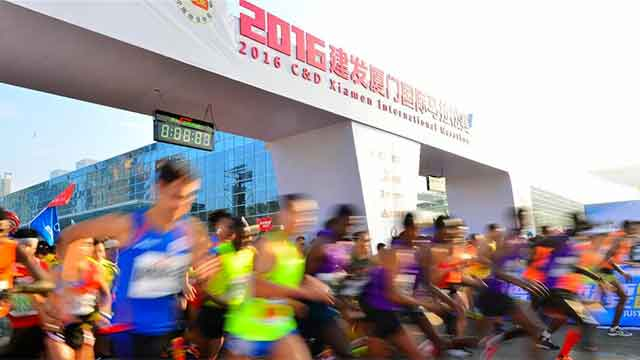
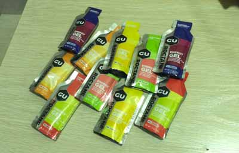

# 2016厦门马拉松胜利完赛

2016年新年伊始，继去年9月份成功完成第一个全程马拉松后，元旦期间在厦门又成功跑完了2016年的第一个马拉松！

和去年的4小时50分相比，今年的成绩提高到了4小时31分！

赛前我把目标定为4小时，当然这是不切实际的。前30公里稳定地以每小时10公里的速度前进，然后腿就感觉没劲了，于是把目标改为4小时15分，跑到38公里时感觉彻底没劲了，于是把目标再改为4小时30分。走了十分钟后，腿感觉又缓过劲了，最后两公里开始冲刺，原本计划妥妥地跑进4小时30分，结果发现自己疏忽了一个问题：手机软件的GPS统计的距离点比实际距离点提前了500米，所以最后多花了1分多钟！

我总结了一下，今年的战绩能提高20分钟的原因主要有以下三点：

一是12月份坚持训练，累计跑了140公里；

二是老天爷给力，本来预报的厦门当天20度的高温，结果多云，基本没晒着太阳；

三是总结了上次北马的经验教训，这次带足了补给：

下一个目标，暂定4小时！
