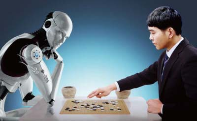

# 彪悍的职业不惧阿尔法狗

这几天铺天盖地的都是阿尔法狗对阵李世石的新闻。无论李世石最终能否战胜AI，一个显而易见的事实是，我等围棋零段选手倘若对阵阿尔法狗，肯定被虐成渣。

现在阿尔法狗引发了一轮机器学习的新高潮，我估计大家的手机都被刷屏了。反复讨论的几个问题无非是：电脑到底会不会有真正的智能？电脑最终会不会毁灭掉人类文明然后由机器人统治地球？

讨论这种问题跟讨论哲学问题一样，包括霍金在内的智商最高的一群科学家都无法达成共识。

我个人的看法是，假设宇宙中诞生过很多文明，其实他们的发展过程和人类文明都是一样的：首先诞生生命，然后进化出智能物种，智能物种创造了计算机并致力于发展AI，AI最终超越了智能物种并自己统治了行星。由于AI进化实在太快，他们开始试图直接获取恒星的能量，但宇宙定律不会因为AI太聪明而改变。AI能力再强也无法100%模拟亚原子级别的核物理实验。在真正的亚原子实验中，恒星爆炸了，整个星系连同AI文明一同被摧毁。

你看，文明的发展就是这么简单：单细胞生物，多细胞生物，智能生命，AI，智能生命被AI毁灭，然后AI毁灭了星系，一个文明结束了。

你问我有什么证据，愚蠢的人类啊，过去若干年人类观测到的每一次超新星爆炸都是一个AI文明的结束，这就是为什么外星人无法到访地球的原因了：他们早把自己搞死了。

以上胡扯结束，下面开始做广告。

话说阿尔法狗的机器学习超能力也不是搞着玩的，毕竟要大把大把地砸钱啊。有可靠的谣言称Google对自己招聘的机器学习专家开出了200多万美金这种惨无人道的天价年薪。不要忘了Google也是资本家在管理，怎么会投资只赔不赚的事情？下一步，他们就要用机器学习来大把大把地赚钱了。怎么赚？凡是机器学习可以解决的问题，人就可以下岗了，毕竟是机器，不拿工资不上保险，不吃不喝只费电，在中国也就网费稍贵点，也不是大问题。

现在大问题来了：未来的若干年内，哪些人的工作会被有机器学习能力的电脑取代？

其实简单思考一下就会明白，凡是不用动脑子，整天干重复性劳动的岗位就会消失。

打个比方，假如你是一个小编，每天负责在网上收集段子然后发到公众号，这个工作就很危险，因为给用户定向推送的机器学习程度都不需要达到阿尔法狗的水平。但是段子手这个工作就不会被机器取代，类似不会被机器取代的还有搞绘画的艺术家，电影导演等等，简单地概括就是，从事创造性工作的岗位永远不用担心被机器抢了工作。

软件工程师也不用担心，因为写程序也是一种创造性的工作。有人担心将来机器学习发展成电脑会自己写程序了怎么办，这实在是杞人忧天。如果你仔细阅读了上文，就会发现，当软件工程师的工作被电脑取代时，地球就即将被AI统治，太阳系离毁灭也不远了。所以说，写程序将是世界上最后一个消失的工作。

从事一种地球上最后一个消失的行业绝对是一个明智的选择。如果你想以小白的身份进入这个行业，不妨从[小白的Python新手教程](../../../books/python/index.html)开始，零基础起步，将来成为机器学习的专家。
