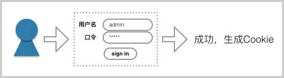
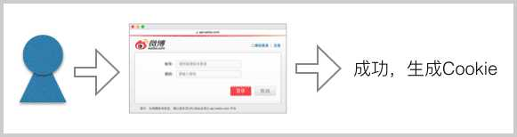

# 设计一个可扩展的用户登录系统 (2)

在[设计一个可扩展的用户登录系统 (1)](../2016-04-20-extensible-login-part-1/index.html)中，我们设计了可扩展的数据库表的结构，基本思想是：

- `Users`表只存储`User`的Profile信息，没有任何认证信息（例如，不存Password）；
- 每一种登录方式对应一个`XxxAuth`表，该表存储对应的认证信息，以及一个`userId`字段用于关联到某个`User`。

数据库结构再好，代码写得乱七八糟，一样没法扩展。所以本文讨论的，就是如何编写认证代码。

现在的问题是，在Web系统中，由于HTTP请求本质上是无状态的，每个已认证用户的信息都必须通过Cookie来传递。

> 不对啊，我们无论用ASP、PHP还是JSP，打开服务器的session就可以识别用户了啊！

少年，服务器的session也无非是靠一个特殊名称的Cookie来识别而已，只不过由服务器本身帮你完成了解析Cookie、在session中查找User的过程，而代价却是内存占用高，单台服务器变成有状态，无法简单扩展成集群。遇到不懂事的年轻人，什么都敢往session里扔，很快就把服务器搞死了。

所以，除了演示程序外，我们从不用服务器提供的session。

如果仔细思考用户的登录过程，又可以发现，其实不同的登录方式实现起来复杂度也是不同的。

### 用户名＋口令登录

当用户需要以用户名＋口令来登录时，我们会让用户填写一个登录表单，如果验证通过，就给用户生成一个可靠的Cookie来标识这个用户：



如果用户继续访问其他页面，我们就需要利用这个Cookie来识别用户。

### 通过第三方网站登录

当用户需要以第三方OAuth登录时，我们会让用户重定向到第三方登录页，例如微博登录页，如果用户在第三方登录成功，第三方会再把用户重定向回我们的网站，并附上一个code表示是否验证通过。如果验证通过，我们还需要给用户生成一个可靠的Cookie来标识这个用户：



### 通过HTTP Authorization Header登录

这种方式通常不是用户自己发起的请求，而是由代表用户的机器发起的请求。因为每个页面都会附上`Authorization: Basic XXXXX`这个Header，所以每个页面都需要验证。

### 通过X-API-Token登录

这种方式和上一种情况类似，也是由代表用户的机器发起的请求，不同的是用`X-API-Token`代替了`Authorization` Header，更安全可靠。同上，每个页面都需要验证。

### 如何认证

现在问题来了，这么多类型的认证，怎么才能把代码写得能看明白？

复杂的问题都要分解成几步。我们先看通过用户名＋口令的表单登录。

在这种条件下，用户首先要被导向到一个登录URL，例如，`/signin`，然后填写用户名和口令。具体验证方式就是利用`Users`表和`LocalAuth`表，如果验证成功，我们就创建一个可信的Cookie给用户。

通过第三方网站登录也是类似的，要先把用户导向到登录URL，登录成功后，创建一个可信的Cookie。

剩下的问题就只有一个：用户每访问一个普通页面，如何确认用户身份？

确认用户身份，我们需要一个统一的`Authenticator`接口。以Java为例，该接口看起来如下：

```java
public interface Authenticator {
    // 认证成功返回User，认证失败抛出异常，无认证信息返回null:
    User authenticate(HttpServletRequest request, HttpServletResponse response) throws AuthenticateException;
}
```

接下来，对于每一种类型的认证，我们都编写一个对应的`Authenticator`的实现类。例如，针对表单登录后的Cookie，需要一个`LocalCookieAuthenticator`：

```java
public LocalCookieAuthenticator implements Authenticator {
    public User authenticate(HttpServletRequest request, HttpServletResponse response) {
        String cookie = getCookieFromRequest(request, 'cookieName');
        if (cookie == null) {
            return null;
        }
        return getUserByCookie(cookie);
    }
}
```

对于直接用Basic认证的`Authorization` Header，我们需要一个`BasicAuthenticator`：

```java
public BasicAuthenticator implements Authenticator {
    public User authenticate(HttpServletRequest request, HttpServletResponse response) {
        String auth = getHeaderFromRequest(request, "Authorization");
        if (auth == null) {
            return null;
        }
        String username = parseUsernameFromAuthorizationHeader(auth);
        String password = parsePasswordFromAuthorizationHeader(auth);
        return authenticateUserByPassword(username, password);
    }
}
```

对于用API Token认证的方式，同样编写一个`APIAuthenticator`：

```java
public APIAuthenticator implements Authenticator {
    public User authenticate(HttpServletRequest request, HttpServletResponse response) {
        String token = getHeaderFromRequest(request, "X-API-Token");
        if (token == null) {
            return null;
        }
        return authenticateUserByAPIToken(token);
    }
}
```

然后在一个统一的入口处，例如`Filter`里面，把这些`Authenticator`全部串起来，让它们依次自己去尝试认证：

```java
public class GlobalFilter implements Filter {
    // 所有的Authenticator都在这里:
    Authenticator[] authenticators = initAuthenticators();

    // 每个页面都会执行的代码:
    public void doFilter(ServletRequest request, ServletResponse response, FilterChain chain) {
        User user = null;
        for (Authenticator auth : this.authenticators) {
            user = auth.authenticate(request, response);
            if (user != null) {
                break;
            }
        }
        // user放哪？
        chain.doFilter(request, response);
    }
}
```

现在，一个可扩展的认证体系在Web层就基本搭建完成了，我们可以随意组合各种`Authenticator`，优先级高的放前面。一旦某个`Authenticator`成功地认证了用户，后面的`Authenticator`就不执行了。

最后只剩一个问题：认证成功后的`User`对象放哪？

放session里？NO，我们在前面已经拒绝了使用服务器提供的session。放`request`里？也不好，因为HTTP级别的对象太低级，很难传到业务层里。

> 那你说应该放哪？

当然是放到一个与业务逻辑相关的地方了，比如`UserContext`中。把`Filter`代码改写如下：

```java
public class GlobalFilter implements Filter {
    Authenticator[] authenticators = initAuthenticators();

    public void doFilter(ServletRequest request, ServletResponse response, FilterChain chain) {
        // 链式认证获得User:
        User user = tryGetAuthenticatedUser(request, response);
        // 把User绑定到UserContext中:
        try (UserContext ctx = new UserContext(user)) {
            chain.doFilter(request, response);
        }
    }
}
```

这样一来，任何地方需要获得当前`User`时，只需要写：

```java
User user = UserContext.getCurrentUser();
```

是不是太简单了？

最后总结一下我们编写认证逻辑的思路：

1. 每一种认证方式都是一种`Authenticator`的实现；
2. 把所有认证方式串起来，在一个统一的Filter入口来认证；
3. 认证后的`User`对象用`UserContext`存储，并提供一个简单的方法返回当前`User`。

好处如下：

1. 认证方式可简单扩展；
2. 认证逻辑统一在一处。

还有一个最大的好处，就是业务相关的代码根本就不需要依赖底层HTTP对象，比如session和request，它们只依赖`UserContext`，这才是真正的解耦，并且非常容易测试业务逻辑，因为不再需要模拟session和request。

赶快按照上述思想，把上面的认证代码调通后，细心的同学才能发现，本文还遗留了几个小问题：

1. 表单和OAuth认证成功后，如何生成“可信”的Cookie？
2. 如何根据“可信”的Cookie识别用户？
3. `UserContext`怎么编写？

这些小问题将会在[系列(3)](../2016-04-22-extensible-login-part-3/index.html)中一一解答。
