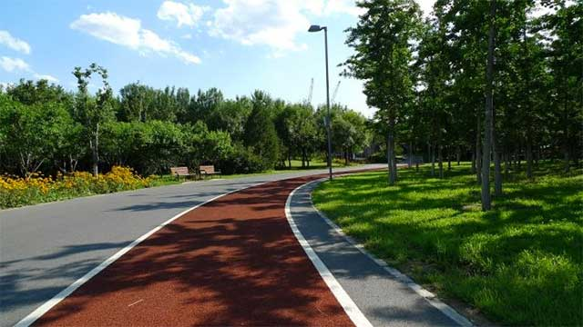
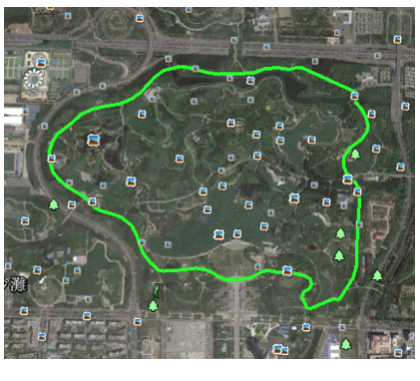
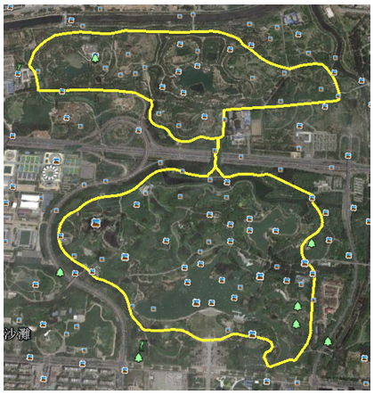
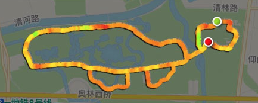
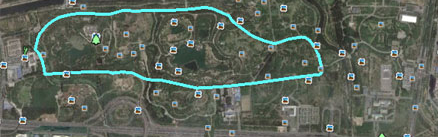
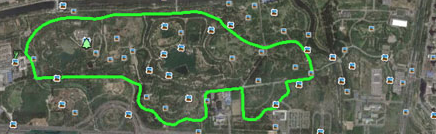
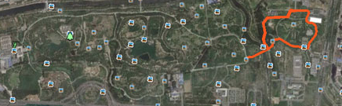

# 给大家推荐几条经典的跑步路线

给大家推荐几条经典的跑步路线。

首先，你必须能去奥森跑，因为这几条线路都是在奥森规划的。

第一条线路是奥森南园，一圈5.1公里，4圈就可以跑完20公里，适合从南园任意门进入的跑友：

第二条线路是奥森南北园大圈，一圈10.7公里，两圈就可以跑完20公里，适合从任意门进入的跑友：

这个大圈的缺点是中间坡道很陡很陡，跑两圈需要4次上下坡，对体能是个考验。

下面重点说说如何在北园跑出这个隐藏在奥森的著名的大乌龟：

首先，要先跑一个小圈，一圈4.7公里：

然后，再跑一个大圈，一圈5.5公里：

最后，还得把龟头跑出来，需要再跑2.5公里：

所以，一共至少需要跑 4.7+5.5+2.5=12.7 公里，就可以跑出一个大乌龟：

这个乌龟适合从北园北门进去的跑友。

当你跑出大乌龟以后，立刻打开手机里的Pokeman Go，就可以抓到它：

亲测有效！

祝大家跑步愉快！

