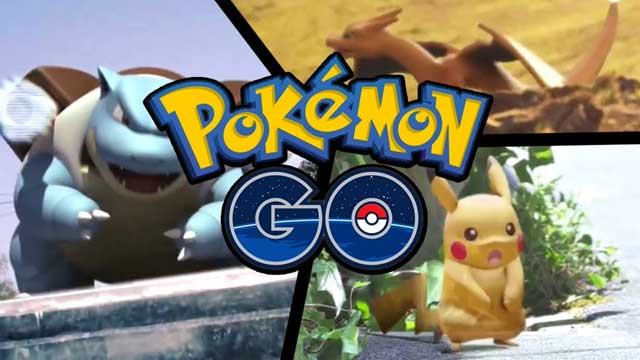
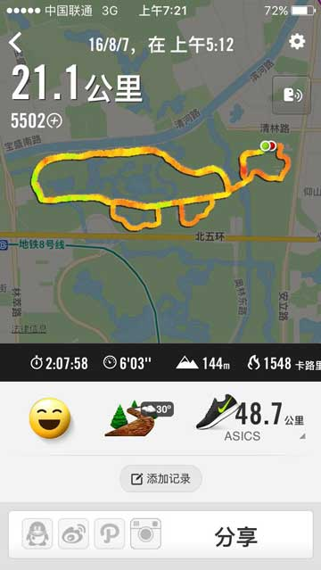
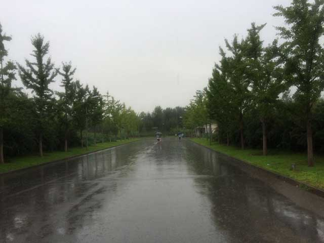
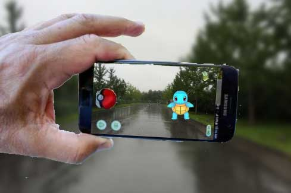

# 奥运期间北京奥森玩转Pokemon Go权威指南

前几天给大家推荐了[奥森北园著名的大乌龟跑步路线](../2016-07-30-running-routes/index.html)，而且我特意告诉大家，只要你跑出了这个大乌龟，而且跑够21.1公里，就可以打开Pokemon Go然后抓到一只小乌龟噢！

结果一群不明真相的吃瓜群众非说我骗人。

我虽然读书多，但从不骗人。

为了证明跑大乌龟确实能抓到Pokemon，今天早上我又特意去奥森北园跑了21.1公里，顺便刷新了半马PW（Personal Worst）：

注意，必须跑完21.1公里，少100米都是不行的，这是必要条件之一。

今天虽然立秋了，但还是三伏天，一年中最热的时候，跑起来非常辛苦，好在后半段下了点雨，稍微凉快了点。大家锻炼时务必要悠着点，时刻监控自己的状态，不要为了抓Pokemon把自己搞挂了。

跑完以后，我立刻打开Pokemon Go，果然被我发现附近有一只小！乌！龟！而且就在奥森的北园门口！

啥也没有啊！

注意！注意！注意！Pokemon Go是一款AR游戏，你要打开游戏，在手机屏幕里才能看到！

为了证明给大家看，我就不截屏了，因为截屏可以造假。我找了一个散步的老大爷帮忙，借他的手机拍了个照片：

老大爷的手机拍照效果不是很好，大家凑合看吧。

因为我已经抓到过这个小乌龟了，所以今天就不抓了，留在那里，让后面跑完21.1公里的朋友去抓吧。

有人问21.1公里要多久跑完才能抓Pokemon，这个我真不知道，只能说2小时左右是肯定没问题的，至于有没有时间限制，你可以去Pokemon Go的官网问问客服。

为什么Pokemon Go中国区只能在北京奥林匹克森林公园才能玩？我猜可能奥运期间，Pokemon Go想用这种方式和喜爱跑步的中国人民一起庆祝吧！

祝大家跑步愉快！

