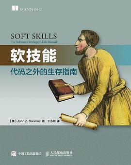
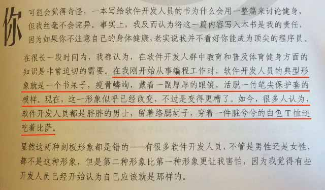
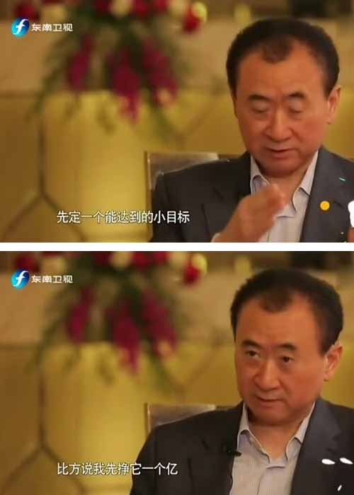

# 软技能：代码之外的生存指南

最近读了一本老外写的《Soft Skills: the software developer's life manual》，中文翻译是《软技能：代码之外的生存指南》。

这本书是美国的一个软件开发人员写的，但是书中除了有Java、C#几个单词外，没有一行代码，因为这本书讲的是代码之外的东西。

我来帮大家总结一下主要内容：

- 不要做宅男；
- 和面试官成为好朋友后再去面试（结果你懂的）；
- 如何成为自由职业者；
- 假装自己能成功；
- 打造自身品牌：坚持写博客；
- 有效管理时间以提升效率；
- 学会理财：要善于炒股炒房（炒股在中国可能不算理财算赌博）；
- 不要刷爆信用卡（这个问题可能美国人比较严重）；
- 少看电视多运动，争取练成肌肉男。

除了个别项目需要结合我国国情，总的来说，我基本上赞同作者的观点，尤其是最后一点。

> 在我刚开始从事编程工作时，软件开发人员的典型形象就是一个书呆子，瘦骨嶙峋，戴着一副厚厚的眼镜，活脱一付笔尖保护套的模样。现在，这一形象似乎已经改变，不过是变得更糟了。如今，很多人认为，软件开发人员都是胖胖的男士，留着络腮胡子，穿着一件脏兮兮的白色T恤还吃着比萨。

作为一个业余马拉松选手，我在健身的方面多少还是有点发言权的。现在大多数软件开发人员，肚子大小和年龄成正比，这可不是什么好兆头。

即使将来挣了一个亿，花在医院里肯定不划算。不如像王首富那样，先定一个能达到的小目标，比方说先跑一个马拉松。健身这件事情，工作忙不是借口，完全可以早上约个一个小时的会议，会议内容就是跑步。

如果你不想一个人安静地写代码，这本书可以看一看。
