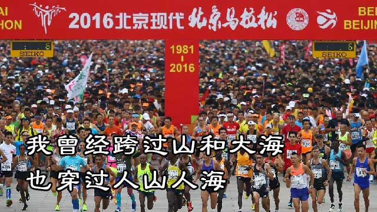
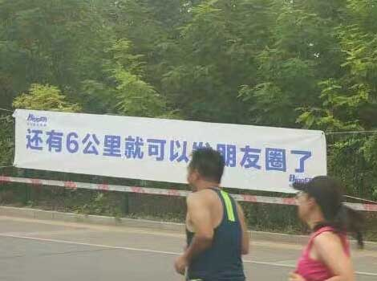
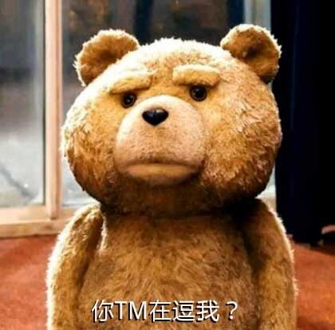

# 挑战2016北京马拉松

今天是中秋假期的最后一天。因为中签了北马，所以今天不得不自虐一把，准备挑战2016北京马拉松，也是我的第三个马拉松。

昨天北京一整天都是雾霾，本来担心今天可能要做一次人肉空气净化器，没想到老天爷给力，晚上突降暴雨。今早起来一看，多云，但是没！有！雾！霾！空气质量在优良徘徊！官方预报今天高温高湿，结果高温没出现，太阳公公连个脸都没露，高湿也没感觉出来。

有了去年参赛的经验，今年我就比较镇定。7点半开跑，我6点多才出门，叫了一辆滴滴快车。司机师傅听说我是要去跑马拉松，顿时对我产生了深深的敬仰之情，各种赞美之词我就不一一细表。下车后支付车费，果断五星好评。

提前20分钟到了天安门广场，再晚一点就进不去了。和去年一样，照样是人山人海。7:30枪响，我一点也不急，先检查鞋带，再去一次厕所，然后跟着大部队走到起跑线，一看计时器，7:40！

前20公里，感觉比较轻松，这跟今年加强了20公里训练有关。可能参加北马的选手实力都很强，到了半程，人还是很多，跑不开。接下来10公里感觉腿有点沉，这是要撞墙的前奏。跑到35公里后感觉更沉了，但是还能坚持，因为再过半小时到终点就可以发朋友圈了！

*口号是不是很励志？*

值得一夸的是，今年矿泉水管够，40公里处都准备了足够的水！表扬一下赞助商怡宝！去年30公里以后矿泉水就断供了！

志愿者很多，沿途啦啦队和围观群众也很多，大家热情非常高，很多人都在为马拉松选手打气：

> 再坚持一下，马上就到终点了！

骗谁呢？至少还得再跑半个小时。

最后半个小时我已经不知道是如何坚持过去的，小腿已经不是自己的了！一路超越了不少停下来走路的选手。4小时18分！终于跑过终点，掏出手机，点击结束然后准备秀截图，正在此时，App竟然闪！退！了！

无图无真相，只能等官方成绩出来后再秀图了。你可以想象当时我有多窝火，这里必须点名批评Nike+ Running，差评！

去年的北马成绩4小时50分，其中走了大概十几分钟，今年一月份的厦马成绩4小时31分，其中走了两公里。今天是第三次跑马拉松，第一次全程跑下来了，完全用尽了洪荒之力，也算是一次比一次进步。

冠亚军当然毫无悬念地被非洲兄弟包揽了，感觉他们就是天生为跑步而生而且永远跑不死的小强。

这就是我今天跑北马的所见所闻所感。不得不说，马拉松真是一项反人类的运动，但是每一个跑马拉松的人都乐在其中，而且梦想有一天成为一个百马王子。
