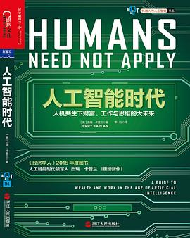

# 人工智能时代的危机

这是一篇书评。

上个月我家刚买了一个扫地机器人和一个拖地机器人，它们用起来很简单，而且清扫地面的效果也不错，从此家里扫地和拖地的任务就交给机器人了，我家也算是拥有了“智能机器人”。

在不久的将来，家政机器人会走进绝大多数家庭。机器人做家务当然好，但家政公司和家政阿姨们恐怕就不得不转行了。

这是我读完《人工智能时代》的结论。这本书的作者是杰瑞·卡普兰（Jerry Kaplan），他曾经在1987年创办了GO公司，是触屏输入的先驱，后来败给了微软的Windows。这段历史还被他写成了《IT创业疯魔史》。后来这位大哥去了斯坦福大学的人工智能实验室，然后就写了这本书。

在这本书中，卡普兰对人工智能的思考极为深入。提起人工智能，大多数人都有两个极端的想法，要么是好莱坞的科幻片《终结者》里能毁灭人类的的人形金属机器人，要么是人工智能还处于极其初级的实验阶段，目前也仅仅能通过网络下下棋，聊聊天。但其实，具备人工智能的机器人可不一定是机器，像人一样的机器人其实非常罕见，更多的机器人形态是计算机程序控制的工业生产线上的机械手臂，或者是直接运行在云端的计算机程序。那些金融市场中的高频交易软件，以及谷歌的在线翻译等等，都可以看作是人工智能。

作者对人工智能做了一个非常恰当的比喻：人工智能不是让计算机像人类大脑那样思考，而是以编程的方式，用机器学习加海量数据的方法，不断提升结果的精确性。从表面上看，人工智能通过千万亿次运算输出的结果和人类大脑思考后给出的结论其实并无二致，然而随着时间的推移，在绝大多数情况下，人工智能将会远远强于人类。这好比潜艇可以在水中行驶，它最初是模拟鱼的功能，飞机可以在空中飞行，最初也是模拟鸟的功能，但最终，潜艇和飞机的功能都远远超出了鱼类和鸟类本身，至于其运动机制是否和自然界的生物一样，已经无人关心了。

人工智能也是如此。基于统计学的机器学习，最初可能只能给出非常初级的结论，例如，早期的计算机程序根本不是专业围棋选手的对手，但是，随着计算能力上亿倍的提升，谷歌的Alpha GO已经击败了世界最高水平的围棋专业选手。

如果人工智能仅限于下下棋，或者在电子竞技中充当玩家的对手，那么它对现实世界就几乎没有影响。然而，人工智能事实上正在或者即将滲透到各个产业。正如计算机诞生之初仅仅用在军事和科研领域，但是现在，没有哪个行业也没有任何人能够离得开计算机。

每一次科技革命都会极大地推动社会生产力的提升，但是，科技革命在创造出新的产业和就业时，也会无情地埋葬那些旧的产业，让许多人失业。汽车代替马车，创造了汽车设计和制造的工作机会，但也让马车司机失去了工作。计算机的出现，让铅字排版、钢笔等大批产业消失。

如果科技革命的进程比较慢，则产业更替时间就会比较长，由失业引发的社会问题就可以逐渐解决。但是，如果科技革命的进程非常快，短时间内淘汰的产业将导致大量的人失业，这些失业工人的再就业问题会非常严峻。

我们目前正处在由人工智能引发的下一轮科技革命的前夜。纵观人类历史上的几次技术革命，可以发现，每一次新技术革命从兴起到普及的时间越来越短。这可能是一件好事，也可能会带来巨大的社会问题。

汽车的自动驾驶技术就是人工智能的一个最佳应用之一，目前该技术正在迅速推进，很多专家认为五到十年内就会大规模普及自动驾驶。一旦该技术成熟并商用，和很多人的想象不同的是，我们现有的社会形态和生活方式将会被彻底改变。

自动驾驶技术最先可能普及的不是小客车，而是货车运输行业，这将直接导致上千万人失业（2015年我国有3000多万货车司机），随之而来的是物流行业成本大幅下降。

一旦自动驾驶技术在小客车普及，那整个城市的生态将发生彻底改变。出租车司机将会失业，自动驾驶的出租车价格会大幅下降，而且，由于数量不受出租车司机的限制，打不到车的情况极难发生，这会导致绝大多数家庭不再购买车辆，而是随时随地租用无人驾驶的汽车。整个汽车行业保守估计将萎缩三分之二，与之相关的产业如石油、车险、4S店等将面临市场大幅缩小，无数人将面临失业。由于小区、商场和写字楼将不需要再修建停车位，房地产也会重新估价。

这还只是由人工智能驱动的技术之一。事实上人工智能已经在悄悄地影响并深刻改变着我们的生活。在新闻和电商网站中广泛应用的推荐引擎就是一种人工智能。

作者还以亚马逊为例：今天，以亚马逊为代表的电商网站通过人工智能向我们做精准推荐，明天，人工智能会更精准地为每个人报一个精准的“最低价”，让你无法拒绝这个交易，也让传统的零售业根本无法与之竞争。

在人工智能时代，很快，大批蓝领将被机器人取代而失业，而大批白领则将被另一种看不见的机器人取代而失业。作者认为，会计、医生、律师等现在的高级职业，未来大部分将被人工智能取代。

在工业时代，20%的少数人凭借资本占据了大部分社会财富，而在人工智能时代，作者担心的是，1%的人可能凭借大数据占据90%以上的社会财富。如何通过立法来实现比较公平的财富分配，关系到社会的稳定。

虽然我们个人无法影响历史的进程，但是，顺应技术的发展趋势，不要让自己去和机器人竞争工作：你是竞争不过机器人的，应该做设计和制造机器人的工作。未来的人才必然是跨行业的复合型人才，一个是某个特定行业，另一个就是计算机行业。计算机技术，特别是计算机软件技术，将来会变成像数学、物理一样的基础学科，任何人都必须掌握它，才能在人工智能时代做到“人机共存”。
