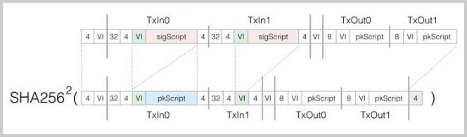

# 深入理解比特币交易的脚本

在比特币区块链中，每一个区块都指向上一个区块，这些通过SHA256计算的区块哈希链就是比特币账本不可篡改的基础。

在一个区块中，比特币系统用交易（Transaction）来表示一笔比特币交易。一个区块包含至少一笔交易。这些Transaction的Hash通过Merkle Tree计算出所有交易的Merkle Hash，并被包含至区块Hash中，从而实现交易的不可修改。

如果我们仔细观察每一笔交易，可以发现，除了第一笔交易是矿工的挖矿所得外，每一笔交易都拥有一个或多个输入（TxIn），以及一个或多个输出（TxOut）：

```ascii
┌─────────────────────────────────────────────┐
│Tx: 12af...e85d                              │
├─────────────────────┬───────────────────────┤
│TxIn                 │TxOut                  │
├─────────────┬───────┼──────┬────────────────┤
│prev hash    │index  │btc   │pkScript        │
├─────────────┼───────┼──────┼────────────────┤
│0000...0000  │ffff   │12.5  │OP_DUP c58a...  │
├─────────────┼───────┼──────┼────────────────┤
│2016...a3c5  │3      │0.15  │OP_DUP a1b2...  │
├─────────────┼───────┼──────┼────────────────┤
│2015...b6d8  │1      │0.08  │OP_DUP c3d4...  │
└─────────────┴───────┴──────┴────────────────┘
```

第一笔矿工挖矿的收入交易通常被称为Coinbase，它没有输入，所以TxIn的Hash总是被标记为`00000000...0000`

其他的交易，任何一个TxIn都会唯一追溯到区块链上在本区块之前的某个交易Hash，以及索引：

```ascii
┌─────────────────────────────────────────────┐
│Tx: abcd...1234                              │
├─────────────────────┬───────────────────────┤
│TxIn                 │TxOut                  │
├─────────────┬───────┼──────┬────────────────┤
│prev hash    │index  │btc   │pkScript        │
├─────────────┼───────┼──────┼────────────────┤
│2016...a3c5  │3      │0.15  │OP_DUP a1b2...  │◀─┐
├─────────────┼───────┼──────┼────────────────┤  │
│2015...b6d8  │1      │0.08  │OP_DUP c3d4...  │  │
└─────────────┴───────┴──────┴────────────────┘  │
                                                 │
 ┌───────────────────────────────────────────────┘
 │
 │  ┌─────────────────────────────────────────────┐
 │  │Tx: a1b2...e8f9                              │
 │  ├─────────────────────┬───────────────────────┤
 │  │TxIn                 │TxOut                  │
 │  ├─────────────┬───────┼──────┬────────────────┤
 │  │prev hash    │index  │btc   │pkScript        │
 │  ├─────────────┼───────┼──────┼────────────────┤
 └──│abcd...1234  │0      │0.15  │OP_DUP 3456...  │
    ├─────────────┼───────┼──────┼────────────────┤
    │cdef...5678  │2      │0.02  │OP_DUP 9876...  │
    └─────────────┴───────┴──────┴────────────────┘
```

通过交易Hash和索引（从0开始），即可唯一确定一个未花费的交易输出——UTXO（Unspent Transaction Output）。这样，每一个Tx Input都和之前的某个Tx Output关联了起来。

我们假设在上一笔交易中，Bob给Alice支付了`0.15`个BTC。

由于比特币并没有账户的概念，这一笔交易的输出并没有写上Alice的名字，也没有写上Alice的公钥。

那么，Alice想要花费这`0.15`个BTC，她应该如何证明自己拥有这个UTXO，并且，其他人无法假冒Alice来花费这个UTXO呢？

答案是比特币的交易创建的输出其实并非一个简单的公钥地址，而是一个脚本。在Bob给Alice支付`0.15`个BTC的这个交易中，Bob创建的输出脚本类似：

```plain
OP_DUP OP_HASH160 abcd1234...9876 OP_EQUALVERIFY OP_CHECKSIG
```

其中，`abcd1234...9876`是Alice的公钥Hash。整个脚本的意思是，谁能够提供一个签名和一个公钥，让这个脚本运行通过，谁就能花费这笔交易的`0.15`个BTC。

由于创建签名只能使用Alice的私钥，非Alice的私钥创建的签名将无法通过这个脚本的验证，所以，其他人无法假冒Alice来花费这笔输出。

一旦Alice提供了一个签名和自己的公钥，她实际上已经创建了另一笔交易来花费这个输出。

所有人都可以验证Alice创建的这个新交易是否有效。如果有效，该交易就会被矿工打包进新的区块，从而成为区块链上不可更改的一部分。

我们以著名的[Pizza Transaction](https://btc.com/btc/transaction/cca7507897abc89628f450e8b1e0c6fca4ec3f7b34cccf55f3f531c659ff4d79)为例，来验证一个交易是否是有效的。

在交易[cca75078...4d79](https://btc.com/btc/transaction/cca7507897abc89628f450e8b1e0c6fca4ec3f7b34cccf55f3f531c659ff4d79)中，唯一的TxIn输入提供的sigScript是：

```plain
8b4830450221009908144ca6539e09512b9295c8
a27050d478fbb96f8addbc3d075544dc41328702
201aa528be2b907d316d2da068dd9eb1e23243d9
7e444d59290d2fddf25269ee0e0141042e930f39
ba62c6534ee98ed20ca98959d34aa9e057cda01c
fd422c6bab3667b76426529382c23f42b9b08d78
32d4fee1d6b437a8526e59667ce9c4e9dcebcabb
```

该sigScript实际上由两部分构成：

签名：`30450221...ee0e01`（71字节+1字节签名类型），实际签名是去掉最后一个字节`01`的`30450221...ee0e`，签名类型是`SIGHASH_ALL`（0x01）。

公钥：`042e930f...cabb`（65字节）

为了验证该交易是否有效，我们首先要根据TxIn所声明的Previous Output Hash：`a1075db5…d48d`和索引`0`找到上一笔交易的输出[a1075db5...d48d](https://btc.com/btc/transaction/a1075db55d416d3ca199f55b6084e2115b9345e16c5cf302fc80e9d5fbf5d48d)。

这笔交易输出的脚本是：

```plain
1976a91446af3fb481837fadbb421727f9959c2d32a3682988ac
```

比特币的脚本由一系列指令和数据构成，每个指令占用一个字节，数据由数据头部的长度决定。上述二进制脚本翻译后的比特币指令如下：

```plain
OP_DUP OP_HASH160 46af3fb4...6829 OP_EQUALVERIFY OP_CHECKSIG
```

现在，我们有了签名，公钥和脚本：

sig: `30450221...ee0e01`

pubkey: `042e930f...cabb`

script: `OP_DUP OP_HASH160 46af3fb4…6829 OP_EQUALVERIFY OP_CHECKSIG`

就可以运行这个脚本来验证交易是否有效。

比特币脚本被设计成以栈来运行的虚拟机指令，它只有有限的几种指令，并且故意被设计成没有循环、条件跳转，所以，比特币脚本不是图灵完备的语言。

比特币脚本的执行非常简单。我们首先要准备一个空栈，然后把签名和公钥入栈：

```ascii
┌───────────────────────────────┐
│                               │
├───────────────────────────────┤
│                               │
├───────────────────────────────┤
│pubkey: 042e930f...cabb        │
├───────────────────────────────┤
│sig: 30450221...ee0e01         │
└───────────────────────────────┘
```

紧接着，我们就可以执行TxOut的脚本：

```plain
OP_DUP OP_HASH160 46af3fb4...6829 OP_EQUALVERIFY OP_CHECKSIG
```

首先执行`OP_DUP`，这条指令把栈顶的元素复制一份，所以结果变成：

```ascii
┌───────────────────────────────┐
│                               │
├───────────────────────────────┤
│pubkey: 042e930f...cabb        │
├───────────────────────────────┤
│pubkey: 042e930f...cabb        │
├───────────────────────────────┤
│sig: 30450221...ee0e01         │
└───────────────────────────────┘
```

紧接着执行`OP_HASH160`，它对栈顶元素计算SHA256/RipeMD160，实际上是计算公钥Hash，所以运行结果变成：

```ascii
┌───────────────────────────────┐
│                               │
├───────────────────────────────┤
│hash: 46af3fb4...6829          │
├───────────────────────────────┤
│pubkey: 042e930f...cabb        │
├───────────────────────────────┤
│sig: 30450221...ee0e01         │
└───────────────────────────────┘
```

接下来的指令实际上是一个数据，我们直接把数据入栈：

```ascii
┌───────────────────────────────┐
│data: 46af3fb4...6829          │
├───────────────────────────────┤
│hash: 46af3fb4...6829          │
├───────────────────────────────┤
│pubkey: 042e930f...cabb        │
├───────────────────────────────┤
│sig: 30450221...ee0e01         │
└───────────────────────────────┘
```

然后，执行`OP_EQUALVERIFY`，这条指令会比较栈顶的两个元素是否相等，如果不等，整个脚本就执行失败了，如果相等，脚本会继续执行，所以运行结果变成：

```ascii
┌───────────────────────────────┐
│                               │
├───────────────────────────────┤
│                               │
├───────────────────────────────┤
│pubkey: 042e930f...cabb        │
├───────────────────────────────┤
│sig: 30450221...ee0e01         │
└───────────────────────────────┘
```

最后，执行指令`OP_CHECKSIG`，这条指令会验证签名。首先，我们根据签名类型`SIGHASH_ALL`（0x01）对整个交易进行验证。验证方法是：

把当前Transaction的所有TxIn的scriptSig去掉（红色部分），并把当前TxIn的scriptSig替换为UTXO的script（蓝色部分），调整长度字段（绿色部分）：



最后加上小端序4字节的签名类型`0x01`（灰色部分），计算两次SHA256，我们得到：

```plain
c2d48f45...2669
```

现在，使用ECDSA算法对签名进行验证：

```java
boolean ecdsa_verify_signature(byte[] message, byte[] signature, byte[] pubkey)
```

根据签名的验证结果，我们即可确认该交易是否有效。

由于引入了脚本，我们可以看到，比特币实际上通过编程脚本实现了一个严格以计算机程序验证为基础的数字货币所有权的转移机制。由于计算机程序的可扩展性，比特币支付其实并不限定在必须支付给某一个公钥地址。利用脚本，我们可以构造出各种支付条件，例如，多重签名验证条件：

```plain
2 <public-key1> <public-key2> <public-key3> 3 OP_CHECKMULTISIGN
```

这种提供多个公钥地址，并且需要多个签名验证的多重签名脚本，允许在M个签名种至少给出N个签名即可使用。上述脚本允许提供3个公钥地址中的任意两个有效签名。

当我们把比特币托管在某个第三方的在线钱包中时，就可以使用多重签名来保证只有自己和第三方钱包共同签名后才可动用输出，这样保证了黑客在攻击了第三方钱包后也无法花掉用户的比特币。

通过`OP_CHECKLOCKTIMEVERIFY`，我们可以指定一个交易的锁定时间，在此之前，该交易输出无法被花掉。这个指令其实实现了支付宝的7天资金锁定然后再支付给卖家的功能。

还有一些交易并没有指定一个公钥Hash，例如，[这个交易](https://btc.com/btc/transaction/a4bfa8ab6435ae5f25dae9d89e4eb67dfa94283ca751f393c1ddc5a837bbc31b)的脚本如下：

```plain
OP_HASH256 6fe28c0ab6f1b372c1a6a246ae63f74f931e8365e15a089c68d6190000000000 OP_EQUAL
```

它的意思是说，谁能够提供一个数据，它的SHA256是`6fe28c0a...0000`，谁就可以花费这笔交易。

（注：该交易已经被花费了，有人找到了符合条件的数据）

从比特币的脚本，我们可以看到，基于区块链的数字货币支付实际上是数字货币所有权的安全转移。如果我们把金融资产或者实物资产以数字化的形式登记在区块链上，通过脚本就可以安全实现各种条件下的所有权转移，这正是智能合约在区块链上的应用。
