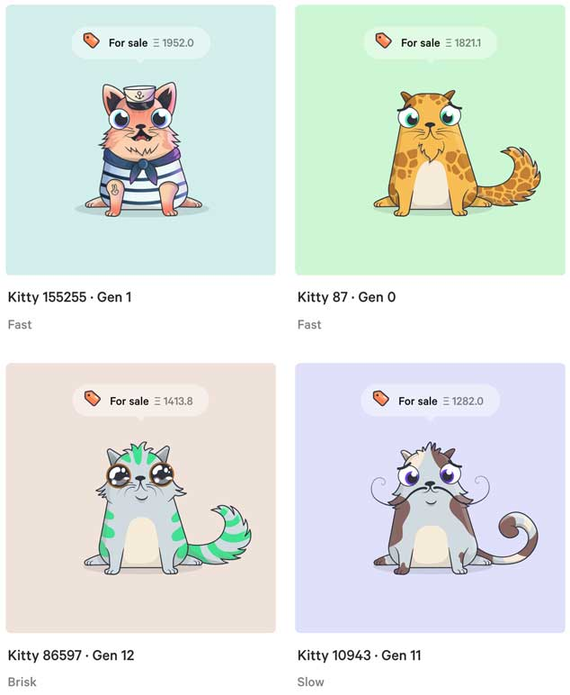
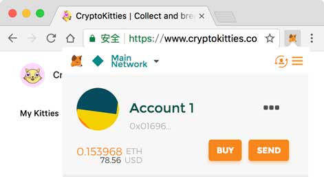
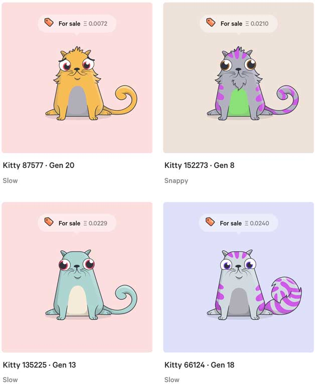
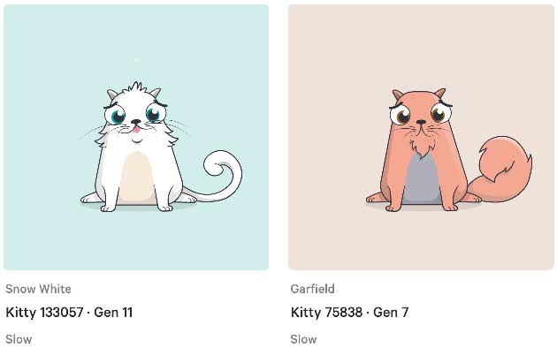
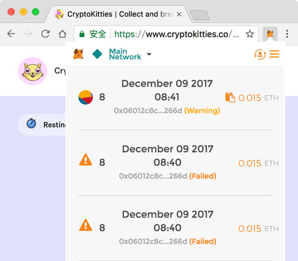
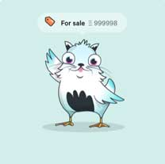
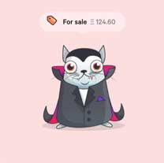
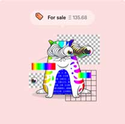

# 深度解读区块链撸猫

最近，区块链技术被炒得火热的除了比特币屡创天价外，一种区块链撸猫的游戏突然火遍以太坊，短短一周时间就让以太坊网络几乎瘫痪。

这款把以太坊网络“攻击”瘫痪的游戏就是CryptoKitties，俗称区块链撸猫。许多猫的售价高达数百至数千ETH，折合美元相当于几万多。花几万美元买个猫，想想看，这得是什么土豪。

到底什么是区块链撸猫，区块链撸猫和云撸猫，单机撸猫，撸实体猫有啥区别？

先来看看CryptoKitties上出售的猫：

按照$400~500一个的ETH换算一下，能在区块链上撸猫的还都是*真*土豪。

CryptoKitties有哪些规则？到底怎么玩？别急，想要在区块链上撸猫，还需要一定的技术门槛：

首先，CryptoKitties使用ETH作为“货币”来买卖猫，ETH是以太坊的数字货币，所以，玩家需要先有ETH。然后，还必须安装MetaMask这个ETH钱包，它提供了一个Chrome浏览器插件，在MetaMask钱包中创建一个账户，或者导入已有的以太坊账户，就可以看到ETH地址和ETH余额：

ETH地址就是CryptoKitties的唯一账号，注册时需要粘贴ETH地址，以及一个额外的Email地址。Email只用来发送通知，和撸猫本身关系不大。所有的猫都登记在区块链上，通过地址确认猫主。由于区块链采用非对称加密，只要确保自己的私钥不被盗，没有任何人可以拿走通过地址登记的猫，开发商不行，神仙也不行。

要想在区块链上愉快地撸猫，就得先去市场上买一只猫。先挑便宜的买：

一次性买两：

想要买到猫可不容易，由于以太坊区块链拥堵，不得不不断提高手续费，$15买猫需要花$1的手续费！

买到后，就可以让它两下崽了：

每只猫都有Gen标识，Gen 0表示这是创世猫，Gen 1是第一代，Gen 2是第二代，以此类推。

下崽是个技术活。每只猫都有256个属性，控制着毛色、花纹、胡须、牙齿等等，可以理解成256种不同的基因。两只猫繁殖的时候，基因以一定的概率遗传。

基因也会突变，如果遇到基因突变，就会生出奇形怪状的小猫。例如，带翅膀的猫：

海军猫：

吸血猫：

Bug猫：

这些小猫由于基因突变，往往能卖出高价。

每次生完小猫后，父母就会进入冷静模式（Cooldown），必须“恢复”一段时间才能继续繁殖小猫。每只猫恢复的时间有长有短，而且越生得多恢复的时间就越长。恢复时间长短也是影响猫价的一个因素。

如果只有一只猫，想跟别人的猫配种，也可以到市场上看看。玩家1可以标一个“配种价”，玩家2如果想配种，需要支付给玩家1这个价格，生下来的猫归玩家2所有。基因优秀的猫可以在配种市场上标个高价。

配种成功后，生育也需要一段时间（几个小时不等）。小猫出生后，就可以在My Kitties页面看到新出生的小猫。

CryptoKitties在11月28号正式启动，由于用户热情高涨，短短一周时间，累计繁殖了约10万只猫，交易额超过了500万美元，占据了整个以太坊大约25%的交易，由此导致以太坊网络几乎瘫痪。

CryptoKitties自己如何赚钱？

CryptoKitties在以太坊上部署了智能合约，网站本身只用来展示以及为用户提供比较方便的交易平台。每隔大约15分钟，会产生一只Gen 0的创世猫，并通过合约自动拍卖，拍卖所得进入开发商的钱包。

此外，用户繁殖猫通过智能合约实现，开发商收取每次交易金额的3.75％作为手续费。

区块链撸猫和云撸猫有啥区别？最大的区别是，游戏规则确立后，你的猫永远是你的猫，开发商无权也无法剥夺任何人的猫。而云撸猫是一个中心化的游戏，所有的猫都登记在开发商的数据库中，开发商可以随时篡改、剥夺任何人的猫，开发商也可以任意给自己创建高价猫。想想看，在线游戏中的道具不过就是开发商自己创建并拿来出售的数字资产，没有任何方式可以保证开发商不作弊。

说完了区块链撸猫的优点，我们再看看目前区块链撸猫的缺点。

由于用户买卖猫，包括繁殖小猫，都是通过智能合约实现的，执行一次交易需要等待区块链打包，时间从1分钟到十几分钟不等。因为CryptoKitties导致的以太坊网络拥堵，等待几个小时都是常有的事，所以实时性很差。提交一笔买卖交易后，你可以先睡一觉，第二天早上再看交易是否成功。此外，以太坊交易的手续费随着拥堵的加剧而急剧增加，如果手续费设得太低，则交易根本不会成功。一次交易的手续费从0.1美元已经涨到了1～3美元，对用户来说显然非常不划算。注意这个手续费是给矿工的手续费，不是开发商收取的手续费。

由此暴露出以太坊网络目前处理能力严重不足，还不足以支撑未来大量的区块链应用。

另外，用户想要参与区块链撸猫，需要较高的技术门槛，即必须对私钥、地址、以太坊、以太币、钱包、挖矿、打包等比较熟悉。对区块链不熟的用户可能根本无法创建一个成功的交易，也不理解为什么一个交易需要几分钟甚至几个小时才能完成。

目前，区块链相关技术，尤其是钱包，对普通用户来说易用性还非常差。如果解决了易用性问题，可以说用户会出现几个量级的增长。

无论如何，CryptoKitties通过游戏向大众普及了区块链的概念。虽然目前区块链的应用还处于非常早期的阶段，但未来的潜力不可估量。

－－－－广告分割线－－－－

想要深入学习区块链原理的童鞋，请移步教程[区块链教程](../../../books/blockchain/index.html)，快人一步，掌握区块链。
