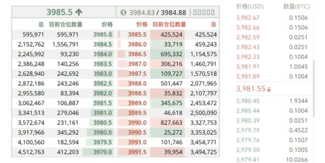

# 关于期货合约的几点思考

期货合约本质上是多空双方的对赌。在不考虑手续费的情况下，所有交易对手的盈亏总和是0，所以期货合约和赌博一样，是一种零和博弈。

既然是零和博弈，那期货合约的价值是什么？期货合约最大价值在于风险转移，即将价格波动的风险从风险厌恶者转移到高风险偏好的投机者。

因为风险不会消失，风险只能转移。为了把风险转移出去，必然是以高额收益为诱饵吸引投机者（即赌徒）。当然，高收益同时带来高风险。

### 最小变动价位

期货合约的最小变动价位非常重要。Bitmex的BTC期货最小变动价位是$0.5，沪深300指数期货的最小变动价位是0.2点。

过低的变动价位不但不会提升市场的流动性，反而会破坏市场的流动性。例如，以$0.01变动的报价，买一和卖一常常有几十档缺口，不利于成交。

观察左右两个盘口，左侧买一`3985.0`和卖一`3985.5`中间无空档，而右侧买一`3980.45`和卖一`3981.89`有143档。

### 全仓和逐仓

传统期货市场并没有全仓和逐仓之分，而数字货币期货通常会有全仓和逐仓两种模式。

在全仓模式下，所有可用余额均作为全部仓位的保证金，一旦爆仓，整个账户就全部赔光。

而逐仓模式则把一部分保证金指定给某一仓位，实现“专款专用”，如果这个仓位爆仓，则最多损失该仓位的保证金。

用一个形象的比喻就是，全仓模式好比烤全羊，一爆仓整个羊全没了。逐仓模式好比只压一个羊腿，一爆仓只损失羊腿。

以当前情况看，操纵数字货币市场真是易如反掌，选择全仓模式的玩家真的就是待人屠宰的全羊。

### 结算

传统期货市场通常采用逐日盯市的结算制度，而许多数字货币期货按周结算，周期太长，不利于风险控制，应该从周结算改为日结算。

### 爆仓

爆仓不可怕，可怕的是在极端市场行情下，因为一个爆仓引发连环爆仓，导致市场深度迅速被砸穿。

从技术角度讲，完全可以做到每秒处理1万个爆仓仓位。但是，快不等于好，交易所的风控应该充分考虑市场的流动性，让爆仓单逐步释放，从而避免市场因流动性枯竭造成的更多的不必要爆仓。

### 穿仓

对于爆仓导致穿仓的处理，有强减和分摊两种机制。强减是在对手盘找到杠杆和盈利最高的用户仓位，强行予以减仓。因为不强制减仓，会导致没有对手盘从而无法平掉爆仓仓位。而分摊是结算或交割后，所有盈利用户按照比例分摊穿仓损失。

总的来说，强减比分摊好。因为高杠杆用户更容易触发爆仓，因此，对高度投机的高盈利用户进行强制减仓是减少市场波动性的有效手段，客观上帮助了高盈利用户止盈。

按比例分摊对于低风险用户是不公平的。例如，一倍杠杠的用户根本没有任何爆仓风险，但盈利部分仍然需要分摊，实际上是鼓励用户使用高杠杆，加剧了市场的波动性风险。

以上对数字货币期货合约的分析仅代表个人意见，切勿盲目参考。
