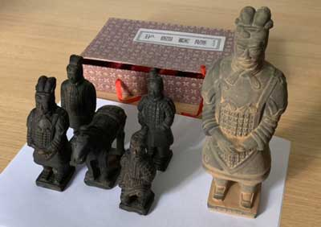

# 兵马俑

来西安旅游，自然一定要去看兵马俑。

兵马俑在西安临潼区，作为秦始皇陵的一部分，被誉为“世界第八大奇迹”的这个庞大的陪葬坑已经成了西安的一张金字名片。来到秦始皇帝陵博物院门口，宽阔的广场上，矗立着一尊巨大的秦始皇的雕像，约有十来米高，仿佛在向来自四面八方的游客打招呼：“欢迎来我家参观！”

我们跟着导游进入博物馆，首先来到兵马俑的一号坑。进入馆内，密密麻麻的人群沿着栏杆把兵马俑的大坑围得水泄不通，我们只能见缝插针地挤到栏杆前，才能一睹兵马俑的风采。

一号坑是现在已挖掘的最大的兵马俑坑，它长达200多米，宽60多米，足足有两个足球场那么大。站在俑坑的正前方观看，几个巨大的深坑由一条条平行的土墙隔开。坑里整齐地排列着上千个秦俑。这些秦俑和真人大小相当，身高在一米八左右，有车兵、骑兵、步兵等不同的兵种，按照方阵排列得整齐有序，非常令人震撼。

这些兵马俑是如何制成的呢？有一种说法是当年秦始皇用活人士兵烧制的。我还记得小时候看过一部香港电影，讲的是一个秦代士兵被烧成了兵马俑，历经千年后在现代复活的故事。这种说法当然是不可信的，秦始皇即使再暴虐，也不可能用活人烧制兵俑。实际上，这些兵马俑都是秦代工匠用陶土雕刻并烧制而成。仔细观察兵俑，可以发现，每个兵俑不但衣着各异，而且面容、神态也各不相同。据说，制作兵俑的秦代工匠是按照当时秦人的真实面貌来烧制的，这些工匠用精湛而高超的技艺，为我们留下了这批稀世珍宝。

说起我们现在看到的这些排列整齐的兵马俑，其实并不是它们出土时的模样。在俑坑的修复区，还矗立着十来个正在修复中的兵俑。实际上，兵马俑出土时，早已是支离破碎，面目全非，全靠文物工作人员以极大的耐心将这些碎片一点一点修复，尽量恢复成它们原本的样子。一个兵马俑的修复短则个把月，长则半年，可以想象，这需要花费多少人力和物力。直到现在，还有许多已发掘和发掘中的兵马俑正在等待修复。

从一号坑的展厅出来，我们又来到二号坑。和一号坑恢宏的规模相比，这个俑坑虽然要小很多，但拥有最壮观的军阵，不但有骑兵、步兵，还有战车、陶马，展示了两千多年前秦军的威武之师。

三号坑则在一号坑的西边。这个坑比二号坑更小，呈一个“凹”字型。其中有南北厢房和一个车马房，车马房中有一辆驷马战车和四个兵马俑，据考证这个坑应该是秦军的“指挥部”。

参观完一、二、三号坑，整个兵马俑也就参观得差不多了。但这绝不是说兵马俑就只有这三个坑，实际上，考古学家利用现代科技手段，早已探测到埋藏在更大范围的兵马俑，只是条件受限，目前只挖掘了这几个俑坑。而整个秦始皇陵的规模之大，实在令人难以置信。

离开兵马俑之前，我们又去博物馆内的文创店逛了逛。除了青铜器、印章外，最受欢迎的当然是摆放在展台上的兵马俑模型。这些微型兵马俑大概有一个手掌大小，据导购介绍，它们都是用正宗的陶土按照真实兵马俑烧制而成，根据大小不同，每个在一百到两百大洋不等。更专业的搭配方式是一匹战马，加上一个将军俑，一个武士俑，一个军吏俑和一个跪射俑，组成一个小型“方阵”。这么一套配下来大约需要五百到一千大洋。也有人会搭配一个“秦始皇俑”，但我个人不推荐购买秦始皇俑，因为秦始皇作为千古一帝，是绝不可能把自己做成陶俑的。最后没舍得买五件套，只买了一个将军俑。结果刚出博物院的大门，一位大姐就向我兜售秦俑五件套，只需要十元！果断拿下！半天的兵马俑之行就圆满结束了。

