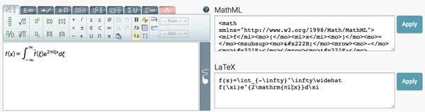

# 使用KaTeX渲染数学公式

在Word中，我们经常用到公式编辑器，来编辑数学公式。

但是，在网页上，如何方便地插入数学公式呢？比如像这样的公式：

```math
x=\frac{-b\pm\sqrt{b^2-4ac}}{2a}
```

一个简单的方法是把公式做成图片，但是图片既不好排版，又很难缩放。最好的方法是用文字来描述数学公式，把渲染的工作交给引擎，这样就可以方便地编辑公式。

实际上，在文字处理领域，早就有非常成熟的排版系统[LaTeX](https://www.latex-project.org/)，它完全使用文本描述排版，对于复杂的数学公式、表格、化学分子式等完全不在话下，甚至可以排五线谱、棋谱、电路图等。

我们的需求是在网页上以文本的形式展示数学公式，所以只需要一个LaTeX的子集，能渲染数学公式即可。

[KaTeX](https://katex.org/)就是这样一个支持HTML的轻量级的数学公式引擎，它由[Khan Academy](https://www.khanacademy.org/)开发，使用起来也非常简单。

第一步，引入KaTeX的JS代码与CSS样式：

```html
<link rel="stylesheet" href="https://cdn.jsdelivr.net/npm/katex@0.10.1/dist/katex.min.css">
<script defer src="https://cdn.jsdelivr.net/npm/katex@0.10.1/dist/katex.min.js"></script>
```

第二步，通过一个简单的JS调用就可以正确渲染出数学公式：

```javascript
katex.render("x=\\frac{-b\\pm\\sqrt{b^2-4ac}}{2a}", document.getElementById("math"));
```

使用JavaScript手动渲染还是稍微麻烦了一点，最好是通过Markdown按照下面的语法：

    ```math
    x=\frac{-b\pm\sqrt{b^2-4ac}}{2a}
    ```

就自动渲染出数学公式：

```math
x=\frac{-b\pm\sqrt{b^2-4ac}}{2a}
```

如果要内嵌KaTeX公式，可以用这样的Markdown语法：

```plain
内嵌的Katex效果$`E=mc^2`$就是这样
```

内嵌的KaTeX效果$`E=mc^2`$就是这样。

通过一点点JavaScript的代码，很容易实现自动渲染。

### 可视化

渲染公式很容易，但是像这样的公式：

```math
f(x)=\int_{-\infty}^\infty\widehat f\xi\,e^{2\pi i\xi x}\,d\xi
```

想要正确地写出它的文本形式可不容易：

```plain
f(x)=\int_{-\infty}^\infty\widehat f\xi\,e^{2\pi i\xi x}\,d\xi
```

如果仅仅为了写个公式，就去学LaTeX语法，那没有十天半月的肯定不行。这个时候，你需要一个[可视化公式编辑器](https://demo.wiris.com/mathtype/en/developers.php)的神器，它可以让我们可视化地编辑公式，然后自动得到它的LaTeX文本：



现在，就可以在页面上愉快地和数学公式玩耍了！
