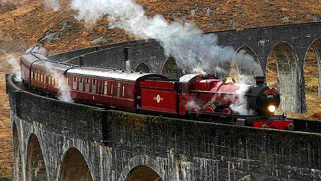
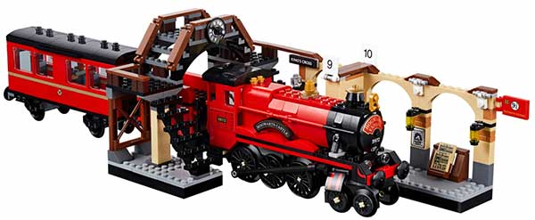
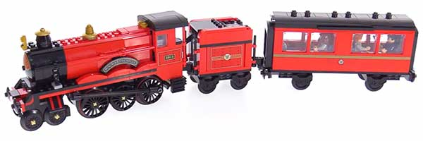
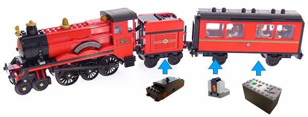
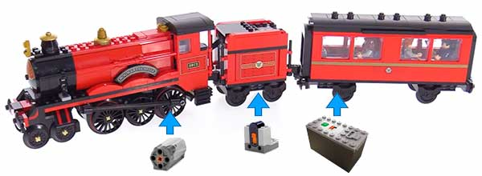
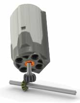
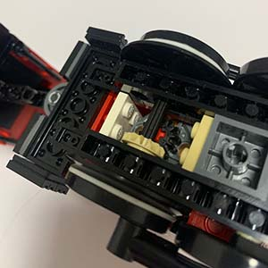
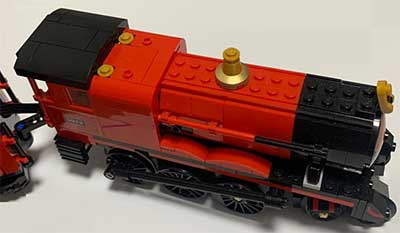
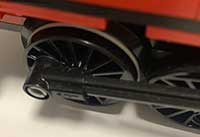

# 霍格沃茨火车改装指南



乐高发布的霍格沃茨特快列车作为哈利波特系列的一个明星产品，造型和电影相比非常逼真，值得收藏：



以100分为满分，我给它打99分。少一分不是怕它骄傲，而是这个霍格沃茨火车居然没有动力，难道真的要使用魔法才能驱动它？

本着“自己动手，丰衣足食”的原则，经过多方考察各国网友的改造经验，我总结出在不学习魔法的前提下改造霍格沃茨火车的两种方法。

因为霍格沃茨火车由车头、小车厢和大车厢三部分组成：



要添加动力，最简单的方案是直接使用乐高的火车动力马达88002，遥控接收器8884和电池88000，分别装在第二节车厢和第三节车厢：



这个方案的好处是改造简单，但实际测试发现，火车在弯道非常容易出轨，原因就是火车的动力不在车头，而是在第二节车厢，相当于推着车头走，怎么看怎么难受，正所谓“强扭的瓜不甜”。

要解决这个问题，就要把动力移到车头。因此，第二种比较复杂的方案是使用M号马达8883，遥控接收器8884和电池88000，分别装在车头、第二节车厢和第三节车厢：



这个方案的难点不在后面两节车厢的改造，而在于如何将马达塞进车头。因为马达要驱动轮子，而且受空间限制，只能竖直放置。经过反复实验，马达只能放在第三个大轮子上方，并通过一个传动装置把垂直方向的转动变成水平方向的转动来驱动它，示意图如下：



这是实际改造的动力传动装置：



因为马达的尺寸问题，所以改造后的车头在马达处不得不胖了一圈：



对应的一些砖块也要调整位置。整个改造过程耗时约3小时左右。改造完成后即可上轨道实验。

一跑不要紧，跑出了新问题：由于马达转速太快，也没有空间安装减速齿轮，轮子与轨道打滑，火车只能在原地不动，怎么办？

解决方案是给驱动轮套个橡皮筋，增大摩擦力：



经过不懈努力，反复实验，实地测试，终于在不借助魔法的情况下成功地让霍格沃茨火车跑起来了，来看看效果：

```video ratio=16:9
https://www.bilibili.com/video/BV1Di4y1s7rN/
```
