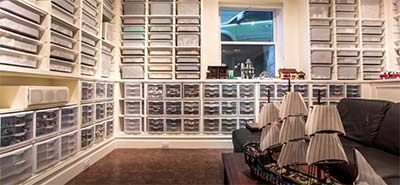
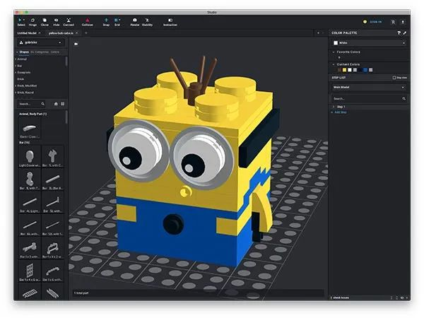

# 乐高MOC设计指南

乐高玩具相信大家都不陌生，一般是买一个套装然后照着图纸拼搭出来。

乐高MOC就比较小众了。什么是MOC呢？MOC是My Own Creation的缩写，就是完全自己设计模型然后搭建出来。简单地讲就是自己找一堆零件按照自己的想法搭出来。乐高自己就搞了一个[LEGO Ideas](https://ideas.lego.com/search/global_search/ideas)网站让网友上传自己设计的作品，另一个[Rebrickable](https://rebrickable.com/mocs/)网站也有许多热门的作品，可以参考。

如果要自己从头开始设计并制造出一个完整作品，怎么做？

土豪玩家的玩法：买齐市面上常见的乐高零件，堆满半个屋子，然后……随心所欲地拼。

这个玩法除了成本太高外，还有一个问题就是找零件太麻烦。乐高常见的零件种类高达1000种，再加上每种零件都有十种左右颜色，这么一算，SKU就高达1万。

所以钱还不是最主要的问题，最主要的问题是零件不好找。

另一种方法是先用设计软件设计好作品，然后，导出所需的零件，采购，等快递，拼装，就跟乐高套装差不多，只不过成品是自己设计的。

那么问题来了：设计乐高模型，用什么软件？

乐高原来有一个自己维护的设计软件，叫[LDraw](https://www.ldraw.org/)，不过已经停止更新了。目前推荐使用Bricklink的[Studio](https://www.bricklink.com/v3/studio/download.page)软件，可直接设计乐高模型：

这是渲染效果：

这是拼装好的实物：

设计好模型之后，就可以采购零件了。但是，乐高在国内并没有散件业务，所以，这里推荐国内的一个专业散件厂商[Gobricks](https://gobricks.cn/)，搭建一个专业的模型步骤如下：

1. 使用Studio设计模型；
2. 导出LDraw格式的模型；
3. 把模型[上传](https://gobricks.cn/#/toolkit)到Gobricks网站；
4. 下单购买；
5. 等快递收货；
6. 动手完成搭建；
7. 到处炫耀。

这里有几点需要注意的地方，虽然Studio软件中可以使用任意的乐高零件和任意的颜色，但是并不是所有零件都能买得到，所以还是尽量使用常用的零件和常见色。如果在Gobricks上部分零件显示为缺货，可以替换为其他颜色，或者灵活一点，比如没有2x4的板子，就换成两个1x4的板子。实在想用某种特殊零件，但是Gobricks没有的，可以去淘宝上购买。

后续给大家分享一些设计模型。
