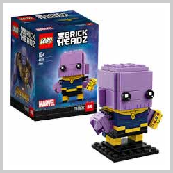
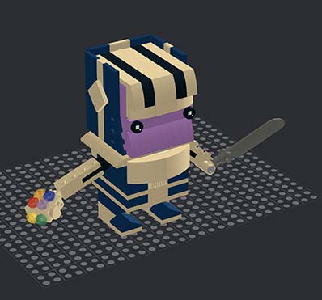
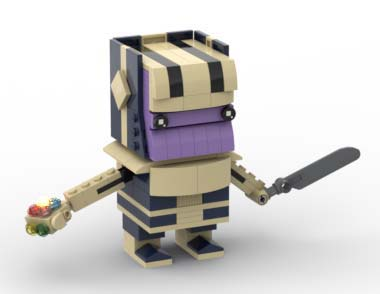
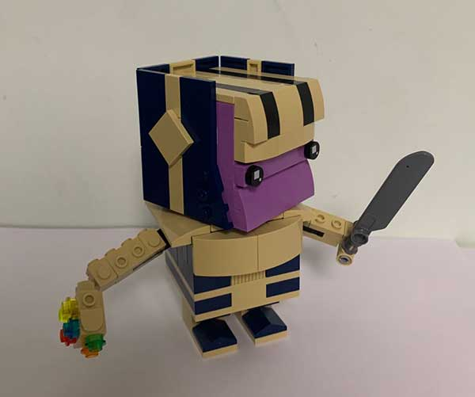
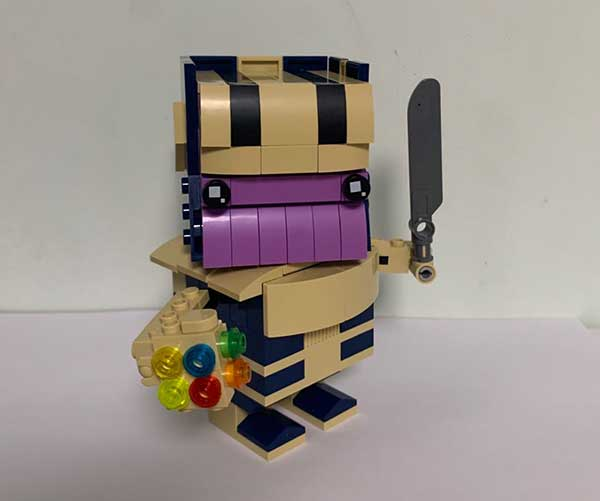

# 灭霸方头仔设计指南

今天给大家带来的方头仔是灭霸。

灭霸是深受人民群众喜爱的反派大Boss，实际上乐高也出过方头仔灭霸，这是乐高原版设计，长这样：

感觉是个婴儿灭霸，一点气势都没有。

我从网上找了国内外网友的几个设计图片，改进了一下，在软件中设计如下：

这是渲染的效果图：

和原版相比，有如下几点改进：

1. 带头盔，是成年灭霸；
2. 拿大砍刀，有气势；
3. 无限手套不是贴纸，而是拼搭的；
4. 六颗无限宝石货真价实，童叟无欺；
5. 脑袋可360度转动；
6. 胳膊和手腕均可转动。

最终的成品效果到底如何？来两张近距离照：

最后附[模型图+拼搭手册](thanos-cube.zip)，想要自己动手的童鞋自取。
