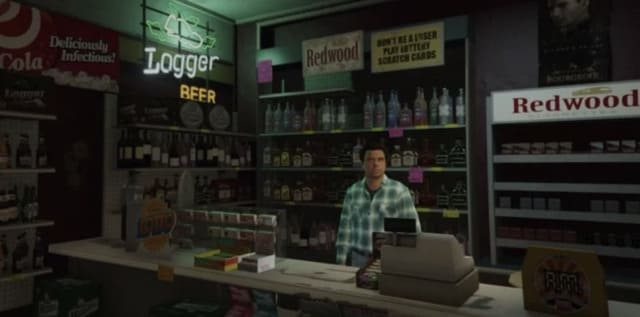

# 元宇宙落地指南

元宇宙——Metaverse，最近火了，连Facebook都直接更名Meta，据网友称是Make Everything Terrible Again的缩写。

元宇宙究竟是什么，正如一千个人眼里有一千个哈姆雷特，一千个人眼里也有一千种元宇宙。Facebook的元宇宙就是AR/VR的虚拟社交，类似头号玩家的电影场景，一些游戏公司把GameFi配合区块链食用定义成元宇宙，并且还真的吸引了大批羊毛党用户，国内的互联网巨头也纷纷号称要进军元宇宙。

那么未来的元宇宙应该是什么形态？到底是头号玩家的沉浸式VR体验，还是黑客帝国直接脑部植入生物电波？

我也不知道。

预测10年后的技术发展是非常困难的，即使方向对了，领先一步是先驱，领先两步就是先烈了。

我们不能以10年后的技术作为元宇宙的发展目标，而是应该尽量用现有的技术先搭建一个可以落地的，粗糙的元宇宙，随着技术的进步，再慢慢完善它。

正如今天非常逼真的4K 3D游戏，也不是一夜之间冒出来的，它是从早期的像素游戏、2D游戏一步一步发展起来的。

现阶段可以搭建的“入门级”元宇宙，应该是一个开放世界的轻社交3D平台，用户可以以虚拟造型在开放世界中探索，或者和好友闲逛。

这个开放世界对用户而言有什么吸引力呢？我们可以对比一下直播。目前，最火的短视频、网络直播等已经占用了用户越来越多的时长。实际上，很多用户长时间开启直播并不是注意力一直在直播上，更多时候是为了打发时间，类似于开着电视把新闻当作背景是一样的。

开放世界的轻社交3D平台对用户是没有压力的，但它现在就可以连接一系列的服线上与线下服务。用户在开放世界中探索时，完全可以进入某个网络直播间：

或者与好友进入虚拟电影院看大片：

或者在某个便利店购买饮料，15分钟后外卖送到家：

或者在商店里购买商品，这件虚拟商品的实体也完全可以快递到用户家里：

毕竟，这些线上和线下的服务现在都是现成的。

以下是对现阶段初级元宇宙的一个总结：

1. 它应该是一个开放世界的轻社交3D平台，让用户可以24小时置身其中但毫无压力，以打发时间为主；
2. 用户在探索开放世界的过程中，可以连接到已有的各种线上线下服务；
3. 它可能会取代电脑浏览器和手机App成为一个新的3D互联网流量入口。

最后是免责声明：

凡根据本文观点融资、开发导致项目失败的，作者概不负责。
