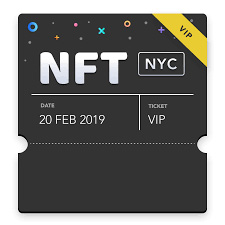

# NFT如何重构票务系统

本文将讨论NFT技术如何重构票务市场。

什么是NFT？

NFT是运行在区块链上的一种不可分割的凭证（Non-Fungible Token），或者称为非同质化代币。NFT目前主要用在数字艺术品的铸造、拍卖、流转，因为一个NFT能唯一地确定它的所有者，并可在链上跟踪每一次所有者的转移。

NFT的技术实现可以说非常简单，一个NFT本质上就是一个全剧唯一的256位整数，每个NFT会有一个地址的唯一映射，在区块链合约里，它存储的数据结构就是一个映射表：

```solidity
contract NftContract {
    mapping(uint256 => address) nfts;
}
```

依靠区块链提供的加密防伪能力，NFT能轻松实现数据透明、不可伪造、不可复制、可控流转。在现实世界中，我们注意到，电影票、门票、公园年票这些物品，本质上都可以看作是具有唯一ID的凭证。基于这种特点，使得NFT非常适合票务市场。



有的童鞋会问，现有的票务市场已经实现了在线购票，在线支付，二维码验票，很好的体验，还有必要改进么？

实际上，现有的票务系统是一个分散的中心化系统，例如阿里有淘票票，美团有电影票，加上大麦网、豆瓣电影等等，这些系统是不可能互联互通的，每一家影院都要对接如此多的票务系统，对售票方来说其IT成本就很高了。

此外，对接的这些第三方系统，用户在各个平台上，影院完全无法触达，甚至连给用户推送一个优惠都做不到。

基于区块链的NFT技术正是降低票务系统IT成本的有效措施。现有的各家票务系统，无一不把用户和购票数据作为自家私有数据存储而绝不会共享。相反，NFT在链上数据公开透明，任何影院只需要把一场电影的所有电影票以NFT的形式发行到链上，就相当于完成了一级市场的“登记发行”，而任何第三方票务系统，甚至个人，都可以将一级市场的NFT电影票销售给用户，这就是“二级市场销售”。由于NFT无法造假，所以不存在假票问题，电影院自身验票也完全不依赖任何第三方系统，它只需要同步区块数据就可以自行验证NFT电影票。

由于NFT还具备可编程特性，发行方完全可以自定义售卖和二次售卖规则。例如，有的票是不允许转让的，有的票可以转让，但是要收取一定的手续费，这些灵活的规则无需由阿里或美团定义，发行方自己就可以以合约的形式创建好。

最后，由于NFT的发行和流转数据完全透明，这使得影院真正得以分析自己的用户数据。借助成熟的隐私保护协议，用户也可以选择公开还是隐藏自己在链上的身份。

综上所述，一个基于NFT的票务系统将有如下显著的优势：

1. 安全性：发行方的每一张以NFT标识的票务都具备可溯源、防伪和可验证的特点；
2. 低成本：发行方无需与多个第三方票务系统直接集成，而任何第三方只要有技术和销售能力，都可以充当销售渠道；
3. 透明度：所有交易数据均在链上存储，数据不再属于某个第三方专有。

当然，现阶段用NFT改造票务系统，仍然存在很多挑战，例如区块链的TPS远远低于中心化系统的数据库，用户如何掌控自己在链上的身份等等，需要一步一步地改进。

最后是免责声明：

凡根据本文观点融资、开发导致项目失败的，作者概不负责。
