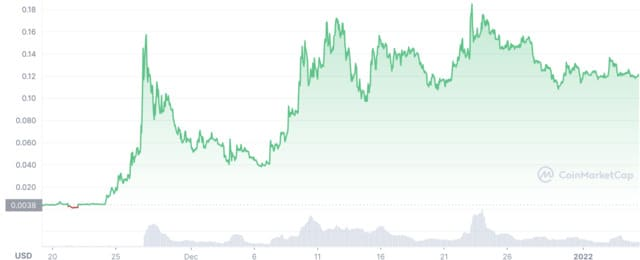

# DAO如何重构艺术品市场

2021年兴起的DAO，全称Decentralized Autonomous Organization，即分布式自治组织，热度越来越高。

一个DAO组织，最重要的特征就是借助区块链提供的无需信任的计算环境，实现基于智能合约的筹款、投票、治理。

本文仅讨论DAO在未来以何种方式能够重构艺术品市场。

乍一看，DAO是一群极客在区块链上的自留地，跟艺术品市场根本八杆子打不着。

但故事要从2021年11月讲起。

在2021年11月，美国有一场拍卖会，将拍卖美国宪法第一版的一个印刷版本，当时一共印了500份，但保留到现在的只有13份，此次拍卖品来自一个私人收藏家，预计竞拍价格在数千万美元。

一群区块链上的乌合之众决定众筹参与竞拍。如果放到过去，众筹是不可能的，谁牵头也无法让大家相信众筹和后续股权的公平性。但是现在有了智能合约，于是他们注册了一个[ConstitutionDAO](https://www.constitutiondao.com/)（宪法DAO），利用智能合约在[Juicebox](https://juicebox.money/#/p/constitutiondao)上众筹，最后累计1.7万人参与，一共筹得11612个ETH，价值大约4000多万美元。

最后的结果很不幸，竞拍失败了，众筹的钱通过智能合约原路退回。但是由于参与人数众多，每个人出资额度也不大，于是众人高呼：退什么钱，把币炒起来！

这里简单介绍一下智能合约的众筹模式：在筹款阶段，任何人如果向合约发送1个ETH，合约就自动铸造100万个PEOPLE代币给投资人。而在退款阶段，投资人将手里的100万个PEOPLE代币发送给合约，合约就销毁这些代币，再把1个ETH返回给投资人。

因此，根据合约设定的规则，我们很容易算出，1个PEOPLE代币价值就是0.000001 ETH，按当时1 ETH=$4000的价格计算，约$0.004。

来看看炒作的成果：最高涨了约40倍，果然赌博是人类的天性。

当然我们这篇文章讨论的重点并不是炒作，而是思考ConstitutionDAO如果竞拍成功的话，会是什么结果。

如果竞拍成功，根据竞拍成交价格4320万美元计算，ConstitutionDAO的合约资金池应该被耗尽（即所有筹款所得的ETH用于购买目标商品），而持有PEOPLE代币的所有人按持有份额享有目标商品——宪法印刷品的所有权。因此，所有PEOPLE代币背后的价值就不再是1.1万个ETH，而是价值4320万的历史文献投资品。

但这并不妨碍二级市场的流通。如果一个人持有PEOPLE，他完全可以将其以合适的价格卖给另一个人。随着二级市场上PEOPLE的价格变动，这将由市场对该投资品做出实时定价，其流动性远远超过了传统的拍卖行。

试想一下，如果一件艺术品由DAO拍下后，DAO可以委托博物馆管理这些艺术品，并向公众展示。几乎可以肯定，由于持有人数众多，它将不会再回到某个私人收藏家的手里。如果越来越多的艺术品由DAO持有，其背后真正的拥有者将是成千上万的个人，这是真正意义上的共有。

此外，由拍卖行主导的艺术品买卖，流动性极差，仅限参与的富豪。而由DAO持有的艺术品，在二级市场可以7x24小时交易并定价。

因此，运行在区块链上的DAO，参与艺术品投资，将获得如下优势：

1. 每件艺术品的所有权由其代币表示，人类文明的成果将真正变成共有；
2. 由拍卖行提供的极低的艺术品流动性将变为7x24小时交易的极高的流动性；
3. 任何人都可以购买他梦寐以求的艺术品，尽管普通人能买入的份额极低。

DAO在未来能否重构艺术品市场，让我们拭目以待。

最后是免责声明：

凡根据本文观点融资、开发导致项目失败的，作者概不负责。
