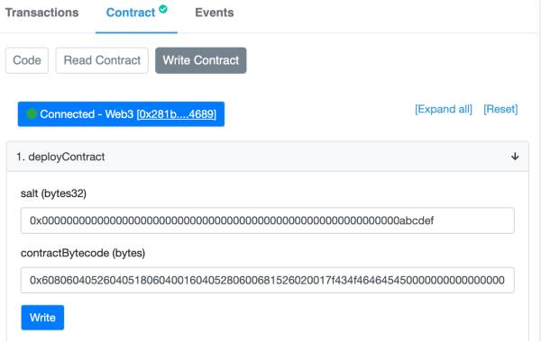
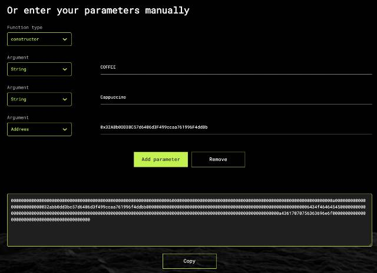

# 如何在不同链部署地址完全相同的合约

在以太坊中，合约是一种特殊的账户，它没有私钥，只有代码。而合约的地址通常是由部署者的地址与nonce共同做keccak哈希生成的。具体的算法实际上就是：

```plain
contractAddress = keccak256(rlp.encode(deployingAddress, nonce))[12:]
```

对于那些需要在多个链部署的项目来说，如果保证部署者的地址相同，nonce相同，则可以部署出相同地址的合约。例如，Uniswap的[UniswapV2Factory](https://docs.uniswap.org/protocol/V2/reference/smart-contracts/factory)在Ethereum的主网、Ropsten、Rinkeby等均有相同的地址。

但是这种部署方式要求每个网的部署顺序要完全一致，以确保nonce相同。有没有办法能更好地部署不同链得到相同的地址呢？

答案是使用`CREATE2`指令。

`CREATE2`指令是以太坊EIP-1014引入的一种能预先计算合约地址的新的指令，它的算法如下：

```plain
contractAddress = keccak256(0xff + deployingAddress + salt + keccak256(bytecode))[12:]
```

只要保证`deployingAddress`和一个指定的`salt`不变，相同的合约代码（bytecode）部署后得到的合约地址就一定是相同的。

如果我们在不同的链首先部署一个能部署合约的合约，这样`deployingAddress`就可以永久保持不变。每次部署合约时，传入相同的`salt`和`bytecode`，在不同的链上部署的新合约就一定是相同的。

我们来实现这个“用`CREATE2`部署合约”的合约，核心代码如下：

```solidity
contract ContractDeployerFactory {
    event ContractDeployed(bytes32 salt, address addr);

    function deployContract(bytes32 salt, bytes memory contractBytecode) public {
        address addr;
        assembly {
            addr := create2(0, add(contractBytecode, 0x20), mload(contractBytecode), salt)
            if iszero(extcodesize(addr)) { revert(0, 0) }
        }
        emit ContractDeployed(salt, addr);
    }
}
```

现在的关键是首先保证将`ContractDeployerFactory`合约部署到不同链上，并具有相同的地址。我们需要创建一个全新的账号，例如，`0xf257772770efa0cae27a0465983a0ef44fa0396e`，用别的账号给该新地址打钱，然后，分别在ETH Ropsten和BSC Testnet上部署`ContractDeployerFactory`合约。要保证该部署是新账户的第一个tx。

因为两个链的合约创建者的地址是一样的，并且`nonce`都是0，因此，部署后得到的`ContractDeployerFactory`合约地址是一样的，这里采用Solidity 0.8.7无优化编译，得到的两个链的地址均为`0x0b7b30f4d1d6c148e4336dec1d08cb202a46c05a`：

- Ropsten：[https://ropsten.etherscan.io/address/0x0b7b30f4d1d6c148e4336dec1d08cb202a46c05a](https://ropsten.etherscan.io/address/0x0b7b30f4d1d6c148e4336dec1d08cb202a46c05a)
- BSC Testnet：[https://testnet.bscscan.com/address/0x0b7b30f4d1d6c148e4336dec1d08cb202a46c05a](https://testnet.bscscan.com/address/0x0b7b30f4d1d6c148e4336dec1d08cb202a46c05a)

下一步，我们部署一个无构造方法的合约`UnnamedCoffeeCoin`，代码见[链接](https://ropsten.etherscan.io/address/0x73e74818121254433c2b573fff5c54c9f850dfe5#code)。

编译后，得到合约的`bytecode`如下：

```plain
60806040526040518060400160405280600681526020017f434f464645450000
0000000000000000000000000000000000000000000000008152506003908051
906020019062000051929190620000d0565b5060405180604001604052806013
81526020017f47656e6572616c20436f6666656520436f696e00000000000000
...
80fd5b5056fea2646970667358221220dabb5e53355d3b4c2da8fb6498abab37
647560c2b19c489cd44592b3c02af7d764736f6c63430008070033
```

随便找一个`salt`，例如，`0x...0000000000abcdef`，将`salt`和`bytecode`填入：



只要保证`salt`和`bytecode`是完全一样的，即使用不同的账号部署，我们也可以在Ropsten和BSC Testnet上得到完全相同的合约地址`0x73e74818121254433c2b573fff5c54c9f850dfe5`：

- Ropsten：[https://ropsten.etherscan.io/address/0x73e74818121254433c2b573fff5c54c9f850dfe5](https://ropsten.etherscan.io/address/0x73e74818121254433c2b573fff5c54c9f850dfe5)
- BSC Testnet：[https://testnet.bscscan.com/address/0x73e74818121254433c2b573fff5c54c9f850dfe5](https://testnet.bscscan.com/address/0x73e74818121254433c2b573fff5c54c9f850dfe5)

```alert type=warning title=注意
创建的合约地址需要根据tx的日志查看。
```

### 部署带构造方法参数的合约

对于没有构造方法的合约，直接使用上述流程部署是没有问题的。但是，大多数带构造方法参数的合约，用上述方法部署将失败，原因是EVM在执行合约部署时，要求构造方法的参数附加在合约的`bytecode`后面。我们可以在`ContractDeployerFactory`合约里添加一个带构造方法参数的合约部署方法：

```solidity
function deployContractWithConstructor(bytes32 salt, bytes memory contractBytecode, bytes memory constructorArgs) public {
    bytes memory payload = abi.encodePacked(contractBytecode, constructorArgs);
    address addr;
    assembly {
        addr := create2(0, add(payload, 0x20), mload(payload), salt)
        if iszero(extcodesize(addr)) { revert(0, 0) }
    }
    emit ContractDeployed(salt, addr);
}
```

用这个方法，我们可以部署需要在构造方法中传入参数的合约，例如[NamedCoffeeCoin](https://ropsten.etherscan.io/address/0xfe66608d03e2bc26cc387981c9756e4ba05c462c#code)合约。

但是，且慢！

既然我们能预先计算出合约的地址，那么完全可以写段代码，尝试不同的`salt`，使得生成的合约地址是我们指定的前缀！

例如，我们想指定合约地址以*老铁666*开头，可以编写JavaScript代码来尝试不同的`salt`，直到找出特定的`salt`，部署后将得到我们想要的指定前缀的地址`fe666`。

用JavaScript搜索`salt`的代码如下：

```javascript
const ethUtil = require('ethereumjs-util');
// ContractDeployerFactory的地址:
const deployContract = '0b7b30f4d1d6c148e4336dec1d08cb202a46c05a';
// 待部署合约的bytecode:
const bytecode = '60806040523480156200001157600080fd5b5060...';
// 待部署合约构造方法参数:
const constructorArgs = '0000000000000000000000000000000000000000000000000000000000000060'
                      + '00000000000000000000000000000000000000000000000000000000000000a0'
                      + '00000000000000000000000032abb0dd3bc57d6406d3f499ccaa761996f4ddbb'
                      + '0000000000000000000000000000000000000000000000000000000000000006'
                      + '434f464645450000000000000000000000000000000000000000000000000000'
                      + '000000000000000000000000000000000000000000000000000000000000000a'
                      + '43617070756363696e6f00000000000000000000000000000000000000000000';

// 计算bytecode的哈希:
let bytecodeHash = ethUtil.keccak256(new Buffer(bytecode + constructorArgs, 'hex')).toString('hex');

// 寻找特定的salt:
for (let i = 0; i< 0xfffffff; i++) {
    let salt = i.toString(16).padStart(64, '0');
    // 用deployContract, salt和bytecodeHash计算payload:
    let payload = 'ff' + deployContract + salt + bytecodeHash;
    // 计算合约地址:
    let addr = ethUtil.bufferToHex(ethUtil.keccak256(new Buffer(payload, 'hex'))).substr(26);
    // 如果以指定前缀开头则找到特定的salt:
    if (addr.startsWith('fe666')) {
        console.log(salt);
        console.log(addr);
        break;
    }
}
console.log('END');
```

运行后程序打印出`salt`为`0000000000000000000000000000000000000000000000000000000000043c19`，计算出地址为`fe66608d03e2bc26cc387981c9756e4ba05c462c`。

注意：如果没有找到合适的`salt`，就需要扩大搜索范围，即`for`循环的上限，这将消耗更长的时间。

细心的童鞋可能会问，构造方法参数的编码是如何确定的？

我们先看[NamedCoffeeCoin](https://ropsten.etherscan.io/address/0xfe66608d03e2bc26cc387981c9756e4ba05c462c#code)合约的构造方法：

```solidity
contract NamedCoffeeCoin {
    constructor(string memory _symbol, string memory _name, address _to) {
        ...
    }
    ...
}
```

一共有3个参数。如果我们希望传入`COFFEE`、`Cappuccino`以及`0x32ABb0DD3BC57d6406d3F499ccaa761996F4ddBb`，就需要把这3个参数编码。这里我们使用一个能在线编码的网页[https://abi.hashex.org](https://abi.hashex.org)，直接输入构造方法参数如下：



直接把编码后的构造方法参数复制出来即可：

```plain
0000000000000000000000000000000000000000000000000000000000000060
00000000000000000000000000000000000000000000000000000000000000a0
00000000000000000000000032abb0dd3bc57d6406d3f499ccaa761996f4ddbb
0000000000000000000000000000000000000000000000000000000000000006
434f464645450000000000000000000000000000000000000000000000000000
000000000000000000000000000000000000000000000000000000000000000a
43617070756363696e6f00000000000000000000000000000000000000000000
```

下一步，我们用`ContractDeployerFactory`合约的`deployContractWithConstructor`方法，把计算出来的`salt`、编译得到的`bytecode`和通过网页在线编码得到的`constructorArgs`传进去，最终部署后的`NamedCoffeeCoin`合约地址为`0xfe66608d03e2bc26cc387981c9756e4ba05c462c`，与我们计算得到的一致：

- Ropsten：[https://ropsten.etherscan.io/address/0xfe66608d03e2bc26cc387981c9756e4ba05c462c](https://ropsten.etherscan.io/address/0xfe66608d03e2bc26cc387981c9756e4ba05c462c)
- BSC Testnet：[https://testnet.bscscan.com/address/0xfe66608d03e2bc26cc387981c9756e4ba05c462c](https://testnet.bscscan.com/address/0xfe66608d03e2bc26cc387981c9756e4ba05c462c)

### 在线部署工具

可以通过[deploy.eth.itranswarp.com](https://deploy.eth.itranswarp.com/)实现在线部署。

### 小结

使用合约部署合约的关键是首先在不同链部署相同的Deploy合约，确保该合约地址相同，此后，可以使用任意用户调用此合约的方法来部署新合约以便在不同的链上获得相同的地址，并且，我们还可以通过预先计算使得新合约地址有指定的前缀。
