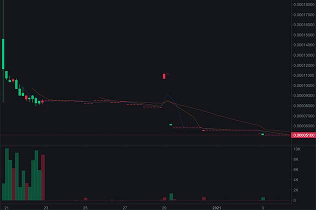
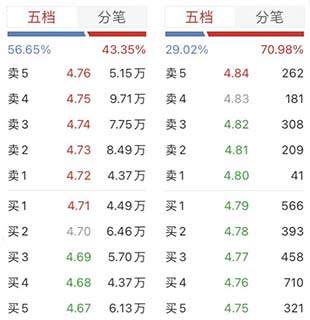

# 流动性概述

```alert type=caution title=注意
本文是普及金融市场交易的基础知识，不是为了鼓励大家去炒股炒币。相反，通过学习证券知识，理解衍生品原理，可以更好地认识市场风险，自觉放弃杠杆赌博暴富等不切实际的幻想，避免落入各种理财、带单、空气币等诈骗套路。本文一切内容均不构成任何投资意见或建议。
```

在金融市场中，经常听到流动性这个词。

什么是流动性？字面意义上的流动性其实就是水流的大小：长江的流动性高，家门口的小溪流动性低，如果是一滩死水，则根本没有流动性。因此，古人总结出“流水不腐，户枢不蠹”这个道理。


市场的流动性，就是指买卖双方想要成交，到底能成交多少而不至于显著地影响价格。

我们还是以菜市场为例：如果去小区里的超市买白菜，一次买一斤没问题，买10斤问题也不大，但老板可能会趁机涨点价。如果要买100斤就是想买也买不到，因为小超市根本没有这么多白菜可卖。但是，去新发地批发市场买100斤白菜就非常容易，原因就是，大型批发市场的流动性比小超市要高很多倍。

对应到金融市场，衡量流动性大小最简单最直观的指标就是一段时间内的总成交额。以A股为例，茅台的每天成交额在几十亿甚至过百亿，因此茅台的流动性就非常高。反过来，一只ST股票每天成交额只有几百万，流动性很小。假设两个投资人各持有市值1亿的茅台股票和ST股票，两个人想要把手里的股票卖出去，难度就是天壤之别：卖一个亿的茅台只需要几分钟的时间，卖一个亿的ST股票得连续卖100天也未必能卖完，而且价格不知道被砸到多低。可见，流动性是金融资产的生命线，没有流动性的资产，就相当于四五线城市有价无市的二手房，砸在手里卖不出去。

A股的大量散户资产都在10万级别甚至更少，无论是买茅台还是买ST，流动性差异对于小散来说不是大问题，因此，绝大多数小散并未意识到流动性的问题。而规模上亿的基金就不可能不考虑流动性的问题。一个规模几亿的基金只能考虑市值百亿以上的股票，一个规模几百亿的基金只能考虑市值万亿以上的股票，因为小溪可以容纳一只快乐的小青蛙，而江豚只能在长江中才能生存。

那么流动性能不能造假呢？其实是完全可以的，因为庄家自买自卖就相当于假装提高了流动性。造假是不可能完全避免的，但是在有监管的市场中，首先，造假要付出手续费的成本，A股的T+1制度（当天买入的股票只能第二天才能卖出）也大大增加了造假的时间成本，其次，多个账户相互之间来回买卖也很容易被监管的大数据分析出来。

但是币圈因为无监管，情况就完全不一样了。很多空气币均以自买自卖来伪装流动性，而交易所往往对此类账户设置极低的手续费甚至是0手续费，让造假完全没有成本。一旦停止了自买自卖，流动性几乎完全降为0。我随便找了一个空气币的4小时K线图，大家可以感受一下：



除了头两天有一点虚假的交易量外，后面近乎直线的K线图表明，如果你手里持有该空气币，挂单几个小时都无人问津。如果你手里持有大量该空气币，可能10年20年都卖不完。

在币圈，经常听到某某十倍币，百倍币，很多小白被这种虚假的高收益吸引上当受骗被套牢，实际上就是对流动性缺乏深刻理解。对一个百倍币来说，投1元确实能赚100元，但投1万别指望能赚100万，能把手里的筹码卖出1万保本都不错了。

我们说流动性最重要的指标是成交额，而基于盘口撮合的现货交易市场，流动性还有一个重要指标：盘口深度。

因为A股规定报价都是两位小数，按100股/手为最小单位买卖，所以我们找两个价格差不多的股票，感受下盘口的差距：



盘口深度决定了一个买入或卖出操作，能引发多大幅度的价格波动。显然，盘口深度越好，则同样的成交数量下，价格波动更小，这意味着要买入的成本更低，或者卖出的金额更高。

由一笔买卖带来的价格波动称为滑点，滑点越小越好。要让滑点小，就必须让盘口有足够的深度。

盘口深度能不能造假呢？因为币圈无监管，盘口深度也是可以造假的。有的小白用户会发现某些山寨币盘口深度似乎很大，但是几分钟也不动。当自己要卖出时，就在下单后的一瞬间，买单自动撤销了，自己的卖单没有按预期成交而是挂在了盘口，对手方是如何准确地“预测”到卖单的发送时间的呢？实际上这种高级作弊方式需要交易所配合，这里就不展开细讲了。

在金融交易中，流动性就是生命线。具体到买卖交易细节，我们还需要关注成交量、成交额、盘口深度、滑点等。
