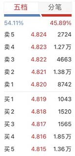
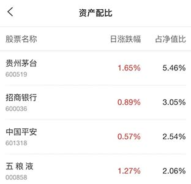

# ETF指南

```alert type=caution title=注意
本文是普及金融市场交易的基础知识，不是为了鼓励大家去炒股炒币。相反，通过学习证券知识，理解衍生品原理，可以更好地认识市场风险，自觉放弃杠杆赌博暴富等不切实际的幻想，避免落入各种理财、带单、空气币等诈骗套路。本文一切内容均不构成任何投资意见或建议。
```

ETF全称Exchange Traded Fund：交易所交易基金。

在交易所，可以满仓梭哈一只股票：如果早年梭哈了茅台，现在就走上了人生巅峰，如果早年梭哈了乐视，现在……已经退市了。可见，梭哈不是一种好的投资策略。

为了防范单一股票存在的暴雷风险，可以把资金分成10份，分别买入10只股票，即使有一只股票暴跌退市了，亏损最多也才10%。如果把资金分成100份，买入100只股票，风险就更加分散了。

但是一个小散本身资金量不大，可能连一手茅台都梭哈不了，怎么分散买入100只股票？

可以投资基金，因为基金汇集了很多投资人的钱，体量很大，几亿到几十亿的规模，分散买入100只股票是完全可以而且能轻松实现的。但是，常规的基金有申购和赎回的时间窗口，不能自由交易，赎回价格也是一天收盘后算一次，白天交易所交易时并不能赎回，价格也不会波动。用流动性来说，就是常规基金的流动性不如股票。

而ETF基金解决了常规基金交易不便的问题。例如沪深300ETF，它就是按沪深300的指数构成买入这300种股票。一个小散买入一手沪深300ETF，就相当于按比例买入了300只股票。更重要的是，300ETF和普通股票一样，在交易所交易。由于沪深300ETF跟踪的是沪深300指数，指数时刻在波动，因此，沪深300ETF的价格也在时刻波动：



因此，一个ETF完全可以看作是一揽子组合型股票。根据投资策略，想投大盘股选上证50ETF，想投中小股选中证500ETF，折中就选沪深300ETF。此外，各行业也有各自的ETF。选择ETF主要看资产配比，下图是沪深300ETF的资产配比：



即每投入100元相当于5.46元买入了茅台，3.05元买入了招行，等等。

在A股，由于没有个股期权，投资ETF还有一个额外的好处，就是某些ETF，有对应的期货和期权，可以实现风险对冲。关于期货和期权，我们在后面讨论。

既然持有ETF就相当于持有了一揽子股票，它最大的好处就是分散风险。但是在A股，ETF也有一个缺点，就是持有ETF不计入持股市值，无法参与新股申购。

最后总结一下ETF的两大特点：

1. 能按比例打包一揽子资产，方便购买；
2. 能在交易时间段像普通股票一样在场内交易。
