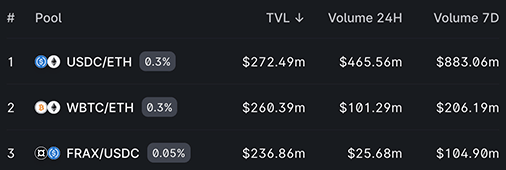
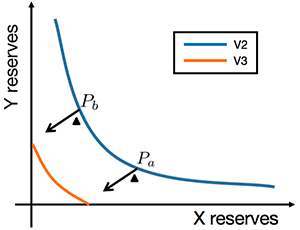

# Uniswap入门

```alert type=caution title=注意
本文是普及金融市场交易的基础知识，不是为了鼓励大家去炒股炒币。相反，通过学习证券知识，理解衍生品原理，可以更好地认识市场风险，自觉放弃杠杆赌博暴富等不切实际的幻想，避免落入各种理财、带单、空气币等诈骗套路。本文一切内容均不构成任何投资意见或建议。
```

在现货交易中，买卖双方各自报价，然后撮合成交，这是最简单，最直接，也是微观层面可以直接实现的一种交易方式。因此，自世界上第一家证券交易所诞生以来，撮合交易一直是最主流的方式。

随着DeFi的兴起，在以太坊这样的去中心化链上怎么实现买卖双方的交易？最直接的想法是把买卖盘搬到链上。然而，严重的技术问题导致了这种方式既慢又不经济。

对以太坊这种可以运行智能合约的链来说，交易实际上就是执行合约的函数。一个合约部署在链上，实际上相当于一组函数代码存放在链上。任何用户都可以通过钱包软件来调用这些函数，实现与合约的交互。但是，有几个限制：

1. 每次只能调用一个函数，不过这个问题不大，因为合约内部，一个函数又可以调用其他函数；
2. 用户必须主动发起调用，合约自身无法主动调用任何函数，也不存在定时调用机制，这是区块链的确定性计算和可验证性决定的，因此，价格涨到某个位置自动卖出或者价格跌到某个位置自动买入是无法在链上实现的；
3. 买卖订单写入链上非常昂贵，如果一个订单写入是$0.1，那么100万个订单就要$10万，并且，第二天100 万个新订单又需要$10万，这个成本是不可能被用户接受的；
4. 链上极低的TPS（一般在每秒几十到几百），无法支持传统撮合交易高达每秒上百万的性能。

而智能合约有几个独特的技术特性：

1. 智能合约没有私钥，即使是合约部署者，也没有合约的控制权。所谓的合约控制人，只能写到代码逻辑里；
2. 合约可以持有资产，这意味着与合约交互时，既可以把资产转移到合约，也可以从合约转移资产出去。

一句话总结，就是链上的交易，总是交易员与合约交互，这与传统的撮合交易，总是人与人的交互不同。因此，简单照搬撮合模式的链上交易，无一例外都不成功。

直到2018年底，[Uniswap](https://uniswap.org/)上线，一个全新的Swap交易模式诞生了。

需要特别指出的是，此Swap不是指金融衍生品的掉期，它是Uniswap的现货交易模式。

Uniswap首先解决的问题是任何交易员都是在与链上的合约程序交易，由合约本身充当做市商，即自动化做市商 AMM：Automated Market Maker。对于两种资产组成的交易对，例如UNI/ETH，卖出ETH，买入UNI，或者卖出UNI，买入ETH，要与程序完成这笔交易，合约本身首先要持有这两种资产，比如100个ETH和2000个UNI，这样，交易员用1个ETH买入20个UNI后，合约持有资产可能变成101个ETH和1980个UNI。如果另一个交易员稍后卖出40个UNI，合约持有的资产又可能变成2020个UNI和99个ETH。

程序做市的资产从哪来呢？只能由流动性提供者LP（Liquidity Provider）先存入合约。为了鼓励LP将资产作为流动性存入合约，需要以手续费返还的形式作为激励。

和撮合产生市场价不同，和程序交易，需要用算法产生市场价。Uniswap引入了最简单的固定乘积公式`x * y = k`来由程序决定价格。

还是以UNI/ETH为例，如果初始状态下LP注入2000个UNI和100个ETH到流动性池子里，那么初始价格就是1ETH=20UNI，或者1UNI=0.05ETH，而乘积`k = 2000 * 100 = 200000`就是固定常数。

假设下一个交易员准备卖1个ETH，他将买入N个UNI，池子里会有100+1个ETH和2000-N个UNI，带入公式`(100 + 1) * (2000 - N) = 100 * 2000`，计算得知N=19.802，因此，不计手续费的情况下该交易员花费1ETH获得19.802个UNI，买入UNI后价格变为1ETH=19.606UNI，或者1UNI=0.051ETH，即UNI的价格略微上涨。

在Uniswap交易对中，两种资产的地位是等价的，且任何人都可以注入流动性充当做市商。对做市商来说，任何时候，都可以按照当前价格的比例注入两种资产，Uniswap会计算新注入的LP的占比，并返回给做市商一个LP代币作为做市凭证。做市商稍后可以将LP凭证兑换出两种资产，并在兑换时一次性获得累计的手续费。

做市商的风险在于，做市的价格和退出做市的价格很可能不一样，例如做市时注入了100ETH和2000UNI，退出时取出了50ETH和4000UNI，价格变化可能造成做市商损失，这种损失被称为无常损失：Impermanent Loss。

对交易员来说，往一个交易池里扔进去一种资产，就自动获得另一种资产，数量由Uniswap计算后确定，这就是Swap。

每次Swap交易都会改变交易池里两种资产的数量，从而引起价格的变动。那么，影响滑点大小的因素有哪些呢？由Uniswap价格公式可知，如果做Swap交易的数量较少，则滑点较小。如果流动性池子的资产数量越多，则滑点越小。因此，注入到池子里的资产数量至关重要，Uniswap用总锁仓量TVL：Total Value Locked表示池子的大小，可以从Uniswap交易页看到TVL排名靠前的交易池：



如果交易员想要交易UNI/WBTC，但是Uniswap没有这个交易池，或者交易池太小，怎么办？可以找两个较大的交易池，例如UNI/ETH和WBTC/ETH，做两次Swap，完成UNI和WBTC的交易：

```ascii
     ┌─────────┐
────▶│ UNI/ETH │
     └─────────┘
          │
          ▼
     ┌─────────┐
◀────│WBTC/ETH │
     └─────────┘
```

这种借助中介资产的交易方式会付出更多的手续费，但滑点会大大降低。

由于流动性池子的大小对于滑点有重要影响，而通常价格只会在某个范围波动，为了更好地利用做市商的流动性池子，Uniswap的V3协议允许做市时指定价格区间，超过区间后该做市商的资金就不会被使用。这种改进的目的在于使用更少的资金提供相同的流动性：



除了Uniswap，还有其他基于链上Swap的DEX。

[Balancer](https://balancer.fi/)允许多个资产在同一个池子中交易，它采用的公式如下：

```math
V=\prod_{}B_t^{W_t}
```

[Curve](https://curve.fi/)也允许多个资产在同一个池子中交易，它采用的公式如下：

```math
\prod_{}x_i=\left(\frac Dn\right)^n
```

数学功底过硬的同学可以自行推导价格变化曲线，这里我们就不展开细讲了。

### 术语

- 自动化做市商AMM：Automated Market Maker
- 流动性提供商LP：Liquidity Provider
- 无常损失：Impermanent Loss
- 总锁仓量TVL：Total Value Locked

### 小结

Uniswap开创了自动化做市的AMM机制，使得程序化在链上做市成为可能。
