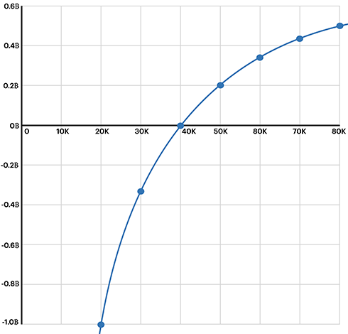

# 反向合约原理

```alert type=caution title=注意
本文是普及金融市场交易的基础知识，不是为了鼓励大家去炒股炒币。相反，通过学习证券知识，理解衍生品原理，可以更好地认识市场风险，自觉放弃杠杆赌博暴富等不切实际的幻想，避免落入各种理财、带单、空气币等诈骗套路。本文一切内容均不构成任何投资意见或建议。
```

我们前面讲了期货合约，有时候也简称合约。

期货合约总是跟踪某个标的物价格，理论上任何标的物都可以有对应的期货合约，且现金交割方式下，买卖双方均不需要持有标的物，对赌更加方便。

如果以BTC为标的物，以USD为现金，那么BTC合约就是以USD下注对赌的一种标准金融合约，它的期货价格以USD计价，保证金也是USD。如果每张合约价值₿1，那么以$40,000买入，$50,000卖出一张合约，很容易计算盈利为$10,000。反之，以$40,000买入，$35,000卖出一张合约，亏损$5,000。

即每张合约的标的物数量是固定，随着价格波动，实际盈亏=价差x每张合约标的物数量x合约张数。

还有一种以BTC为标的物，以USD计价，但是却以BTC作为保证金的期货合约，被称为反向合约。

反向合约由[BitMEX](https://www.bitmex.com/)首创，BitMEX是黑叔叔Arthur在2014年创建的。之所以不用USD做保证金，而用BTC做保证金，是因为币圈没有监管，无牌交易所想吸引大家入场交易，如果以USD作为保证金，需要接入银行系统，而且是多家银行，对于无牌交易所来说不现实。而以BTC作为保证金，由于参与者往往也是持有BTC的用户，所以充提自由。

反向合约由于保证金是BTC，所以盈亏计算与传统合约（即正向合约）不同。我们举例说明。

假设小明以$40,000的价格开多40,000手反向合约，每张合约价值$1，则开仓数量40,000张，价值$40,000，由于保证金不是USD而是BTC，所以开仓价值按$40,000的价格换算成BTC，相当于开仓价值为₿1.0，按10%保证金计算，需要保证金为₿0.1。

假设合约价格上涨至$50,000，由于每张合约的价值仍为$1不变，但仓位价值按BTC计算变为₿0.8，BTC变少了，相当于原来需要₿1就可以维持价值$40,000的仓位，现在只需要₿0.8就能维持价值$40,000的仓位了，于是小明以$50,000卖出平仓后，可以赚₿0.2。如果我们以$50,000的价格计算小明赚的₿0.2，刚好是$10,000，即小明赚的BTC如果再以平仓价现货卖出，与正向合约赚的USD相等。

反过来，如果合约价格下跌至$30,000，由于每张合约的价值仍为$1不变，但仓位价值按BTC计算变为₿1.3333，BTC变多了，相当于小明亏损₿0.3333。如果我们以$30,000的价格计算小明亏的₿0.3333，刚好是$10,000，即小明亏的BTC如果再以平仓价现货卖出，与正向合约亏的USD一样。

但是上涨$10,000小明只赚了₿0.2，但下跌$10,000小明却亏了₿0.3333，所以反向合约的盈亏不是线性的。我们可以画出小明的收益曲线图如下：



正向合约很好理解，即BTC是商品，以USD计价，买卖BTC，盈亏是USD。

而理解反向合约的关键就是该合约的商品是USD，以BTC计价，买卖USD，盈亏是BTC。但是由于以BTC计价USD很不方便，所以计价还用USD。

因此，反向合约的特点是，当价格上涨时，赚的BTC不是线性增长，而是越来越少。反过来，当价格下跌时，赚的BTC也不是线性减少，而是越来越多。

要计算反向合约的盈亏，以多仓为例：

```
盈亏 = (1/开仓价 - 1/平仓价) x 合约乘数 x 合约张数
```

由于反向合约以BTC作为保证金，所以按1倍杠杆开仓时，空仓永不爆仓，而多仓在价格下跌50%时即损失全部保证金爆仓。因此反向合约做空比做多安全，BitMEX也被称为空军基地。

参与反向合约时，要特别注意盈亏不是线性的，特别是多仓亏损的时候，随着价格的下跌，亏损额度以BTC计算不是线性增加，而是越来越快。
