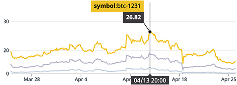
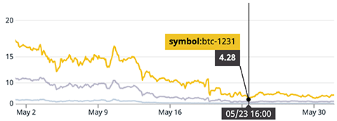
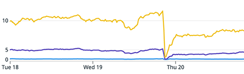

# 套利原理

```alert type=caution title=注意
本文是普及金融市场交易的基础知识，不是为了鼓励大家去炒股炒币。相反，通过学习证券知识，理解衍生品原理，可以更好地认识市场风险，自觉放弃杠杆赌博暴富等不切实际的幻想，避免落入各种理财、带单、空气币等诈骗套路。本文一切内容均不构成任何投资意见或建议。
```

在金融交易市场，有一种资金，专门从事低风险的低买高卖的投资策略，这种策略称为套利。

套利有很多种策略，我们以币圈为例，列举几种常见的套利策略。

### 跨交易所套利

以BTC为例，各交易所的价格虽然趋近，但很多时刻都有差价。如果A交易所价格比B交易所高，最简单的套利策略就是在A交易所卖出BTC，在B交易所买入等量的BTC。如果赚取的差价比两次交易的手续费多，那么这个套利策略就是成功的。

该策略要求A、B两个交易所各放一定数量的BTC和USD。最理想情况是A、B交易所的价差一会是正的，一会是负的。如果A交易所的价格长期略高于B交易所，那么很快A交易所的BTC将耗尽，B交易所的USD将耗尽，套利者还需要跨交易所转移资产，套利的效率将大大降低。

实际上正是由于跨交易所套利的存在，各交易所的BTC价格才总是趋于一致。跨交易所套利也不是没有风险，该策略的风险主要有3点：

1. 盘口流动性不足导致滑点损失；
2. API响应太慢导致下单时盘口已发生变化；
3. 有一侧交易不成功导致仓位不平衡。

### 期现套利

对交割合约来说，交割价格就是现货价格。但是，如果离交割还有一段时间，通常期货合约价格会比现货高一点，这个时候，就有套利空间。

以BTC正向合约为例，假设现货价格是$40,000，期货价格是$40,400，升水1%，到期还有两个月，那么此刻，先花$40,000买入₿1现货，同时以$40,400的价格卖出₿1期货，然后耐心持有到交割日：

1. 如果交割价格是$50,000，那么现货盈利$10,000，期货亏损$9,600，整体盈利$400；
2. 如果交割价格是$30,000，那么现货亏损$10,000，期货盈利$10,400，整体盈利还是$400；
3. 如果交割价格是$40,000不变，那么现货不盈利也不亏损，期货盈利$400，整体盈利还是$400。

可见，期现套利的关键是卖出的期货数量一定要和买入的现货数量相等，这样就可以几乎无风险地赚取升水的差价。

让我们来计算一下收益率。首先，买入₿1现货需要投入$40,000，卖出₿1期货需要10%的保证金，即$4,040，最后收益$400，收益率0.91%。假设两个月到期，则换成年化收益率为5.5%。

如果使用我们前面提到的支持混合保证金的交易所，那么直接用买入的₿1作为期货保证金卖空，则无需再投入USD，收益率将变成1%，年化6%，且避免了价格上升时期货爆仓的风险。

年化6%看上去不高，但实际上，市场疯狂的时候，合约升水幅度非常大。我们可以看看2021年4月比特币创历史新高时的升水，在FTX交易所12月31日到期的合约BTC1231升水最高达26.82%：



实际上20%以上的升水持续了至少两周，以20%的升水计算年化收益率高达26.67%。但这并不意味着4月份做期现套利必须持有到年底，因为5月份暴跌后，升水幅度迅速减少到5%：



如果以20%价差开始套利，5%价差平仓，这意味着一个月的时间即可实现15%的利润。

如果我们把价格曲线的周期放大，看看2021年5月19日暴跌的当天的价差：



BTC1231合约的基差跌到过0，精准选择平仓时刻可以完全吃掉20%的价差。

如果长期观察比特币市场，老鸟一般都知道，暴跌后往往会有一个暴力反弹，随着价格反弹企稳，基差从0扩大至约6～8%。

基差扩大也是套利的时机。对于这种情况，我们应当做空现货，做多BTC1231合约，等基差扩大后再平仓。

那么问题来了：如何做空现货？

有的童鞋会去融币做空，但那需要抵押。我们前面提到了永续合约几乎能完全地跟踪现货价格，因此，可以做空永续合约，做多BTC1231合约，来赚取基差扩大的钱。

做空永续还有一个好处：只需要10%的保证金，再加上做多BTC1231合约需要的10%的保证金，实际上相当于5倍杠杆套利，6%的套利空间实际收益率是30%，仅仅需要不到1天时间。

期现套利也不是无风险，这种策略的风险在于：

1. 如果现货价格上涨，基差扩大，会带来浮亏；
2. 对于无法使用现货BTC充当保证金的期货合约来说，10%的保证金在价格上涨10%将爆仓，需要时刻注意补充保证金；
3. 套利规模过大时平仓会面临流动性风险。

做空永续，做多远期的反向套利策略也有一定风险，这种策略的风险在于，如果永续和远期两个仓位互相独立，浮盈不能填补浮亏，则一侧仓位存在很大的爆仓风险，一定要选择合并所有仓位计算盈亏的交易所。

此外，期现套利的规模取决于远期合约的总持仓量。开仓时不能一次梭哈，而是要小步快跑期现同时加仓防止滑点过大，平仓时也要小步快跑。极端行情下想要最大化利润的时间窗口很短，最好使用程序交易来替代手工下单。

还有一些其他的套利方式，例如ETF套利，期权套利等，这里就不一一介绍了。

最后讲一下，套利实际上是有利于市场的价格发现功能的。因为市场短期可能会因为种种原因出现不正常的价差，而套利交易会促使价差恢复到正常范围，同时也提高了市场的流动性。
