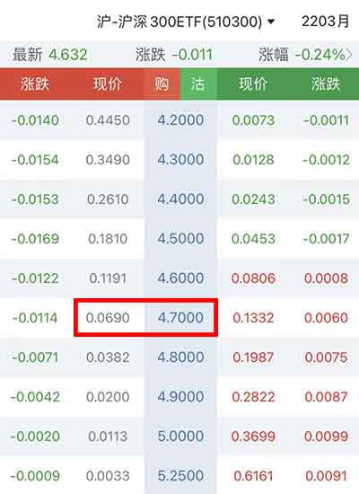
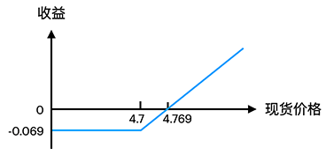
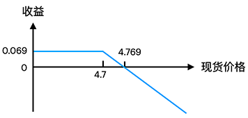
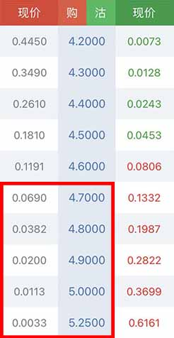
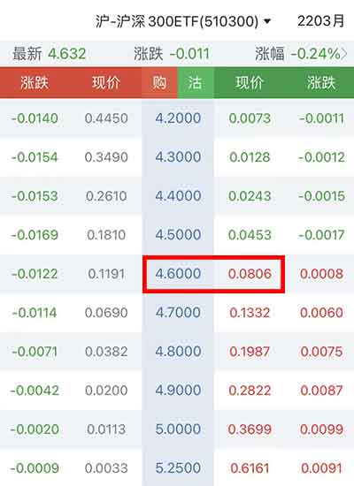
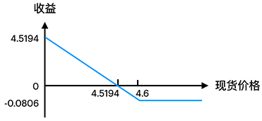
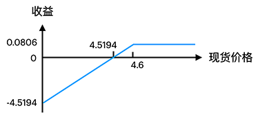
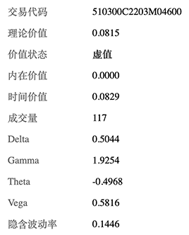

# 期权交易

```alert type=caution title=注意
本文是普及金融市场交易的基础知识，不是为了鼓励大家去炒股炒币。相反，通过学习证券知识，理解衍生品原理，可以更好地认识市场风险，自觉放弃杠杆赌博暴富等不切实际的幻想，避免落入各种理财、带单、空气币等诈骗套路。本文一切内容均不构成任何投资意见或建议。
```

> 交易现货，价格下跌时会亏钱；
>
> 交易期货，价格上涨时也可能亏钱；
>
> 交易期权，价格不涨不跌也可能亏钱。
>
> ——韭菜的成长日记

本文我们简单介绍一下什么是期权交易。

期权交易，就是未来有权利以现在约定的价格买入或卖出某个资产。

单纯从交易解释比较枯燥，我们不妨来看一个现实的例子。

假设某流量歌手两个月后要举办一场演唱会，票价待定，但是作为铁粉，保守估计票价¥1500吧。

这个时候，主办方为了答谢粉丝，决定把门票以优惠价¥1000预售给铁粉，但是要预付定金¥200，如果到时候不买，那么不好意思，定金不退。

这个定金¥200就是期权费用，它的权利是支付了定金的铁粉，到时候可以以¥1000的价格购票而无需担心实际票价是¥1500或者更高。但是，这个权利是有期限的，等演唱会都开始了你还不买票，权利就过期作废了。

金融交易中，期权也是如此，只不过比较复杂一点，可以分为看涨期权和看跌期权，也称认购（Call）和认沽（Put）。加上买入和卖出，一共有4个方向：

- 买入看涨；
- 卖出看涨；
- 买入看跌；
- 卖出看跌。

我们以最容易理解的买入看涨为例，假设小明准备抄底沪深300ETF，现价是4.632，小明觉得3月底涨到5块问题不大，只要能以4.7买入，回报是很不错的。但是现在买，又怕继续跌，怎么办？

小明决定以0.069的价格买入一份期权，如果3月底涨到5块，则到时候小明有权利以4.7的价格买入，净赚5-4.7-0.069=0.231。



这里的期权费0.069就相当于保费，又称权利金。小明是投保的买方，只要3月底300ETF的价格比4.7高，小明就能以4.7的价格行权买入。和演唱会门票定金不同的是，保费一交，就不退了，行权的时候，保费也不能抵差价，因此，3月底如果300ETF的价格比4.7高，小明肯定会行权，但只有价格比4.769高的时候，小明总体才会赚钱，价格越高，小明赚得越多。

反过来，如果3月底价格比4.7低，小明肯定不会行权，因为直接买现货更便宜。这个时候，小明的净亏损为权利金0.069。如果价格介于4.7和4.769之间，则小明行权后亏损部分权利金。

我们画个图看小明的收益：



即无论价格如何变化，小明的最大亏损是确定的0.069，而盈利会随着价格上涨而线性上涨。

为什么小明不买现货要去买看涨期权呢？因为小明认为后市看涨，现在只需要付个保费，不需要全款买现货，就可以享受后市大幅上涨带来的收益，同时规避了由于判断不准价格大幅下跌带来的风险。

在实际交易中，每一手期权合约是10000股，因此，小明买一手期权的花费是¥690，如果要行权，需要花费¥47000买入10000股。

小明作为看涨期权买方，实际上是权利方，交了权利金后，不需要任何保证金。而期权卖方，实际上是义务方，收了权利金后，需要在交易所冻结保证金。如果价格上涨，对买方是有利的，对卖方是不利的，因此，价格上涨，卖方需要追加保证金。作为看涨期权的卖方，最大收益是权利金，但可能的亏损是无上限的，要承担很大的风险。卖方收益图如下：



正因为卖方承担了很大的风险，因此，权利金的多少直接与风险程度相关。3月底300ETF涨到4.7、4.8、4.9、5.0、5.25的概率依次降低，因此，对应行权价的期权价格也依次降低：



而现货价格是4.632，如果行权价比现在的价格还低，例如4.2，即使现货价格保持不变，买方也肯定会行权。正因为如此，行权价4.2的期权价格很贵，是0.445，加起来是0.645，肯定比当前现货价格贵。

根据现货价格又可以把期权分为虚值和实值两类。对看涨期权来说，比现货价格高的都是虚值期权，因为付出的期权费只有时间价值，而比现货价格低的都是实值期权，期权费包含差价和时间价值。如果现货价格恰好等于行权价，那就是平值期权，这种情况很少出现，把平值当作实值为0的处理就好。

换一种说法就是，如果现货价格保持不变，虚值期权到期是无法行权的，因为行权价比现货还高，实值期权到期是肯定可以行权的，但整体是否赚钱还要看行权价与期权买入价的价差。

随着现货价格的波动，如果到期前价格大幅上涨到5.0，那小明买的行权价4.7的看涨期权，价格肯定大于0.3，这个时候，小明不一定要等到行权，可以直接卖出平掉他手里的看涨仓位，赚取期权费的差价。

反之，如果现货价格还略低于4.7，而期权价格不断下跌，小明为了避免损失全部期权费，也可以提前平仓，少赔一点。

对于期权的卖方来说，小明如果赚钱了，卖方就赔钱，小明如果赔钱了，卖方就赚钱。期权本身也是一种零和博弈，不考虑手续费，双方盈亏总和为0。

我们总结一下看涨期权的特点：

- 买方对后市看涨，买入看涨期权，支付期权费；
- 卖方对后市看跌，或者说不看涨，卖出看涨期权，收取期权费；
- 买方最多亏损掉全部期权费，盈利无上限；
- 卖方最多盈利全部期权费，亏损无上限。

### 看跌期权

和看涨期权相反的，就是看跌期权。

假设小明持有300ETF现货若干，他担心后市下跌，导致现货亏损，于是，以0.0806的价格买入行权价为4.6的看跌期权。



如果小明预测正确，后市现货价格大幅下跌，比如跌到4.2，那么小明在行权日仍然能以4.6的价格把手里的现货卖给看跌期权的卖方。这样小明以支付0.0806的成本，避免了0.4的下跌亏损。

所以看跌期权就是有权以行权价卖出，这和看涨期权相反，只有现货价格比行权价低时，看跌期权买方才会行权把现货卖给卖方。

我们来看看小明的收益图。由于现货价格最多跌到0，因此，小明最大亏损为期权费，最大盈利为行权价-期权价：



卖方的收益与小明正好相反：



现货价格越跌，看跌期权的价格越涨。因此，看跌期权的特点如下：

- 买方对后市看跌，买入看跌期权，支付期权费；
- 卖方对后市看涨，或者说不看跌，卖出看跌期权，收取期权费；
- 买方最多亏损掉全部期权费，盈利上限则是行权价-期权价；
- 卖方最多盈利全部期权费，亏损上限是买方的盈利上限。

### 定价

期权和期货不同的地方在于，期货的价格基本上与现货价格线性相关，期权的价格与现货价格却不是线性关系，影响期权价格的因素更多，包括现货价格、行权价格、到期时间、波动率等。

很多同学听说过期权的Delta、Gamma、Theta、Vega等指标，简单来说，Delta反映了期权价格对于现货价格的变化率，Gamma反映了Delta对于现货价格的变化率，Theta反映了期权价格对于时间减少的变化，Vega反映了波动率每变化1%对期权价格的影响。不会计算不要紧，交易软件会实时给出这些值：



Black-Scholes定价模型是最经典的欧式期权定价模型，简称BS模型，看涨期权价格公式如下：

```math
C(S_t,t)=N(d_1)S_t-N(d_2)Ke^{-r(T-t)}\\d_1=\frac1{\sigma\sqrt{T-t}}\left[\ln\left(\frac{S_t}K\right)+(r+\frac{\sigma^2}2)(T-t)\right]\\d_2=d_1-\sigma\sqrt{T-t}
```

看跌期权价格公式如下：

```math
P(S_t,t)=N(-d_2)Ke^{-r(T-t)}-N(-d_1)S_t
```

普通人就别去推导公式了，手动算不了，也不要依靠计算机算的结果去做套利。我们关注这些指标实际上是期权市场对后市价格、波动率的一种预测。

### 行权

期权到期时，对实值期权就可以行权。和期货一样，期权可以交割实物，也可以交割现金。

300ETF的期权交割就是实物交割，这里的实物是300ETF。对看涨期权来说，买方需要预存现金，卖方需要预存ETF，由交易所负责交割。

币圈也有跟踪BTC、ETH现货的期权，一般都是现金交割，即买卖双方盈亏直接折算成现金进行交割，无需交割实物。

根据行权的条件，又可分为欧式期权和美式期权。欧式期权在到期前不能行权，只能在到期日行权，而美式期权可以在到期前任何时间行权。显然，美式期权更加复杂。300ETF期权和常见的BTC/ETH期权都是欧式期权。

对BTC来说，像Deribit这样的交易所，期权采用USD报价，BTC做保证金，BTC结算，有点类似BitMEX的反向合约，主要是为了避免接入银行系统。

期权和期货一样，买卖双方也是零和博弈。作为买方，可以在付出期权费后，将价格向不利方向波动的风险转嫁给卖方。作为卖方，则承担类似保险公司的角色，依靠盈多亏少的概率赚钱。当价格剧烈波动时，卖方也会根据自己的持仓去现货和期货市场对冲风险。

对于初级交易员来说，有两种简单的期权交易模式：

- 如果小明持有现货，他想在高位卖出，在没有期权市场时，小明只能卖出现货。但是，有了期权，小明可以卖出看涨期权，以获得额外的期权费。交易所对持有现货卖出看涨专门设立了备兑开仓模式，仅需冻结现货，无需保证金，无爆仓风险。
- 如果小明想在低位买入现货，他可以选择卖出看跌期权。如果现货价格跌至行权价，则小明可以以预期价格买入，但额外多收了一笔期权费。如果现货价格没有跌至行权价，则小明白赚一笔期权费。

参与期权交易前，要首先考虑自己的交易策略，是要买保险还是卖保险。如果要卖保险，因为风险更大，所以要有对冲策略。
