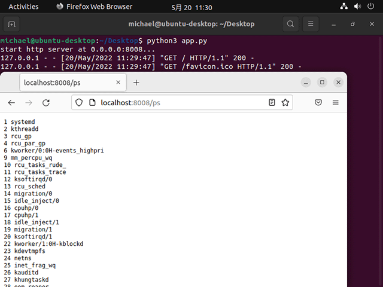
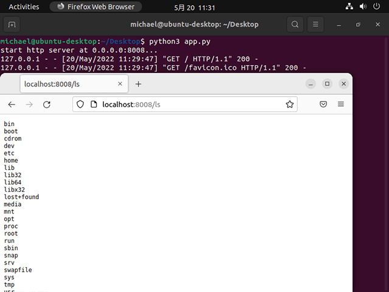
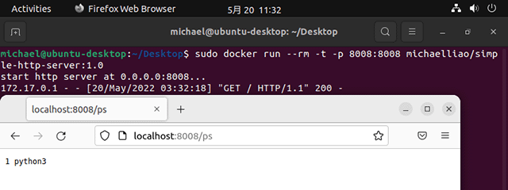
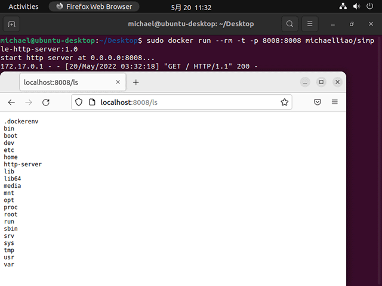
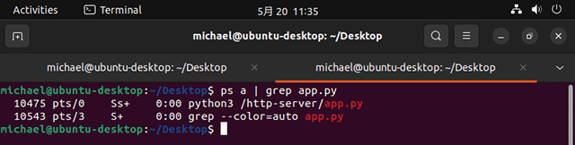

# 一文读懂Docker原理

说起Docker，基本上就是指容器。许多同学熟悉Docker的操作，却搞不懂到底什么是容器。本文就来讲讲Docker容器到底是个啥。

容器被称为轻量级的虚拟化技术，实际上是不准确的。确切地说，容器是一种对进程进行隔离的运行环境。

由于生产环境的容器几乎都是运行在Linux上的，因此，本文提到的进程、Docker等概念或软件均以Linux平台为准。

我们知道进程是Linux操作系统执行任务的最小单元，一个时间同步服务是一个进程，一个Java服务是一个进程，一个Nginx服务是一个主进程+若干工作进程，总之，把一个系统比作一个办公室，进程就是一个个打工人：


正常情况下，一个进程是能感知到其他进程的存在的，正如一个打工人放眼望去，办公室里还坐着一群其他打工人。进程的唯一标识是进程ID，用数字1、2、3……表示，好比打工人的工牌号，大家都各不一样。

而容器技术首先要解决的就是进程的隔离，即一个进程在运行的时候看不到其他进程。如何让一个打工人在工作时看不到其他打工人呢？方法是给这个打工人带一个VR眼镜，于是他看到的不是一个真实的办公室，而是一个虚拟的办公室。在这个虚拟办公室中，只有他一个打工人，没有别人。在Linux系统中，对一个进程进行隔离，主要是通过Namespace和Cgroup两大机制实现的。一个被隔离的进程，操作系统也会正常分配进程ID，比如12345，但是隔离进程自己看到的ID总是1，好比打工人的工牌是12345，但他自己通过VR眼镜看到的工牌号却是1，感觉自己是1号员工似的：


我们通过一个简单的Python程序就可以验证一下隔离进程的特点。我们编写一个简单的HTTP服务程序[app.py](https://github.com/michaelliao/learn-docker/blob/master/simple-http-server/app.py)，针对URL为`/`、`/ps`、`/ls`分别返回自身进程ID、所有进程ID和磁盘根目录列表。

如果我们正常启动这个Python程序，在浏览器中，可以看到进程ID为`10297`：


用/ps查看所有进程，可以看到1号进程是`systemd`，还有很多其他进程：



用/ls查看磁盘根目录，与当前系统根目录一致：



现在，我们制作一个Docker镜像，然后以Docker模式启动这个Python服务程序，再看看进程ID：


从进程自己的视角看，它看到的进程ID总是`1`，并且，用`/ps`看不到其他进程，只能看到自己：



再用`/ls`看一下磁盘，看到的也不是系统的根目录，而是Docker给挂载的一个虚拟的文件系统：



但其实从操作系统看，这个Docker进程和其他进程一样，也有一个唯一的进程ID为`10475`：



所以我们可以得出结论：

一个容器进程本质上是一个运行在沙盒中的隔离进程，由Linux系统本身负责隔离，Docker只是提供了一系列工具，帮助我们设置好隔离环境后，启动这个进程。

最基本的隔离就是进程之间看不到彼此，这是由Linux的Namespace机制实现的。进程隔离的结果就是以隔离方式启动的进程看到的自身进程ID总是1，且看不到系统的其他进程。

第二种隔离就是隔离系统真实的文件系统。Docker利用Linux的mount机制，给每个隔离进程挂载了一个虚拟的文件系统，使得一个隔离进程只能访问这个虚拟的文件系统，无法看到系统真实的文件系统。至于这个虚拟的文件系统应该长什么样，这就是制作Docker镜像要考虑的问题。比如我们的Python程序要正常运行，需要一个Python3解释器，需要把用到的第三方库如`psutil`引入进来，这些复杂的工作被简化为一个`Dockerfile`，再由Docker把这些运行时的依赖打包，就形成了Docker镜像。我们可以把一个Docker镜像看作一个zip包，每启动一个进程，Docker都会自动解压zip包，把它变成一个虚拟的文件系统。

第三种隔离就是网络协议栈的隔离，这个最不容易理解。

我们举个例子：在Docker中运行`docker run redis:latest`，然后在宿主机上写个程序连接`127.0.0.1:6379`，是无法连接到Redis的，因为Redis虽然监听`127.0.0.1:6379`这个端口，但Linux可以为进程隔离网络，Docker默认启动的Redis进程拥有自己的网络名字空间，与宿主机不同：

```ascii
┌──────────────┐ ┌─────────────────────────┐
│redis:        │ │app:                     │
│  listen: 6379│ │  connect: 127.0.0.1:6379│
├──────────────┤ ├─────────────────────────┤
│127.0.0.1:6379│ │        127.0.0.1        │
└──────────────┘ └─────────────────────────┘
```

要让宿主机访问到Redis，可以用`-p 6379:6379`把Redis进程的端口号映射到宿主机，从而在宿主机上访问Redis：

```ascii
┌──────────────┐ ┌─────────────────────────┐
│redis:        │ │app:                     │
│  listen: 6379│ │  connect: 127.0.0.1:6379│
├──────────────┤ ├─────────────────────────┤
│127.0.0.1:6379│ │     127.0.0.1:6379      │
└──────────────┘ └─────────────────────────┘
            │                     ▲
            │                     │
            └─────────────────────┘
```

因此，在Linux的网络名字空间隔离下，Redis进程和宿主机进程看到的IP地址`127.0.0.1`表面上一样，但实际上是不同的网络接口。

我们再看一个更复杂的例子。如果我们要运行ZooKeeper和Kafka，先启动ZooKeeper：

```plain
docker run -p 2181:2181 zookeeper:latest
```

再启动Kafka，发现Kafka是无法连接ZooKeeper的，原因是，Kafka试图连接的`127.0.0.1:2181`在它自己的网络接口上并不存在：

```ascii
┌──────────────┐ ┌──────────────┐ ┌─────────────────────────────┐
│zookeeper:    │ │kafka:        │ │Host                         │
│  listen: 2181│ │  listen: 9092│ │                             │
├──────────────┤ ├──────────────┤ ├──────────────┬──────────────┤
│127.0.0.1:2181│ │127.0.0.1:9092│ │127.0.0.1:9092│127.0.0.1:2181│
└──────────────┘ └──────────────┘ └──────────────┴──────────────┘
            │                │                ▲              ▲
            │                └────────────────┘              │
            └────────────────────────────────────────────────┘
```

必须连接到ZooKeeper的`IP:2181`或者宿主机的`IP:2181`。直接指定IP并不是一个好的方式，我们应该利用Docker Compose，把ZooKeeper和Kafka运行在同一个网络名字空间里，并通过`zookeeper:2181`来访问ZooKeeper端口，让Docker自动把zookeeper名字解析为动态分配的IP地址。`docker-compose.yml`参考配置如下：

```yaml
version: "3"
services:
  zookeeper:
    image: bitnami/zookeeper:3.5
    container_name: zookeeper
    ports:
      - "2181:2181"
    environment:
      - ALLOW_ANONYMOUS_LOGIN=yes
    volumes:
      - "./docker/zookeeper-data:/bitnami"

  kafka:
    image: bitnami/kafka:3.0
    container_name: kafka
    ports:
      - "9092:9092"
    depends_on:
      - zookeeper
    environment:
      - KAFKA_BROKER_ID=1
      - KAFKA_CFG_LISTENERS=PLAINTEXT://:9092
      - KAFKA_CFG_ADVERTISED_LISTENERS=PLAINTEXT://127.0.0.1:9092
      - KAFKA_CFG_ZOOKEEPER_CONNECT=zookeeper:2181
      - KAFKA_CFG_AUTO_CREATE_TOPICS_ENABLE=true
      - ALLOW_PLAINTEXT_LISTENER=yes
    volumes:
      - "./docker/kafka-data:/bitnami"
```

搞懂了容器的运行原理，我们才能更好地掌握Docker命令。掌握了Docker，才能进一步学习K8s——云原生操作系统。
