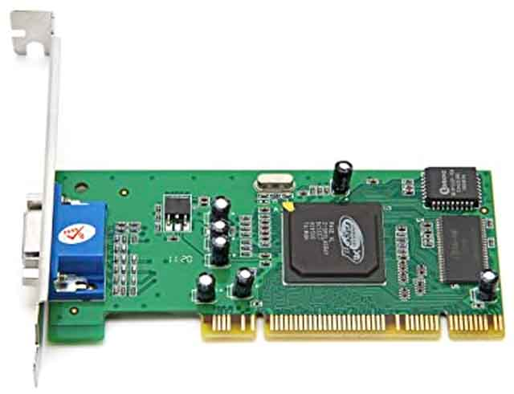
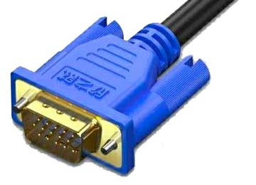
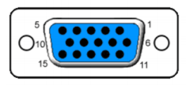
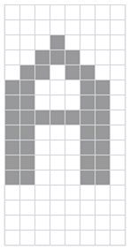
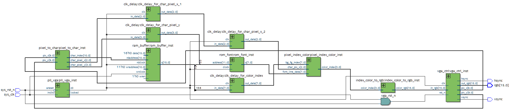
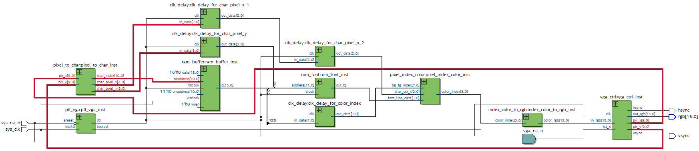
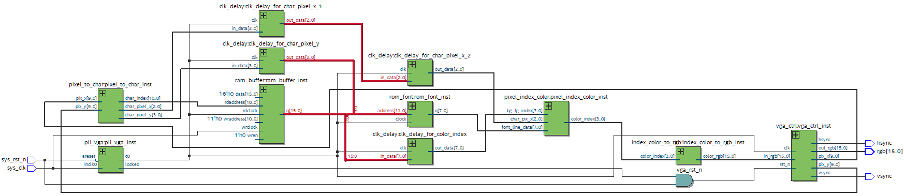
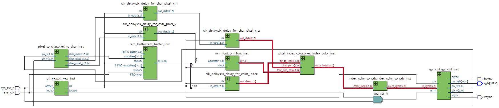
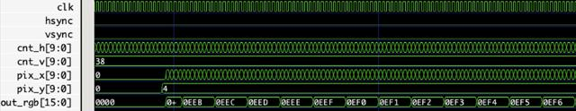

# 从零开始设计并实现VGA显卡

显卡是计算机的基本组件之一，它的用途是将计算机产生的图像信息输出给显示器。没有显卡，我们就没法从屏幕上看到图像输出，只能通过打印机输出一行一行的字符信息。

游戏玩家或者用电脑挖矿的矿工都非常熟悉显卡。早期的显卡并没有多少3D加速功能，并且只支持VGA输出：



显卡的价格主要取决于GPU性能，也就是3D加速性能。现在独立显卡由于功耗巨大，一般都直接盖上几个大扇叶子：


因为我们的目标是从零设计并实现一个显卡，一上来就模仿RTX 3080是不现实的，我们只能设计一个最简单的VGA输出的显卡，并实现最低分辨率640x480@60Hz，颜色为16位RGB 565模式。

要设计VGA显卡，我们首先要了解VGA接口，它长这样：



VGA接口一共有15针，排列为3行：



其中，引脚1～3是RGB模拟信号，不同的电压表示不同的RGB分量。引脚13和引脚14是行场同步信号，剩下的大都是接地信号。

VGA显示的原理就是逐行扫描，在两个行同步信号之间，要完成一行像素点数据的扫描：

```ascii
   ┌──┐                      ┌──┐                      ┌──┐
   │  │◀── Row Pixel Data ──▶│  │◀── Row Pixel Data ──▶│  │
───┘  └──────────────────────┘  └──────────────────────┘  └───
```

场同步则是指在两个场同步信号之间，要完成一整屏的数据扫描，对于640x480分辨率来说，在两个场同步信号之间，要完成525个行同步信号：

```ascii
         ┌─┐   ┌─┐                  ┌─┐   ┌─┐
         │ │ 1 │ │ 2             524│ │525│ │
       ──┘ └───┘ └─── ─ ─ ─ ─ ─ ─ ──┘ └───┘ └──

  ┌──────┐                                ┌──────┐
  │      │                                │      │
──┘      └────────────────────────────────┘      └──
```

根据VGA规范，640x480分辨率的时钟频率是25MHz。行同步信号的宽度是96个时钟周期，加上后沿48个时钟，屏幕显示640个时钟周期，前沿16个时钟周期，每扫描一行需要800个时钟周期。场同步信号需要两个行周期（1600个时钟周期），后沿33个行周期，屏幕显示480个行周期，前沿10个行周期，因此，每次屏幕扫描需要525个行周期，以60Hz刷新率计算，每秒需要：

```plain
800 x 525 x 60 = 25200000 ≈ 25MHz
```

在行同步周期的有效行数据时间内，我们需要不断输出一行的每个点的RGB值，这样，显示器就可以逐行扫描显示出完整的图像。因此，VGA控制模块的输入输出定义如下：

```verilog
module vga_ctrl (
    input  wire clk, // 输入时钟
    input  wire rst_n, // 复位信号
    input  wire [15:0] in_rgb, // 输入RGB
    output wire hsync, // 输出行同步
    output wire vsync, // 输出场同步
    output wire pix_data_req, // 输出请求数据
    output wire [9:0]  pix_x, // 输出请求的x坐标
    output wire [9:0]  pix_y, // 输出请求的y坐标
    output wire [15:0] out_rgb // 输出RGB
);
```

VGA控制模块本身并不关心如何输出RGB，它只把输入的RGB数据原样输出，但VGA控制模块需要输出不断更新的x、y坐标，让其他模块根据x、y坐标查找到对应点的RGB数据，输入给VGA控制模块，就完成了一个点的输出。
那么问题来了：如何根据x、y坐标查找RGB信息？

因为我们要实现的是VGA字符模式，在字符模式下，每行80个字符，一共有25行，即2000个字符。每个字符需要2字节存储，其中第1个字节是颜色信息，第2个字节是字符的ASCII码：


```ascii
┌───────────────┬───────────────┐
│   Attribute   │   Character   │
├─┬─┬─┬─┬─┬─┬─┬─┼─┬─┬─┬─┬─┬─┬─┬─┤
│7│6│5│4│3│2│1│0│7│6│5│4│3│2│1│0│
├─┴─┴─┴─┼─┴─┴─┴─┼─┴─┴─┴─┴─┴─┴─┴─┤
│  BG   │  FG   │     ASCII     │
└───────┴───────┴───────────────┘
```

因此，我们一共需要4000个字节的RAM存储空间来存储所有字符信息，每个存储空间2字节，寻址范围是0x0000～0x07CF。

当我们根据坐标x、y定位到一个字符后，我们同时获得了字符的背景色和前景色信息。模块pixel_to_char就负责把x、y坐标转换为一个字符的索引，以及该字符需要显示的点px和py：

```verilog
module pixel_to_char (
    input  wire [9:0] pix_x, // 输入x坐标 0 ~ 639
    input  wire [9:0] pix_y, // 输入y坐标 0 ~ 479
    output wire [10:0] char_index, // 输出char索引 0 ~ 1999
    output reg [2:0] char_pixel_x, // 输出char的x 0 ~ 7
    output reg [3:0] char_pixel_y // 输出char的y 0 ~ 15
);
```

根据字符索引，我们就可以从RAM中读出字符的颜色和ASCII码，一共2字节。

下一步，我们需要把字符的某个点显示出来。对于ASCII字符来说，每个字符可以用一个8x16的点阵位图表示，例如，字母A的点阵如下：



每一行8个点用0表示背景、1表示点亮，一行正好是一个字节，一共需要16个字节表示点阵信息。256个字符一共需要`256 * 16 = 4096`个字节。我们构造一个4096字节的存储，放到ROM里就相当于一个字库。

因为`A`的ASCII码是`0x41`，因此，`A`的存储起始地址在`0x41 * 16 = 0x0410`，所以地址`0x0410` ~ `0x041f`存储的就是`A`的点阵信息：

```ascii
addr : 8-bits
----------------
0000 : 00000000;
...
0410 : 00000000;
0411 : 00000000;
0412 : 00010000;
0413 : 00111000;
0414 : 01101100;
0415 : 11000110;
0416 : 11000110;
0417 : 11111110;
0418 : 11000110;
0419 : 11000110;
041a : 11000110;
041b : 11000110;
041c : 00000000;
041d : 00000000;
041e : 00000000;
041f : 00000000;
...
0fff : 00000000;
```

我们从ROM中查找字符的点阵信息，再根据字符显示的x、y坐标读到一个点，如果数据为1，则显示前景色，如果数据为0，则显示背景色，这样，我们就可以输出一个点的颜色信息。

注意到VGA字符模式的颜色是索引色，我们需要将索引色转换为RGB颜色后，输出给VGA控制模块，就完成了VGA显卡的设计。

整个VGA显卡的RTL电路图如下：



需要注意的是，从RAM读取字符需要一个时钟周期，从ROM读取字符的一行点阵信息也需要一个时钟周期，因此，VGA控制模块输出的x、y坐标需要提前两个时钟周期，在第一个时钟到达RAM：



在第二个时钟周期到达ROM：



在第三个时钟周期正好把RGB数据输入到VGA控制模块并输出给显示器：



为了同步时钟，还需要在必要的地方加上clk_delay模块，以便把某些数据延迟一个时钟周期。

RTL编写完成后，我们仿真验证：



验证无误后，就可以综合并写入FPGA。这里我们使用Altera的Cyclone IV，它的频率是50MHz，分频后得到25MHz的时钟正好用于驱动VGA。开发工具使用Quartus Prime Lite免费版本，写入FPGA后连接显示器测试，如果一切无误，显示器会显示我们初始化RAM的字符：

```video ratio=16:9
https://www.bilibili.com/video/BV1ma411g7w3
```

我们可以把RAM的写入接口暴露出来，这样外部程序可以修改RAM的内容，就会自动把更新后的字符显示出来。RAM相当于显存，ROM相当于字库，这样我们就成功实现了一个VGA显卡！👌

可以从[GitHub](https://github.com/michaelliao/learn-verilog/tree/master/vga_display)下载源码。
