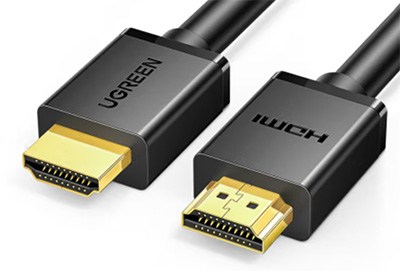
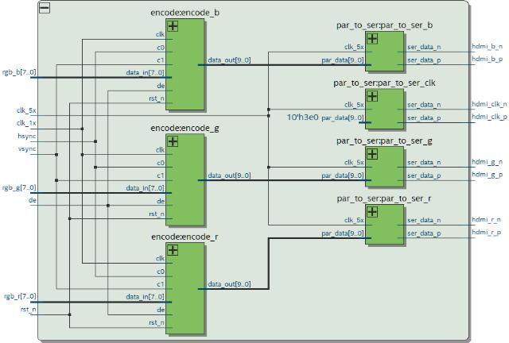

# 从零开始设计并实现HDMI显卡

在[从零开始设计并实现VGA显卡](../2022-09-13-vga/index.html)一文中，我们已经设计并实现了一个VGA显卡。

遗憾的是，现在VGA接口的显示器几乎找不到了，因为显示器的主流接口都是HDMI，某些高端显示器还有更先进的DP接口。如果只实现VGA接口，那我们还得找一条VGA到HDMI的转接头。因此，在VGA显卡的基础上，今天，我们把接口直接升级到HDMI，这样就可以直接用HDMI线输出到显示器了！

在编写代码前，我们先简单介绍一下计算机显示接口的几个标准：

1. VGA接口：这是最早由IBM用于电脑显示器的视频接口，它输出的是RGB模拟信号；
2. DVI接口：为了改进VGA使用模拟信号的缺点，DVI使用一种TMDS（最小化传输差分信号）实现了RGB数字编码，但是很快就被更新的HDMI接口取代了；
3. HDMI接口：和DVI接口一样使用TMDS全数字传输，但可以同时传输视频和音频，而且不限于电脑显示器，它支持电视、平板等任何显示设备；
4. DP接口：专门为4K/8K/16K显示器设计，最新2.0版本有80Gbps的超大带宽。

今天我们来实现主流的HDMI Type A接口，它长这样：



HDMI接口主要信号线包括两条TDMS时钟信号，6条TDMS数据信号分别传输RGB数据。因为HDMI是纯数字接口，RGB分量都是8bit，因此，和VGA使用RGB-565不同，HDMI的RGB是888，即24bit。

和VGA接口类似的是，HDMI使用的行场同步信号与VGA完全一致，因此，我们要输出640x480@60Hz，可以复用VGA的电路，在`vga_ctrl`模块的基础上，再添加一个`hdmi_ctrl`模块，把VGA信号输出转换为HDMI信号。

因为HDMI输出24bit的RGB信号，所以我们要修改一下`vga_ctrl`，添加一个参数`RGB_WIDTH`来表示输出的RGB位宽：

```verilog
module vga_ctrl #(
    parameter PIX_REQ_OFFSET = 1, // default to 1
    parameter RGB_WIDTH = 16 // 16 = RGB-565, 24 = RGB-888
)
(
    input  wire clk,
    input  wire rst_n,
    input  wire [RGB_WIDTH-1:0] in_rgb,

    output wire hsync,
    output wire vsync,
    output wire pix_data_req,
    output [9:0] pix_x,
    output [9:0] pix_y,
    output pix_valid,
    output wire [RGB_WIDTH-1:0] out_rgb
);
```

对应的`index_color_to_rgb`负责把索引色转换成RGB，需要将原来输出16bit的RGB修改为24bit：

```verilog
module index_color_to_rgb (
    input wire [3:0] color_index,
    output reg [23:0] color_rgb
);
    always @ (*) begin
        case (color_index)
            4'd0: color_rgb = 24'b00000000_00000000_00000000;
            4'd1: color_rgb = 24'b00000000_00000000_10101010;
            4'd2: color_rgb = 24'b00000000_10101010_00000000;
            ...
        endcase
    end
endmodule
```

实现HDMI输出的关键是把并行信号转换成串行信号，一个8bit分量需要编码为10bit串行数据，所以需要两个时钟：一个25MHz的VGA时钟，另一个5x即125MHz时钟实现串行编码，最后，把串行信号进行差分编码输出：



TMDS编码规则比较简单，但流程比较繁琐，因此，我们直接从网上下载一个现成的编码器，实现`hdmi_ctrl`模块，然后在顶层模块中把`vga_ctrl`输出到`hdmi_ctrl`，最后输出的信号就是HDMI信号：


我们仿真验证无误后，就可以综合并写入FPGA。写入FPGA后连接显示器测试，如果一切无误，显示器会显示我们初始化RAM的字符：

```video ratio=16:9
https://www.bilibili.com/video/BV1NN4y1A7cy
```

可以从[GitHub](https://github.com/michaelliao/learn-verilog/tree/master/hdmi_display)下载源码。

参考：[野火HDMI显示器驱动设计与验证](https://doc.embedfire.com/fpga/altera/ep4ce10_pro/zh/latest/code/hdmi.html)
