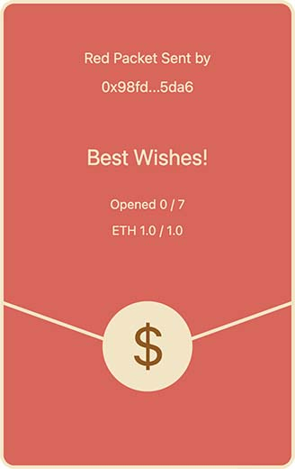
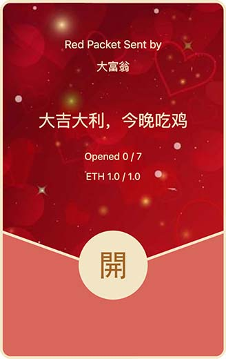
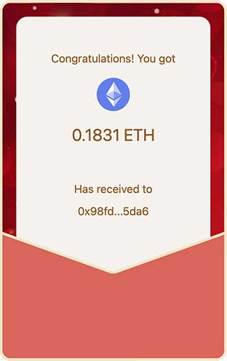

# 创建零知识证明的加密红包

今年节前收到微信的定制红包消息，准备定制两万个红包封面。和去年一样，我从一家版权网站买了一张图片，提供了购买证明和授权证明，结果微信要求提供网站拥有著作权的证明。证明你妹啊，它是个版权交易网站，著作权属于原作者，使用权属于付费购买方，申诉了几次无效后，决定不再和微信的审核耗下去了，咱另辟蹊径，开发去中心化的加密红包，最终效果如下：



同样支持自定义封面和祝福语：





加密红包逻辑非常简单，发送方先把一定金额的ETH或者其他ERC代币存入合约，并指定领取人数，其他人就可以打开红包，实际上就是从合约中提取ETH或ERC代币。

但是考虑到区块链上所有数据全部透明，发送方一旦向合约写入红包，等于全世界都知道了，可能还没来得及发出群通知，红包已经被陌生人领完了。

所以，红包需要一个提取口令，例如，发送方设置口令`1234`，则合约写入口令哈希`5678`，这样，在打开红包的时候，需要提供原始口令`1234`，合约验证`hash(1234)`是否为`5678`来决定能否成功打开红包。

不过，在区块链上，不但所有数据是全透明的，就连发送到P2P网络还没有落块的交易，也是全网可见。因此，直接使用明文口令，起不到任何保护。我们必须要证明接收方知道口令，但不必在链上暴露口令，这就需要用到零知识证明。

零知识证明的数学理论非常复杂，涉及到椭圆曲线的同态隐藏、多项式证明和盲验，这里我们不展开讲解，因为我也看不懂那一大堆数学公式。我们直接选择目前广泛使用的zkSNARK，一步一步实现零知识证明的口令红包。

首先，发送方设置口令`passcode`后，计算`hash(passcode)=out`，然后将out写入合约。
我们需要证明的是接收方知道口令`passcode`，并能计算出`hash(passcode)=out`，但不必暴露`passcode`，而是提供一个零知识证明，合约验证后再放款。

我们要证明的是`hash(passcode)=out`，其中输入的`passcode`是隐藏的，输出的`out`是明文。常用的哈希函数如`SHA-256`、`Keccak`等非常复杂，不便于零知识证明。
我们需要选择一个ZK友好（ZK-Friendly）的哈希函数，即有利于零知识证明验证的哈希函数，目前常用的有`MiMC`和`Poseidon`。我们选择`MiMC`，即证明：

```plain
MiMC(passcode)=out
```

注意到如果一个接收方将有效的证明提交到链上后，其他人也就完全获得了证明，所以我们需要做一点技术处理，让一个证明只针对某个人有效。考虑到接收方地址只有他个人拥有，我们可以把`passcode`变为`address+secret`，即证明：

```plain
MiMC(address+secret)=out
```

其中，`address`和`out`是明文，`secret`是隐藏的。其他人获得了`secret`也是无效的，因为无法通过`MiMC(anotherAddress+secret)=out`验证。

我们用到的工具有[Circom](https://github.com/iden3/circom)和[snarkjs](https://github.com/iden3/snarkjs)，Circom是一个编译电路的工具，snarkjs则用于生成证明和验证。先用Circom编写电路如下：

```plain
pragma circom 2.0.0;

include "./mimc.circom";

template Passcode() {
    signal input addr; // 输入明文
    signal input secret; // 输入密文
    signal output out; // 输出明文

    // 实例化一个MiMC7函数:
    component hash = MiMC7(3);

    hash.x_in <== (addr + secret); // 输入为addr+secret
    hash.k <== 123456789; // 固定随机数
    out <== hash.out; // 输出为哈希结果
}

component main {public [addr]} = Passcode();
```

导入的`mimc.circom`可以从Circom网站直接获得。Circom提供了大量常用的电路模板，可直接选择使用。

下一步是编译电路，编译后获得`passcode.r1cs`和`passcode_js`文件夹，包含一系列工具。`passcode.wasm`就是用来正常计算MiMC哈希的代码。

接下来，我们要初始化一些密钥，用于Groth16算法的信任设置。理论上，知道初始化密钥的人可以伪造所有相关的零知识证明，因此，为保证安全，应该在完成所有代码后丢弃初始密钥。ZCash在全球找了6个人来完成信任初始化，如果这6个人联合起来则可以伪造ZCash的代币。也有一些不需要信任初始化的算法，但相应的证明比较大，而且验证较慢。

根据[Circom官网指南](https://docs.circom.io/)，完成初始化后，我们得到一个`passcode_0001.zkey`这个zkey文件，这就是我们后续进行零知识证明所需的全部密钥。

最后通过`snarkjs`导出Solidity源码格式的`Verifier.sol`合约，用于验证证明。该合约有一个`verifyProof`方法用于验证：

```solidity
function verifyProof(
    uint[2] memory a,
    uint[2][2] memory b,
    uint[2] memory c,
    uint[2] memory input
) public view returns (bool r) {
    ...
}
```

其中，`input`是两个整数，分别是`passcodeHash`和`address`。合约验证时，传入的proof证明仅包括`a`、`b`、`c`：

```solidity
function open(uint256 id, uint256[] memory proof) public returns (uint256) {
    uint256[2] memory a = [proof[0], proof[1]];
    uint256[2][2] memory b = [[proof[2], proof[3]], [proof[4], proof[5]]];
    uint256[2] memory c = [proof[6], proof[7]];
    uint256[2] memory input = [
        passcodeHash,
        msg.sender
    ];
    require(verifyProof(a, b, c, input), "Failed verify proof");
    ...
}
```

明文`input`包含的`passcodeHash`和`address`由合约指定，用户无法传入，故无法使用其他人的有效证明。

我们只需要在网页引入`snarkjs`即可在线完成所有证明。最后捋一下加密红包的创建流程：

1. 创建者选择一个字符串口令作为`password`，例如`bitcoin`；
2. 创建者计算`passcode=keccak(address+password)`，引入创建者的`address`能保证不同的创建者使用相同口令也会计算出不同的`passcode`，这一步将任何字符串口令转换为一个256位整数的`passcode`；
3. 创建者通过snarkjs计算`passcodeHash=MiMC(passcode)`，将明文`passcodeHash`写入合约并打款即完成红包的创建。

加密红包的领取流程如下：

1. 接收者通过各种途径（粉丝群等）获得红包口令`password`；
2. 接收者通过创建者地址计算`passcode=keccak(address+password)`；
3. 接收者根据自己的地址`address`计算`secret=passcode-address`；
4. 接收者通过snarkjs创建证明，该证明能够验证`MiMC(address+secret)=passcodeHash`；
5. 接收者将证明提交给合约，验证后获得打款。

### 安全问题

采用Groth16算法会涉及到信任设置问题，另一个潜在的安全问题是MiMC哈希函数还尚未有碰撞性研究，不过，对于发送小额加密红包来说，零知识证明已足够安全。

使用过短的口令如`bitcoin`会很容易碰撞出`passcode`，建议使用长口令。理论上口令可以包括任意字符，
但要特别注意不要粘贴不可见字符如`\n`、`\u200b`等。

### 项目源码

本文红包项目完全开源，可通过[Github](https://github.com/michaelliao/red-packet-contract)访问所有源码，采用GPLv3授权，若使用此加密红包出现任何问题，作者不承担任何责任。

最后，可以在测试网体验领取BTC红包：

BSC Testnet：[https://bit.ly/3WJ9pwn](https://bit.ly/3WJ9pwn)

Polygon Testnet：[https://bit.ly/3XFA1iR](https://bit.ly/3XFA1iR)

Goerli Testnet：[https://bit.ly/3Hc0A8C](https://bit.ly/3Hc0A8C)

或者，创建一个零知识证明的加密红包→[https://redpacket.eth.itranswarp.com/](https://redpacket.eth.itranswarp.com/)
