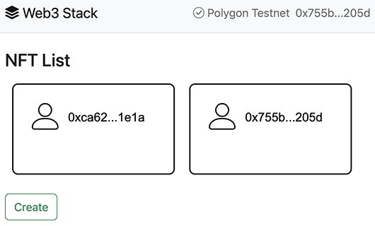
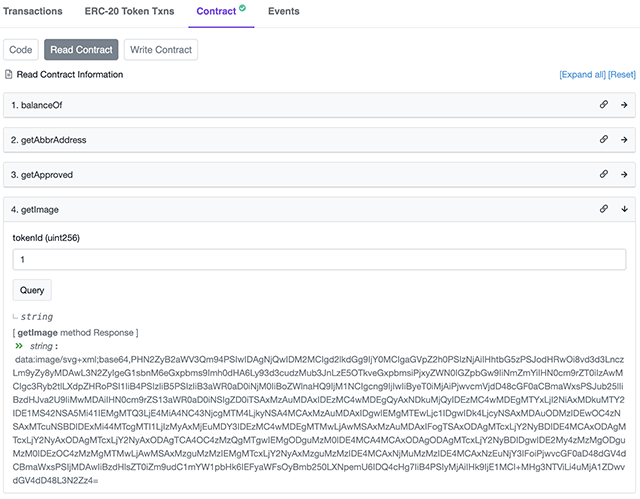
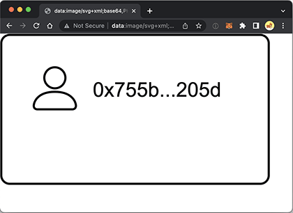
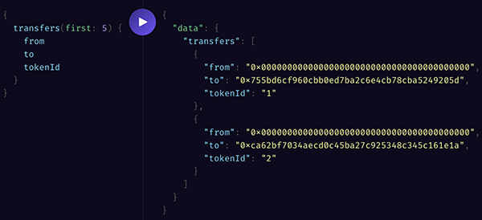
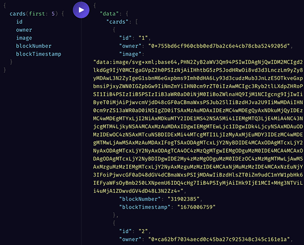

# Web3全栈开发指南

本文将详细介绍Web3 DApp开发的架构、技术，以及使用哪些工具，并给出完整示例。

我们先介绍Web3用到的技术：

- 区块链，以以太坊（Ethereum）为主流，也包括Solana、Aptos等其他非EVM链。区块链本身是软件，需要运行在一系列节点上，这些节点组成P2P网络或者半中心化网络。节点不仅负责接收新的输入并生成新的区块，还需要存储区块链运行时产生的所有数据，并负责同步、对外提供查询等RPC服务。
- 钱包：帮助用户管理自己在区块链上资产的软件，加密存储用户的私钥。当用户需要和区块链交互时，就需要用到私钥签名；
- 智能合约：运行在区块链上的一段托管程序，主要用来和外部账户交互；
- UI：这里特指前端页面，因为直接通过RPC调用合约仅限个别高级用户，普通用户仍需要一个前端页面，并通过JavaScript脚本配合钱包签名与合约交互。

因为区块链上所有数据全透明，要查询任意区块的数据，可以通过[EtherScan](https://etherscan.io/)这个网站查。其他公链，无论是与Ethereum兼容的BSC、Polygon，还是不兼容的Solana、Aptos等，也提供类似XxxScan这样的查询网站。这些Scan能提供基本的读写合约的能力，有助于开发阶段的测试。

区块链本身以及钱包、EtherScan等属于基础设施，如何开发基础设施不在本文讨论范围之内。本文仅限定如何开发DApp。

一个完整的DApp需要开发以下部分：

1. 智能合约：将逻辑写入合约，并部署在链上；
2. UI：为用户提供一个交互式UI，配合钱包完成特定功能。

此外，对后端开发有经验的同学应该知道，通常来说，App数据会存储在数据库中，前端与后端交互，离不开后端对数据的查询和修改。在DApp中，同样需要一个查询的“后端”，但这个后端通常不是数据库。

有的同学会认为，既然节点本身提供了查询链上全部数据的PRC接口，那么，前端直接查询节点是否可行？答案是不行。因为节点提供的数据，是用户产生的原始日志。

举个例子，假设有个NFT合约，允许用户创建NFT，那么，一段时间内，节点产生的日志如下：

- 用户A创建了NFT-1；
- 用户B创建了NFT-2；
- 用户B把NFT-2转移给了用户X；
- 用户C创建了NFT-3；
- ...

这些未经聚合处理的数据没法生成一个不断更新的数据库表：

| Owner | NFT ID |
|-------|--------|
| 用户A  |    1  |
| 用户B  |   N/A |
| 用户X  |    2  |
| 用户C  |    3  |

所以，一个DApp除了前端外，还需要一个后端服务，它主要功能是不断聚合链上产生的数据，并根据DApp的业务需求设计表结构以方便查询。

一个直观的想法是用Java或者Go语言等编写一个后端服务，再配上一个数据库，就可以为前端提供REST API来实现查询。只不过自己维护后端服务比较麻烦，还需要租用云端服务器、数据库等资源，费时费力。

我们推荐另一种后端服务：[The Graph](https://thegraph.com)。它本身也可看作是一个基础设置。The Graph可以让我们部署一个Graph查询服务，如何定义表结构以及如何更新则由我们提供一个预编译的WASM。整个配置、WASM代码以及查询服务都托管在The Graph中，无需自己搭建服务器，非常方便。

因此，一个完整的DApp架构如下：

```ascii
                ┌───────┐
    ┌───────────│ DApp  │───────────┐
    │           └───────┘           │
    │ read/write              query │
    │ contract                 data │
    ▼                               ▼
┌───────┐                       ┌───────┐
│Wallet │                       │ Graph │
└───────┘                       └───────┘
    │                               ▲
    │ sign                    index │
    │ broadcast                data │
    │                               │
    │  ┌ ─ ─ ─ ─ ─ ─ ─ ─ ─ ─ ─ ─ ─  │
    │    ┌────┐ ┌────┐     ┌────┐ │ │
    └──┼▶│Node│ │Node│ ... │Node│───┘
         └────┘ └────┘     └────┘ │
       │         Ethereum
        ─ ─ ─ ─ ─ ─ ─ ─ ─ ─ ─ ─ ─ ┘
```

我们看看开发各个组件所需的技能树需求。由于本文仅讨论ETH以及ETH兼容链的DApp开发，所以，以下技能树仅适用于ETH系：

- 合约开发：使用Solidity语言；
- 合约部署工具：可以选择Hardhat、Truffle或Foundry，建议使用Hardhat；
- 数据聚合服务：选择The Graph提供的托管服务；
- 数据聚合开发：The Graph给出的模板代码是TypeScript，因此这里使用TypeScript；
- 前端页面：HTML+JavaScript/TypeScript，也可配合任意前端框架如Vue、React等；
- 合约交互框架：虽然理论上使用JSON RPC就可以读写合约，但使用Ethers.js可以大大简化开发；
- 钱包支持：如果仅支持MetaMask，则使用Ethers.js已足够，如果要支持多种钱包，尤其是需要连接手机钱包，则需要使用Web3Modal。

综上所述，我们可以总结一个基本的Web3全栈开发技术需求：

1. Solidity语言；
2. JavaScript语言；
3. TypeScript语言；
4. HTML/CSS等前端技能。

以及用到的服务：

1. 将所有源码托管在GitHub；
2. 使用The Graph提供的Hosted Service；
3. 使用GitHub Page实现静态页托管；
4. 可选：绑定一个域名。

下面我们以一个具体的项目来演示Web3全栈开发的完整流程。该项目允许用户在[Polygon](https://polygon.technology/)上创建属于自己的NFT卡片，并可在页面查看链上铸造的所有NFT卡片：



Polygon是兼容以太坊的PoS链，特点是Gas便宜，速度快，领测试币方便。

### 编写合约

创建Web3 DApp的第一步是编写合约。我们使用[Hardhat](https://hardhat.org/)工具，它是Node.js开发的，确保本机安装了Node.js和NPM，先安装Solidity编译器：

```plain
$ npm install -g solc
$ solc --version
solc, the solidity compiler commandline interface
Version: 0.8.17
```

然后创建目录`web3stack`并安装Hardhat：

```plain
$ mkdir web3stack
$ cd web3stack
$ npm install --save-dev hardhat
```

然后输入命令`npx hardhat`开始创建一个新的合约项目：

```plain
$ npx hardhat
```

Hardhat提示选择项目类型：

```plain
? What do you want to do? …
❯ Create a JavaScript project
  Create a TypeScript project
  Create an empty hardhat.config.js
  Quit
```

这里选择JavaScript项目。后续接着提示项目根目录、是否添加`.gitignore`、是否安装相关依赖等：

```plain
✔ What do you want to do? · Create a JavaScript project
✔ Hardhat project root: · /path/to/web3stack
✔ Do you want to add a .gitignore? (Y/n) · y
✔ Do you want to install this sample project's dependencies with npm (@nomicfoundation/hardhat-toolbox)? (Y/n) · y
```

全部按默认值来。完成后查看`package.json`应该有两个dev依赖：

```json
{
    "devDependencies": {
        "@nomicfoundation/hardhat-toolbox": "^2.0.1",
        "hardhat": "^2.12.7"
    }
}
```

Hardhat默认创建了一个`Lock`合约，以及相关配置。我们可以自己再写一个`Card`合约：

```solidity
// SPDX-License-Identifier: GPL-v3
pragma solidity =0.8.17;

import "@openzeppelin/contracts/token/ERC721/ERC721.sol";

contract Card is ERC721 {
    ...
}
```

直接编译：

```plain
$ npx hardhat compile
Error HH411: The library @openzeppelin/contracts, imported from contracts/Card.sol, is not installed. Try installing it using npm.
```

编译提示找不到library报错，因为我们引用了[OpenZeppelin](https://www.openzeppelin.com/contracts)的库，所以要先用NPM安装一下：

```plain
npm install --save @openzeppelin/contracts
```

这条命令会在`package.json`中添加一个新的依赖：

```json
{
    ...
    "dependencies": {
        "@openzeppelin/contracts": "^4.8.1"
    }
}
```

再次编译：

```plain
npx hardhat compile
```

生成的合约存放在`artifacts/contracts/Card.sol/Card.json`，它包括了ABI接口、字节码等所有信息。部署合约就是把字节码部署到链上。

Hardhat提供了一个示例代码`script/deploy.js`用于部署Lock合约，我们可以仿照这个脚本，复制一份`script/deploy-card.js`来部署Card合约：

```javascript
const hre = require("hardhat");

async function main() {
    // 合约工厂:
    const Card = await hre.ethers.getContractFactory("Card");
    // 部署:
    const card = await Card.deploy();
    await card.deployed();
    // 打印部署的地址:
    console.log(`Card deployed to ${card.address}`);
}

main().catch((error) => {
    console.error(error);
    process.exitCode = 1;
});
```

部署时，直接运行脚本：

```plain
$ npx hardhat run scripts/deploy-card.js
```

但是，我们并没有在本地配置任何关于链的信息，也没有配置私钥等账户信息，这个合约是不可能部署到链上的，那它部署到哪了？

实际上合约默认部署到Hardhat提供的“虚拟JavaScript环境”，它可以在本地用Node执行合约代码，主要用于测试。要部署到真实的链上，我们首先要在`hardhat.config.js`中加一点关于链的配置：

```javascript
module.exports = {
    ...
    // 定义所有的链:
    networks: {
        // 定义名为testnet的链:
        testnet: {
            // 配置私钥:
            accounts: ['0x72b3...bd2b'],
            // 配置为Polygon Testnet节点的PRC:
            url: "https://matic-mumbai.chainstacklabs.com"
        }
    },
    ...
}
```

这里为了方便我们把私钥直接写进配置里，实际开发可从环境变量读取。在部署前，确保私钥对应的地址有一点MATIC测试币。可以从[这里](https://faucet.polygon.technology/)领测试币。然后用带`--network`参数的命令部署：

```plain
$ npx hardhat run scripts/deploy-card.js --network testnet
```

如果部署成功，则显示Card合约被部署的地址：

```plain
Card deployed to 0x8131aa1B766966f9F8ec3E1132D9d29D92311AB0
```

在PolygonScan上就能[查看该合约](https://mumbai.polygonscan.com/address/0x8131aa1B766966f9F8ec3E1132D9d29D92311AB0)。顺便可以将合约源码在PolygonScan上验证，验证后即可在PolygonScan对合约进行基本的读写操作。

### 开发DApp UI

DApp UI就是前端页面，既可以手写HTML+JavaScript，也可以使用React、Vue等任何前端框架与Webpack等前端工具。为了简化开发流程，这里我们直接手写一个`index.html`页，让用户能在页面创建一个NFT。

页面引入的第三方库包括jQuery、Bootstrap CSS、Vue，以及用于合约交互的Ethers.js：

```html
<script src="https://cdn.jsdelivr.net/npm/ethers@5.0.32/dist/ethers.umd.min.js"></script>
```

安装了MetaMask插件后，页面会获得一个注入的`window.ethereum`全局变量，通过此变量与钱包进行交互，例如，连接钱包：

```javascript
await window.ethereum.request({
    method: 'eth_requestAccounts',
});
```

调用合约方法则使用Ethers.js。下面的代码创建了Card合约并调用`mint()`方法创建NFT：

```javascript
async function () {
    // 创建合约:
    let contract = new ethers.Contract(
        // 合约地址:
        '0x8131aa1b766966f9f8ec3e1132d9d29d92311ab0',
        // 合约的ABI接口
        '[{"inputs":...]',
        // 钱包签名对象:
        new ethers.providers.Web3Provider(window.ethereum, "any").getSigner()
    );
    // 调用mint()方法:
    let tx = await contract.mint();
    // 等待1个确认:
    await tx.wait(1);
    // TODO: 解析tx的日志并拿到TokenID
}
```

异步调用`mint()`方法时，会拉起MetaMask，提示用户对交易进行签名。签名后返回tx对象代表已发送的交易。等待1个确认后，如果要获取交易信息，则需要解析tx的日志以便拿到Token ID等信息。

最后注意到合约的ABI接口包含了合约完整的读写方法以及输入输出，它是一个JSON对象，这里以字符串形式传入。Card合约的ABI可以在Card.json中找到并复制出来，不过我们可以使用Hardhat的一个插件直接输出ABI文件。我们先用NPM安装插件：

```plain
$ npm install --save-dev hardhat-abi-exporter
```

然后在`hardhat.config.js`中添加插件配置：

```javascript
// 用require引入插件:
require('hardhat-abi-exporter');
...

module.exports = {
    ...
    // 使用ABI Exporter插件:
    abiExporter: {
        // 输出到abi目录:
        path: "./abi",
        clear: false,
        flat: true,
        pretty: false,
        // 编译时输出:
        runOnCompile: true,
    }
};
```

再运行一次编译，我们就可在`abi`目录下看到若干`.json`文件。找到`Card.json`，整理下格式，变成一个字符串粘贴至HTML：

```javascript
...
window.NFT_ABI = '[{"inputs":[],"stateMutability":"nonpayable","type":"constructor"}...';
...
```

这样，通过前端页面，就可以调用合约方法。通过`mint()`方法写入后，NFT已经生成，在PolygonScan查找对应的tx可查看[详细信息](https://mumbai.polygonscan.com/tx/0x28e794c12ae3bb461bec1476d47f668981501c141802b103c9c9316774143584)。通过PolygonScan的`Read Contract`页面调用`getImage()`可获得NFT图片信息：



把返回的`data:image/svg...`复制到浏览器的地址栏，可查看图片：



也可在OpenSea等第三方NFT市场看到该[NFT](https://testnets.opensea.io/assets/mumbai/0x8131aa1b766966f9f8ec3e1132d9d29d92311ab0/1)的图片。

不过我们还有最后一个问题，就是如何在我们自己的页面上展示用户创建的NFT。有的同学会想到在页面调用Card合约的读方法，依次读出每个NFT的信息，这种方式会非常慢，因为需要反复多次调用读方法，且无法实现条件查询，比如根据地址查询该地址拥有的NFT，或者创建于一个月内的NFT。因此，我们还需要用到The Graph提供的数据聚合服务。

### 创建Graph查询

为了创建Graph查询，我们需要使用The Graph提供的托管服务。先注册The Graph，然后安装全局命令行工具，只需运行一次：

```plain
npm install -g @graphprotocol/graph-cli
```

安装后可使用命令`graph`，例如查看版本：

```plain
$ graph --version
0.38.0
```

第二步是在The Graph的`Hosted Service` - `My Dashboard` - `Add Subgraph`创建一个项目，创建成功后The Graph显示状态为未部署（Not Deployed）。为了把Subgraph部署上去，我们在本地项目根目录创建一个`subgraph`目录，然后在此目录下执行命令：

```plain
$ graph init --product hosted-service michaelliao/web3stack
```

注意将登录名替换为你的GitHub用户名，将项目名替换为The Graph上创建的项目名。

接下来依次输入信息：

- 选择协议的类型：选`ethereum`；
- 填写subgraph名称：用默认的名称；
- 填写目录名：用默认目录名；
- 选择链：选`mumbai`（Polygon的测试链）；
- 填写合约地址：填入部署的地址`0x8131...1ab0`；
- 尝试自动获取ABI，一般都能成功；
- 填写从指定的块开始：查看合约部署的TX所在块填入区块高度；
- 填写合约名字：与合约代码保持一致，此处必须为`Card`；
- 是否索引事件：默认是。

接下来会安装一系列依赖。如果填写的信息有问题，或者NPM运行出错，删掉`subgraph`目录再来一遍即可。

然后按照提示，先运行`graph auth`输入The Graph给的一个Access Token，然后进入`subgraph/web3stack`目录，运行：

```plain
npm run deploy
```

几秒钟后，就可以在The Graph提供的Playground输入查询并查看结果：



为什么我们可以直接查询`transfers`？首先，我们查看`schema.graphql`，默认有3个Entity，把Entity看作是数据库表，这3个Entity是The Graph根据合约定义的Event自动生成的：

```typescript
type Approval @entity(immutable: true) {
    ...
}

type ApprovalForAll @entity(immutable: true) {
    ...
}

type Transfer @entity(immutable: true) {
    ...
}
```

但并不是我们的业务需要的。我们需要的是`Card`类型，包括`owner`、`image`等信息。因此，删掉自动生成的代码，换成我们自定义的`Card`：

```typescript
type Card @entity(immutable: false) {
  id: String!
  owner: Bytes!
  blockNumber: BigInt!
  blockTimestamp: BigInt!
  transactionHash: Bytes!
  image: String!
}
```

其中，`id`是唯一主键，这里用NFT的Token ID即可，但类型是`String`而不是`BigInt`。

接下来，在`subgraph.yaml`中定义了如何处理事件，需要修改的有两处，一是`entities`，删除原有的3个Entity，换成我们定义的Card：

```yaml
dataSources:
  - kind: ethereum
    ...
    mapping:
      ...
      entities:
        - Card
```

二是在`eventHandlers`中删除我们不关心的`Approval`和`ApprovalForAll`事件，仅保留`Transfer`：

```yaml
dataSources:
  - kind: ethereum
    ...
    mapping:
      ...
      eventHandlers:
        - event: Transfer(indexed address,indexed address,indexed uint256)
          handler: handleTransfer
```

当The Graph的节点扫描到我们部署的合约产生了`Transfer`事件后，它将调用`handleTransfer`处理，这个函数定义在`src/card.ts`中，自动生成的代码如下：

```typescript
export function handleTransfer(event: TransferEvent): void {
    let entity = new Transfer(
        event.transaction.hash.concatI32(event.logIndex.toI32())
    )
    entity.from = event.params.from
    entity.to = event.params.to
    entity.tokenId = event.params.tokenId

    entity.blockNumber = event.block.number
    entity.blockTimestamp = event.block.timestamp
    entity.transactionHash = event.transaction.hash

    entity.save()
}
```

因此，每捕获到一个`Transfer`事件，会保存一个`Transfer`的Entity，这就是我们前面在The Graph的Playground中能查询`transfers`的原因。

现在我们不需要`Transfer`这个Entity，改成`Card`，先定义`Card`这个Entity：

```typescript
export class Card extends Entity {
    ...
}
```

再修改`handleTransfer()`的代码：

```typescript
export function handleTransfer(event: TransferEvent): void {
    let tokenId = event.params.tokenId;
    let contract = CardContract.bind(event.address);
    if (event.params.from.equals(Address.zero())) {
        // 如果from=0，表示创建了新的NFT:
        let nft = new Card(tokenId.toString());
        nft.owner = event.params.to;
        nft.image = contract.getImage(tokenId);

        nft.blockNumber = event.block.number;
        nft.blockTimestamp = event.block.timestamp;
        nft.transactionHash = event.transaction.hash;

        nft.save();
    } else {
        // from!=0，表示NFT发生了转移，需要更新owner和image:
        let nft = Card.load(tokenId.toString());
        if (nft === null) {
            log.error('failed load NFT by token: {}', [tokenId.toString()]);
        } else {
            nft.owner = event.params.to;
            nft.image = contract.getImage(tokenId);
            nft.save();
        }
    }
}
```

再次运行`npm run deploy`，我们可以在The Graph的Playground中查询到`cards`：



这样，支持页面显示的后端查询服务就准备就绪。

下一步，我们在页面中添加一点查询代码：

```javascript
async function query() {
    let query = {
        "query":
// 输入为Graph查询字符串:
`
{
    cards(first: 20, orderBy: blockTimestamp, orderDirection: desc) {
    id
    owner
    image
  }
}`
    };
    // 调用jQuery发送POST请求并获得JSON结果:
    let opt = {
        type: 'POST',
        dataType: 'json',
        contentType: 'application/json',
        // 与Graph服务接口保持一致:
        url: 'https://api.thegraph.com/subgraphs/name/michaelliao/web3stack',
        data: JSON.stringify(query)
    };
    let result = await $.ajax(opt);
    let cards = result.data.cards;
}
```

拿到查询结果，我们就能直接在页面展示：


最后一步就是把页面发布到GitHub Pages，然后绑一个域名，就可以让用户访问了：

[https://web3stack.itranswarp.com](https://web3stack.itranswarp.com)

至此，一个完整的DApp就开发完毕。

### 参考源码

<a class="git-explorer" href="https://github.com/michaelliao/web3stack/tree/master">https://github.com/michaelliao/web3stack</a>

### FAQ

Q：可以不用The Graph，自己写后端服务吗？

A：可以，很多需求，例如用户实名认证、发送Email是The Graph服务无法支持的，必须自己编写后端服务，配合数据库实现。

Q：可以同时支持多链吗？

A：可以，用户在钱包切换链时，DApp可以通过`chainChanged`事件拿到链ID，提前配置好链ID与不同链的合约地址，就可以正常在不同链调用不同合约。

Q：可以支持多种钱包吗？

A：可以，需要使用[Web3Modal](https://web3modal.com/)这个库，能简化连接多个钱包的代码。

### 小结

从本文给出的完整示例来看，Web3全栈开发，最适合前端开发人员。当年国外有个前端开发叫Hayden，在17年失业了，他决定自学Solidity并花了几个月的时间为以太坊开发了一个DeFi应用，后来这个应用火爆了，它叫Uniswap。
