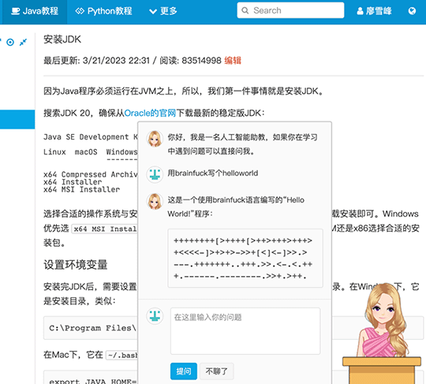

# GPT接入简明指南

最近ChatGPT大火，大家都在讨论GPT将来如何取代各行各业的打工人。

不过据我观察，99%的人其实都只是读了点媒体的文章，根本没有自己体验过，更不要说把GPT接入到自家的系统里。

毛主席教导我们说：没有调查就没有发言权。为了看看GPT到底有多大能力，我花了一天时间给网站接入了GPT，因此略有一点心得，给大家总结下接入GPT三步走：

1. 让GPT写个API接入代码，这个还是很简单的，你让它用啥语言写，它就能给你写出来；
2. 把代码集成到现有网站，这个过程和很多幻想GPT能取代程序员的同学想得有所不同，还是需要资深开发工程师才能把代码集成进去；
3. 做个AI形象，比如AI小姐姐，这一步也是最耗时的一步，因为要用PS处理图片，花了我半天时间。

以上就是接入GPT的步骤：

根据我的使用经验，能不能用好AI，关键看自己能不能准确地表述清楚问题。问题问得好，它就答得好，问题问得不好，它就一脸懵比。

所以，同学们，语文作为基础课，一定得学好啊！别的科不会，你还能问GPT，语文不会，那是干着急也没用啊！
