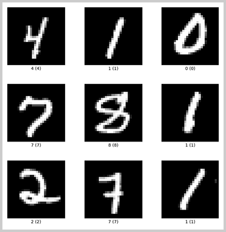
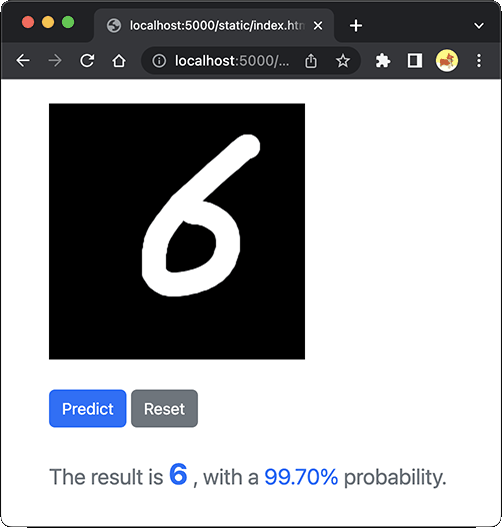

# 零基础AI入门指南

最近大家肯定被各种AI大模型刷屏了，从ChatGPT到Alpaca，从ChatGLM到Bloom，各种大模型层出不穷，给人感觉“再不上车就来不及了”。

然而要上车大模型可不简单，首先，得准备至少几百张炼丹卡，或者直接上超算，普通人看看预算就自觉放弃了。

但是，AI时代已经来临，时代从来不会抛弃那些跟不上时代的人，而是直接从他们身上碾压过去。因此，普通人也有必要学习一点AI知识。

网上很多铺天盖地地在很高的层次大讲特讲人工智能对产业和人类的影响，看完后没有收获知识，但收获了焦虑。本文和热点网文则不同，本文以工程师的视角从零开始搭建并运行一个AI小模型，并把它完全运行起来以理解AI的工作原理，非常接地气。

### AI模型是如何工作的

神经网络是AI的一种重要的计算模型，深度学习是通过神经网络实现特征学习和模式分析，大量用于图像识别等领域。我们以最基础的手写数字识别为例，看看一个神经网络的AI模型是如何工作的。

MNIST（Modified National Institute of Stands and Technology）是一个开源的数据集，它包含了6万个手写的数字图像，每个图像都是28x28黑底白字：



有了这个开源的数据集，我们就可以训练一个识别手写数字的AI模型，这个练习堪称AI界的“Hello, world”。

要编写这个AI模型，我们需要使用一种称为卷积神经网络（CNN：Convolutional Neural Network）的神经网络结构，具体到代码层面，则需要使用[PyTorch](https://pytorch.org/)这样的训练框架。PyTorch底层用C++开发，外层用Python调用，非常方便易用。先确保机器安装了Python3，然后，安装PyTorch 2：

```plain
pip install torch torchvision torchaudio
```

如果本机有CUDA环境，也可以安装GPU版本，训练速度更快。

### 编写模型

准备好环境后，我们开始编写模型。先让AI写一个用CNN识别MNIST数据集的PyTorch代码：

```python
import torch.nn as nn

class NeuralNetwork(nn.Module):
    def __init__(self):
        super().__init__()
        self.conv1 = nn.Conv2d(1, 32, 3, 1)
        self.conv2 = nn.Conv2d(32, 64, 3, 1)
        self.fc1 = nn.Linear(in_features=64 * 5 * 5, out_features=128)
        self.fc2 = nn.Linear(in_features=128, out_features=10)

    def forward(self, x):
        x = nn.functional.relu(self.conv1(x))
        x = nn.functional.max_pool2d(x, kernel_size=2)
        x = nn.functional.relu(self.conv2(x))
        x = nn.functional.max_pool2d(x, kernel_size=2)
        x = x.view(-1, 64 * 5 * 5)
        x = nn.functional.relu(self.fc1(x))
        x = self.fc2(x)
        return x
```

看不懂不要紧，可以接着问AI，它会告诉我们，这个神经网络定义了两个CNN卷积层和两个全连接层，总的来说就是，这个模型定义了2层卷积网络加2层全连接层，输入为1通道图片，经过卷积和池化后进入全连接层，最后输出10个分类结果，分别代表0～9这10个数字。

### 训练

接下来我们要使用MNIST数据集来训练这个模型。受益于PyTorch这个框架，我们连下载和读取数据集都省了，因为PyTorch已经集成了这个数据集，直接下载、加载、训练，一步到位：

```python
from time import time

import torch
import torch.nn as nn
import torch.optim as optim

from torchvision import datasets
from torch.utils.data import DataLoader
from torchvision.transforms import ToTensor

from model import NeuralNetwork

def train(dataloader, device, model, loss_fn, optimizer):
    model.train()
    running_loss = 0.0
    for batch, (inputs, labels) in enumerate(dataloader):
        inputs = inputs.to(device)
        labels = labels.to(device)
        optimizer.zero_grad()
        outputs = model(inputs)
        loss = loss_fn(outputs, labels)
        loss.backward()
        optimizer.step()
        running_loss += loss.item()
    print(f'loss: {running_loss/len(dataloader):>0.3f}')

def test(dataloader, device, model):
    model.eval()
    correct = 0
    total = 0
    with torch.no_grad():
        for inputs, labels in dataloader:
            inputs = inputs.to(device)
            labels = labels.to(device)
            outputs = model(inputs)
            _, predicted = torch.max(outputs.data, 1)
            total += labels.size(0)
            correct += (predicted == labels).sum().item()
    print(f'accuracy: {100.0*correct/total:>0.2f} %')

def main():
    print('loading training data...')
    train_data = datasets.MNIST(
        root='./data', train=True, download=True, transform=ToTensor())
    print('loading test data...')
    test_data = datasets.MNIST(
        root='./data', train=False, download=True, transform=ToTensor())

    train_dataloader = DataLoader(train_data, batch_size=64)
    test_dataloader = DataLoader(test_data, batch_size=64)

    device = 'cuda' if torch.cuda.is_available() else 'cpu'
    print(f'using {device}')
    model = NeuralNetwork().to(device)
    print(model)

    loss_fn = nn.CrossEntropyLoss()
    optimizer = optim.Adam(model.parameters(), lr=0.001)
    epochs = 5
    for t in range(epochs):
        start_time = time()
        print(f'epoch {t+1} / {epochs}\n--------------------')
        train(train_dataloader, device, model, loss_fn, optimizer)
        test(test_dataloader, device, model)
        end_time = time()
        print(f'time: {end_time-start_time:>0.2f} seconds')
    print('done!')
    path = 'mnist.pth'
    torch.save(model.state_dict(), path)
    print(f'model saved: {path}')

if __name__ == '__main__':
    main()
```

数据集分两部分：一个用于训练，一个用于测试训练效果，用PyTorch的`datasets.MNIST()`自动下载、解压并加载数据集（解压后约55M数据，仅第一次需要下载）。然后，定义损失函数和优化器，用`train()`做训练，用`test()`测试训练效果，训练5次，运行结果如下：

```plain
$ python3 train.py
loading training data...
Downloading http://yann.lecun.com/exdb/mnist/train-images-idx3-ubyte.gz
...第一次运行会自动下载数据到data目录并解压...

loading test data...
using cpu
NeuralNetwork(
  (conv1): Conv2d(1, 32, kernel_size=(3, 3), stride=(1, 1))
  (conv2): Conv2d(32, 64, kernel_size=(3, 3), stride=(1, 1))
  (fc1): Linear(in_features=1600, out_features=128, bias=True)
  (fc2): Linear(in_features=128, out_features=10, bias=True)
)
epoch 1 / 5
--------------------
loss: 0.177
accuracy: 97.21 %
time: 30.96 seconds
epoch 2 / 5
--------------------
loss: 0.053
accuracy: 98.62 %
time: 32.24 seconds
epoch 3 / 5
--------------------
loss: 0.035
accuracy: 98.70 %
time: 33.70 seconds
epoch 4 / 5
--------------------
loss: 0.025
accuracy: 98.90 %
time: 35.10 seconds
epoch 5 / 5
--------------------
loss: 0.018
accuracy: 98.95 %
time: 32.02 seconds
done!
model saved: mnist.pth
```

经过5轮训练，每轮耗时约30秒（这里用CPU训练，如果是GPU则可以大大提速），准确率可以达到99%。训练结束后，将模型保存至`mnist.pth`文件。

### 使用模型

有了预训练的模型后，我们就可以用实际的手写图片测试一下。用PS手绘几张手写数字图片，测试代码如下：

```python
import torch
from torchvision import transforms

from PIL import Image, ImageOps
from model import NeuralNetwork

device = 'cuda' if torch.cuda.is_available() else 'cpu'
print(f'using {device}')
model = NeuralNetwork().to(device)
path = './mnist.pth'
model.load_state_dict(torch.load(path))
print(f'loaded model from {path}')
print(model)

def test(path):
    print(f'test {path}...')
    image = Image.open(path).convert('RGB').resize((28, 28))
    image = ImageOps.invert(image)

    trans = transforms.Compose([
        transforms.Grayscale(1),
        transforms.ToTensor()
    ])
    image_tensor = trans(image).unsqueeze(0).to(device)
    model.eval()
    with torch.no_grad():
        output = model(image_tensor)
        probs = torch.nn.functional.softmax(output[0], 0)
    predict = torch.argmax(probs).item()
    return predict, probs[predict], probs

def main():
    for i in range(10):
        predict, prob, probs = test(f'./input/test-{i}.png')
        print(f'expected {i}, actual {predict}, {prob}, {probs}')


if __name__ == '__main__':
    main()
```

因为训练时输入的图片是黑底白字，而测试图片是白底黑字，所以先用PIL把图片处理成28x28的黑底白字，再测试，结果如下：

```plain
$ python3 test.py 
using cpu
loaded model from ./mnist.pth
NeuralNetwork(
  (conv1): Conv2d(1, 32, kernel_size=(3, 3), stride=(1, 1))
  (conv2): Conv2d(32, 64, kernel_size=(3, 3), stride=(1, 1))
  (fc1): Linear(in_features=1600, out_features=128, bias=True)
  (fc2): Linear(in_features=128, out_features=10, bias=True)
)
test ./input/test-0.png...
expected 0, actual 0, 0.9999996423721313, tensor([1.0000e+00, 2.3184e-10, 1.7075e-08, 7.6250e-16, 1.2966e-12, 5.7179e-11,
        2.1766e-07, 1.8820e-12, 1.1260e-07, 2.2463e-09])
...
```

以图片`0`为例，我们要使用模型，需要把输入图片变成模型可接受的参数，实际上是一个Tensor（张量），可以理解为任意维度的数组，而模型的输出也是一个Tensor，它是一个包含10个元素的1维数组，分别表示每个输出的概率。对图片`0`的输出如下：

- 1.0000e+00
- 2.3184e-10
- 1.7075e-08
- 7.6250e-16
- 1.2966e-12
- 5.7179e-11
- 2.1766e-07
- 1.8820e-12
- 1.1260e-07
- 2.2463e-09

除了第一个输出为1，其他输出都非常接近于0，可见模型以99.99996423721313%的概率认为图片是`0`，是其他数字的概率低到接近于0。

因此，这个MNIST模型实际上是一个图片分类器，或者说预测器，它针对任意图片输入，都会以概率形式给出10个预测，我们找出接近于1的输出，就是分类器给出的预测。

### 产品化

虽然我们已经有了预训练模型，也可以用模型进行手写数字识别，但是，要让用户能方便地使用这个模型，还需要进一步优化，至少需要提供一个UI。我们让AI写一个简单的页面，允许用户在页面用鼠标手写数字，然后，通过API获得识别结果：



因此，最后一步是把模型的输入输出用API封装一下。因为模型基于PyTorch，所以使用Python的Flask框架是最简单的。API实现如下：

```python
import base64
import torch
from io import BytesIO
from PIL import Image
from flask import Flask, request, redirect, jsonify
from torchvision import transforms
from model import NeuralNetwork

device = 'cuda' if torch.cuda.is_available() else 'cpu'
print(f'using {device}')
model = NeuralNetwork().to(device)
path = './mnist.pth'
model.load_state_dict(torch.load(path))
print(f'loaded model from {path}')
print(model)
params = model.state_dict()
print(params)

app = Flask(__name__)

@app.route('/')
def index():
    return redirect('/static/index.html')

@app.route('/api', methods=['POST'])
def api():
    data = request.get_json()
    image_data = base64.b64decode(data['image'])
    image = Image.open(BytesIO(image_data))
    trans = transforms.Compose([
        transforms.Grayscale(1),
        transforms.ToTensor()
    ])
    image_tensor = trans(image).unsqueeze(0).to(device)
    model.eval()
    with torch.no_grad():
        output = model(image_tensor)
        probs = torch.nn.functional.softmax(output[0], 0)
    predict = torch.argmax(probs).item()
    prob = probs[predict]
    print(f'predict: {predict}, prob: {prob}, probs: {probs}')
    return jsonify({
        'result': predict,
        'probability': prob.item()
    })

if __name__ == '__main__':
    app.run(port=5000)
```

上述代码实现了一个简单的API服务，注意尚未对并发访问做处理，所以只能算一个可用的DEMO。

### 思考

对于AI程序，我们发现，模型定义非常简单，一共也就20行代码。训练代码也很少，不超过100行。它和传统的程序最大的区别在哪呢？

无论是传统的程序，还是AI程序，在计算机看来，本质上是一样的，即给定一个输入，通过一个函数计算，获得输出。不同点在于，对于传统程序，输入是非常简单的，例如用户注册，仅仅需要几个字段，而处理函数少则几千行，多则几十万行。虽然代码量很大，但执行路径却非常清晰，通过跟踪执行，能轻易获得一个确定的执行路径，从而最终获得一个确定性的结果。确定性就是传统程序的特点，或者说，传统程序的代码量虽然大，但输入简单，路径清晰：

```ascii
f(x1, x2, x3)
  │
  ▼
 ┌─┐◀─┐
 └─┘  │
  │   │
  ▼   │
 ┌─┐  │
 └─┘  │
  │   │
  ▼   │
 ┌─┐──┘
 └─┘
  │
  ▼
 ┌─┐
 └─┘
```

AI程序则不同，它只经过几层计算，复杂的大模型也就100来层，就可以输出结果。但是，它的输入数据量大，每一层的数据量更大，就像一个扁平的巨大函数：

```ascii
       f(x1, x2, x3, ... , x998, x999, x1000)
         │   │   │   │   │   │   │   │   │
         ▼   ▼   ▼   ▼   ▼   ▼   ▼   ▼   ▼
        ┌─┐ ┌─┐ ┌─┐ ┌─┐ ┌─┐ ┌─┐ ┌─┐ ┌─┐ ┌─┐
        └─┘ └─┘ └─┘ └─┘ └─┘ └─┘ └─┘ └─┘ └─┘
         │   │   │   │   │   │   │   │   │
 ┌───┬───┼───┼───┼───┼───┼───┼───┼───┼───┼───┬───┐
 ▼   ▼   ▼   ▼   ▼   ▼   ▼   ▼   ▼   ▼   ▼   ▼   ▼
┌─┐ ┌─┐ ┌─┐ ┌─┐ ┌─┐ ┌─┐ ┌─┐ ┌─┐ ┌─┐ ┌─┐ ┌─┐ ┌─┐ ┌─┐
└─┘ └─┘ └─┘ └─┘ └─┘ └─┘ └─┘ └─┘ └─┘ └─┘ └─┘ └─┘ └─┘
 │   │   │   │   │   │   │   │   │   │   │   │   │
 └───┴───┴───┴───┼───┼───┼───┼───┼───┴───┴───┴───┘
                 ▼   ▼   ▼   ▼   ▼
                ┌─┐ ┌─┐ ┌─┐ ┌─┐ ┌─┐
                └─┘ └─┘ └─┘ └─┘ └─┘
```

这个函数的计算并不复杂，每一层都是简单的矩阵计算，但并行程度很高，所以需要用GPU加速。复杂度在于每一层都有大量的参数，这些参数不是开发者写死的，而是通过训练确定的，每次对参数进行微调，然后根据效果是变得更好还是更坏决定微调方向。我们这个简单的神经网络模型参数仅几万个，训练的目的实际上就是为了把这几万个参数确定下来，目标是使得识别率最高。训练这几万个参数就花了几分钟时间，如果是几亿个甚至几百亿个参数，可想而知训练所需的时间和算力都需要百万倍的增长，所以，AI模型的代码并不复杂，模型规模大但本身结构并不复杂，但为了确定模型中每一层的成千上万个参数，时间和算力主要消耗在训练上。

比较一下传统程序和AI程序的差异：

|         | 传统程序 | AI程序 |
|---------|---------|-------|
| 代码量   | 大      | 少     |
| 输入参数 | 少      | 多     |
| 输出结果 | 精确输出  | 不确定性输出  |
| 代码参数 | 由开发设定  | 由训练决定  |
| 执行层次 | 可达数百万行 | 仅若干层网络  |
| 执行路径 | 能精确跟踪  | 无法跟踪    |
| 并行    | 串行或少量并行 | 大规模并行   |
| 计算    | 以CPU为主   | 以GPU为主    |
| 开发时间 | 主要消耗在编写代码  | 主要消耗在训练 |
| 数据 | 主要存储用户产生的数据  | 需要预备大量训练数据 |
| 程序质量 | 取决于设计架构、代码优化等 | 取决于神经网络模型和训练数据质量 |

传统程序的特点是精确性：精确的输入可以实现精确地执行路径，最终获得精确的结果。而AI程序则是一种概率输出，由于模型的参数是训练生成的，因此，就连开发者自己也无法知道训练后的某个参数比如`0.123`究竟是什么意义，调大或者调小对输出有什么影响。传统程序的逻辑是白盒，AI程序的逻辑就是黑盒，只能通过调整神经网络的规模、层次、训练集和训练方式来评估输出结果，无法事先给出一个准确的预估。

### 源码下载

本文源码可通过[GitHub](https://github.com/michaelliao/mnist)下载：

<a class="git-explorer" href="https://github.com/michaelliao/mnist/tree/master">mnist</a>
