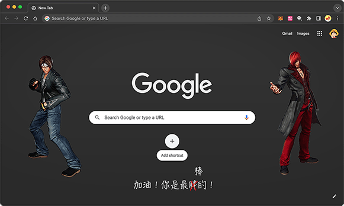

# 制作Chrome主题：King of Fighters

最近比较闲，给Chrome浏览器制作了一个King of Fighters主题：

想要使用的同学请直接通过[Chrome Web Store](https://chrome.google.com/webstore/detail/king-of-fighters/oefdghgnklmkmgnckeimonhmodogmdbh)安装。

下面讲讲如何制作一个Chrome主题。

首先看[Chrome官方文档](https://developer.chrome.com/docs/extensions/mv3/themes/)，详细讲述了如何制作一个主题。上面讲了一大堆，其实一个主题就是一个`manifest.json`描述文件，如果用到了图片，就把图片的相对路径也写进去，然后打一个zip包，上传，填写信息，搞定！

开发的时候，要实时看效果，可以打开菜单Window - Extensions，然后选择“Load unpacked”，选择目录，就可以实时预览效果。每次改动后点那个🔄按钮重新加载。

直接编写`manifest.json`比较麻烦，主要是设置颜色不直观。可以用[在线工具](https://www.themebeta.com/chrome-theme-creator-online.html)辅助设计。

### 源码下载

最后，KoF主题完全开源，想要自己制作主题的同学可以从[GitHub](https://github.com/michaelliao/kof-chrome-theme)下载到本地，然后再做定制修改。
