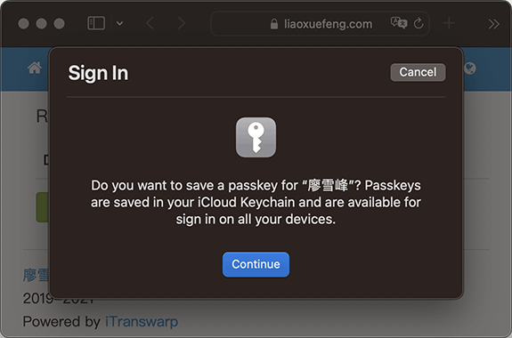
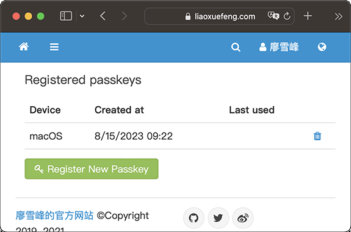
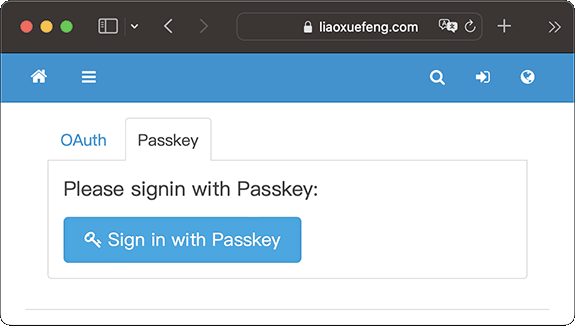
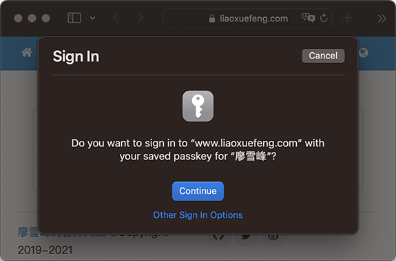
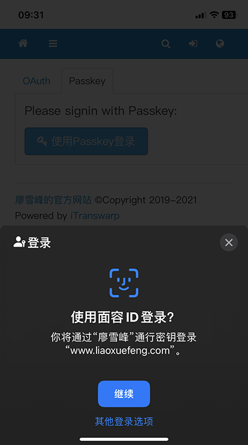

# 一文搞懂Passkey

苹果在2022年的WWDC大会上宣布了在iOS设备上可以使用一种名叫Passkey的无密码登录，苹果把它翻译成“通行密钥”，并随后又在macOS上支持它。谷歌和微软随后也宣布在Android和Windows系统上支持通行密钥。

那么，什么是通行密钥？它和传统的登录方式有何区别？

我们先回顾最原始的登录方式——密码登录：

```ascii
┌──── Sign in ─────────────┐
│                          │
│    ┌────────────────┐    │
│    │bob@example.com │    │
│    └────────────────┘    │
│    ┌────────────────┐    │
│    │********        │    │
│    └────────────────┘    │
└──────────────────────────┘
```

密码登录，要求用户设置一个高强度的密码，因为强度低，容易被破解，但强度高，又记不住。很多网站要求注册时密码必须包含大小写字母、数字和特殊符号，纯属给用户添堵。

而用Passkey登录，则无需输入密码，只需要点一下“一键登录”，就可以直接完成登录。

这种无密码登录到底是什么原理，为什么这么神奇？

其实Passkey的核心技术非常简单粗暴，就是用非对称密钥通过签名完成认证：

```ascii
┌─────────────────────┐           ┌──────────────────────┐
│       Client        │           │        Server        │
│  ┌───┬───────────┐  │ signature │  ┌─────┬──────────┐  │
│  │bob│private key│──┼───────────┼─▶│bob  │public key│  │
│  └───┴───────────┘  │           │  ├─────┼──────────┤  │
└─────────────────────┘           │  │alice│public key│  │
                                  │  └─────┴──────────┘  │
                                  └──────────────────────┘
```

使用Passkey登录时，网站存储了用户的公钥，而用户的私钥存放在本地设备（电脑或手机）中，通过给服务器发送私钥签名，服务器验证签名无误，即登录成功。

由于非对称加密是目前加密强度最高的加密技术，所以用Passkey登录，以目前计算机的算力，任何人都无法破解，可以说安全性是100%。

接下来我们看看如何使用Passkey登录网站。以下演示使用macOS系统和Safari浏览器。

使用Passkey分为两步：登记公钥和一键登录。

登记公钥就是在服务器上登记用户对应的公钥，这个步骤只需要做一次。然而服务器如何知道当前用户的身份呢？所以，登记公钥前，还是需要以传统方式登录网站。比如，我们用OAuth登录网站www.liaoxuefeng.com，然后在右上角选择用户 - 通行密钥 - 注册新的通行密钥，浏览器会弹出提示框询问是否存储Passkey到iCloud：



选择Continue，浏览器先在本地保存了私钥，然后把公钥发送给服务器，我们就可以看到当前用户绑定的公钥：



至此，Passkey就可以使用了。

我们退出登录后，再准备重新登录，选择Passkey登录：



点击`Sign in with Passkey`，浏览器弹出对话框，询问是否用已保存的Passkey登录网站：



选择Continue，登录成功！

如果在iPhone和Mac上使用的是同一用户，由于iCloud会在多个设备中自动同步，所以我们在iPhone上使用系统浏览器时，也可以直接用Passkey登录：



使用Passkey登录，就是这么简单！

### 优点

使用Passkey非常安全，不存在破解的可能。此外，本地存储Passkey时，还会同时关联网站域名，可以从根本上防止钓鱼攻击，因为一个Passkey对应一个网站，无法跨多个网站使用。

### 使用限制

Passkey就是用非对称密钥签名登录，那么私钥存储在哪呢？

私钥存储在操作系统内置的密钥管理器中，浏览器通过与操作系统的API交互完成签名，所以，操作系统和浏览器都要支持Passkey才行。Mac的系统浏览器Safari本身是苹果自己开发的，当然能直接集成macOS的Passkey功能。如果换成Chrome浏览器，当前版本还无法直接与macOS的Passkey交互，所以它会弹出一个二维码，可以用iPhone相机扫码登录，属于曲线救国路线，稍微麻烦点。但可以肯定，各浏览器迟早都会打通直接与操作系统的Passkey交互。

### 如何删除Passkey

可以从服务器上删除Passkey（实际是删除公钥），也可以从本地设备删除Passkey（实际是删除私钥），都可以让该Passkey失效。

从服务器上删除Passkey需要登录网站后，找到相关页面删除。从本地删除Passkey，可以打开Mac的系统设置 - 口令，在列出的网站上点击右键，选择删除。
