# 一文搞懂贝叶斯定理（原理篇）

托马斯·贝叶斯（Thomas Bayes）是18世纪的英国数学家，也是一位虔诚的牧师。据说他为了反驳对上帝的质疑而推导出贝叶斯定理。贝叶斯定理是一个由结果倒推原因的概率算法，在贝叶斯提出这个条件概率公式后，很长一段时间，大家并没有觉得它有什么作用，并一直受到主流统计学派的排斥。直到计算机诞生后，人们发现，贝叶斯定理可以广泛应用在数据分析、模式识别、统计决策，以及最火的人工智能中，结果，贝叶斯定理是如此有用，以至于不仅应用在计算机上，还广泛应用在经济学、心理学、博弈论等各种领域，可以说，掌握并应用贝叶斯定理，是每个人必备的技能。

这里推荐两个视频，深入浅出地解释了贝叶斯定理：

[Bayes' Theorem 贝叶斯定理](https://www.youtube.com/watch?v=Pu675cHJ7bg)

[Bayes theorem, the geometry of changing beliefs](https://www.youtube.com/watch?v=HZGCoVF3YvM)

如果你不想花太多时间看视频，可以继续阅读，我把视频内容编译成文字，以便快速学习贝叶斯定理。

为了搞明白贝叶斯定理究竟要解决什么问题，我们先看一个现实生活的例子：

已知有一种疾病，发病率是0.1%。针对这种疾病的测试非常准确：

- 如果有病，则准确率是99%（即有1%未检出阳性）；
- 如果没有病，则误报率是2%（即有2%误报为阳性）。

现在，如果一个人测试显示阳性，请问他患病的概率是多少？

如果我们从大街上随便找一个人，那么他患病的概率就是0.1%，因为这个概率是基于历史统计数据的先验概率。

现在，他做了一次测试，结果为阳性，我们要计算他患病的概率，就是计算条件概率，即：在测试为阳性这一条件下，患病的概率是多少。

从直觉上这个人患病的概率大于0.1%，但也肯定小于99%。究竟是多少，怎么计算，我们先放一放。

为了理解条件概率，我们换一个更简单的例子：掷两次骰子，一共可能出现的结果有6x6=36种：

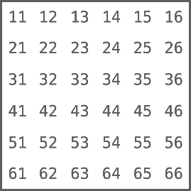

这就是所谓的样本空间，每个样本的概率均为1/36，这个很好理解。

如果我们定义事件A为：至少有一个骰子是2，那么事件A的样本空间如下图红色部分所示：

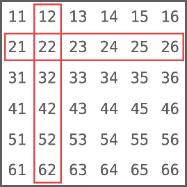

事件A一共有11种情况，我们计算事件A的概率P(A)：

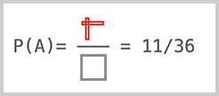

我们再定义事件B：两个骰子之和为7，那么事件B的样本空间如下图绿色部分所示：

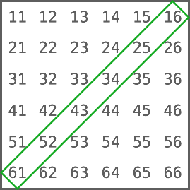

事件B一共有6种情况，我们计算事件B的概率P(B)：

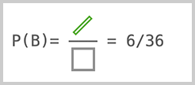

接下来我们用P(A∩B)表示A和B同时发生的概率，A∩B就是A和B的交集，如下图蓝色部分所示：

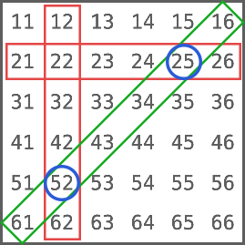

显然A∩B只有两种情况，因此，计算P(A∩B)：

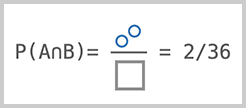

接下来我们就可以讨论条件概率了。我们用P(A|B)表示在B发生的条件下，A发生的概率。由于B已经发生，所以，样本空间就是B的样本数量6，而要发生A则只能是A、B同时发生，即A∩B，有两种情况。

因此，计算P(A|B)如下：

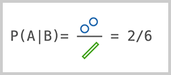

同理，我们用P(B|A)表示在A发生的条件下，B发生的概率。此时，分子仍然是A∩B的样本数量，但分母变成A的样本数量：

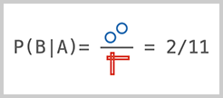

可见，条件概率P(A|B)和P(B|A)是不同的。

我们再回到A、B同时发生的概率，观察P(A∩B)可以改写为：

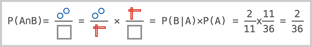

同理，P(A∩B)还可以改写为：

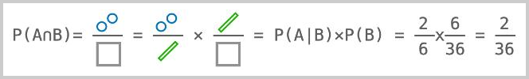

因此，根据上述两个等式，我们推导出下面的等式：

```math
P(A\cap B)=P(A\vert B)\times P(B)=P(B\vert A)\times P(A)
```

把左边的`P(A∩B)`去掉，我们得到等式：

```math
P(A\vert B)\times P(B)=P(B\vert A)\times P(A)
```

最后，整理一下等式，我们推导出贝叶斯定理如下：

```math
P(A\vert B)=\frac{P(B\vert A)\times P(A)}{P(B)}
```

这就是著名的贝叶斯定理，它表示，当出现B时，如何计算A的概率。

很多时候，我们把`A`改写为`H`，把`B`改写为`E`：

```math
P(H\vert E)=\frac{P(E\vert H)\times P(H)}{P(E)}
```

H表示Hypothesis（假设），E表示Evidence（证据），贝叶斯定理的意义就在于，给定一个先验概率P(H)，在出现了证据E的情况下，计算后验概率P(H|E)。

### 计算

有了贝叶斯定理，我们就可以回到开头的问题：

已知有一种疾病，发病率是0.1%。针对这种疾病的测试非常准确：

- 如果有病，则准确率是99%（即有1%未检出阳性）；
- 如果没有病，则误报率是2%（即有2%误报为阳性）。

现在，如果一个人测试显示阳性，请问他患病的概率是多少？

用H表示患病，E表示测试为阳性，那么，我们要计算在测试为阳性的条件下，一个人患病的概率，就是计算P(H|E)。根据贝叶斯定理，计算如下：

```math
P(H\vert E)=\frac{P(E\vert H)\times P(H)}{P(E)}
```

P(H)表示患病的概率，根据发病率可知，P(H)=0.1%；

P(E|H)表示在患病的情况下，测试为阳性的概率，根据“如果有病，则准确率是99%”可知，P(E|H)=99%；

P(E)表示测试为阳性的概率。这个概率就稍微复杂点，因为它是指对所有人（包含病人和健康人）进行测试，结果阳性的概率。

我们可以把检测人数放大，例如放大到10万人，对10万人进行检测，根据发病率可知：

- 有100人是病人，另外99900是健康人；
- 对100个病人进行测试，有99人显示阳性，另有1人未检出（阴性）；
- 对99900个健康人进行测试，有2%=1998人显示阳性（误报），另有98%=97902人为阴性。

下图显示了检测为阳性的结果的分布：

```ascii
           ┌───────┐
           │100000 │
           └───────┘
               │
       ┌───────┴───────┐
       ▼               ▼
   ┌───────┐       ┌───────┐
   │  100  │       │ 99900 │
   └───────┘       └───────┘
       │               │
   ┌───┴───┐       ┌───┴───┐
   ▼       ▼       ▼       ▼
┌─────┐ ┌─────┐ ┌─────┐ ┌─────┐
│ 99  │ │  1  │ │1998 │ │97902│
└─────┘ └─────┘ └─────┘ └─────┘
   │               │
   ▼               ▼
   +               +
```

所以，对于10万人的样本空间来说，事件E=显示阳性的概率为(99+1998)/100000=2.097%。

带入贝叶斯定理，计算P(H|E)：

```math
P(H\vert E)=\frac{P(E\vert H)\times P(H)}{P(E)}\\=\frac{99\%\times0.1\%}{2.097\%}\\=\frac{0.99\times0.001}{0.02097}\\=0.04721\\=4.721\%
```

计算结果为患病的概率为4.721%，这个概率远小于99%，且与大多数人的直觉不同，原因在于庞大的健康人群导致的误报数量远多于病人，当出现“检测阳性”的证据时，患病的概率从先验概率0.1%提升到4.721%，还远不足以确诊。

### 贝叶斯定理的另一种表示

在上述计算中，我们发现计算P(E)是比较困难的，很多时候，甚至无法知道P(E)。此时，我们需要贝叶斯定理的另一种表示形式。

我们用P(H)表示H发生的概率，用<span style="text-decoration:overline">H</span>表示H不发生，P(<span style="text-decoration:overline">H</span>)表示H不发生的概率。显然P(<span style="text-decoration:overline">H</span>)=1-P(H)。

下图红色部分表示H，红色部分以外则表示<span style="text-decoration:overline">H</span>：

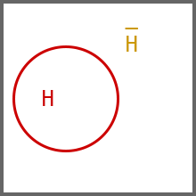

事件E用绿色表示：

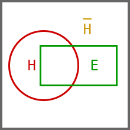

可见，P(E)可以分为两部分，一部分是E和H的交集，另一部分是E和<span style="text-decoration:overline">H</span>的交集：

```math
P(E)=P(E\cap H)+P(E\cap\overline H)
```

根据上文的公式P(A∩B)=P(A|B)xP(B)，代入可得：

```math
P(E)=P(E\cap H)+P(E\cap\overline H)\\=P(E\vert H)\times P(H)+P(E\vert\overline H)\times P(\overline H)
```

把P(E)替换掉，我们得到贝叶斯定理的另一种写法：

```math
P(H\vert E)=\frac{P(E\vert H)\times P(H)}{P(E\vert H)\times P(H)+P(E\vert\overline H)\times P(\overline H)}
```

用这个公式来计算，我们就不必计算P(E)了。再次回到开头的问题：

已知有一种疾病，发病率是0.1%。针对这种疾病的测试非常准确：

- 如果有病，则准确率是99%（即有1%未检出阳性）；
- 如果没有病，则误报率是2%（即有2%误报为阳性）。

现在，如果一个人测试显示阳性，请问他患病的概率是多少？

- P(E|H)表示患病时检测阳性的概率=99%；
- P(H)表示患病的概率=0.1%；
- P(E|<span style="text-decoration:overline">H</span>)表示没有患病但检测阳性的概率=2%；
- P(<span style="text-decoration:overline">H</span>)表示没有患病的概率=1-P(H)=99.9%。

代入公式，计算：

```math
P(H\vert E)=\frac{P(E\vert H)\times P(H)}{P(E\vert H)\times P(H)+P(E\vert\overline H)\times P(\overline H)}\\=\frac{99\%\times0.1\%}{99\%\times0.1\%+2\%\times99.9\%}\\=0.04721\\=4.721\%
```

检测为阳性这一证据使得患病的概率从0.1%提升到4.721%。假设这个人又做了一次检测，结果仍然是阳性，那么他患病的概率是多少？

我们仍然使用贝叶斯定理计算，只不过现在先验概率P(H)不再是0.1%，而是4.721%，P(E|H)和P(E|<span style="text-decoration:overline">H</span>)仍保持不变，计算新的P(H|E)：

```math
P(H\vert E)=\frac{P(E\vert H)\times P(H)}{P(E\vert H)\times P(H)+P(E\vert\overline H)\times P(\overline H)}\\=\frac{99\%\times4.721\%}{99\%\times4.721\%+2\%\times(1-4.721\%)}\\=0.71\\=71\%
```

结果为71%，两次检测为阳性的结果使得先验概率从0.1%提升到4.721%再提升到71%，继续第三次检测如果为阳性则概率将提升至99.18%。

可见，贝叶斯定理的核心思想就是不断根据新的证据，将先验概率调整为后验概率，使之更接近客观事实。
