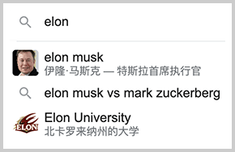

# 一文搞懂贝叶斯定理（应用篇）

在统计学里，长期以来，有频率学派和贝叶斯学派两大学派，他们互相鄙视对方，就像华山派的气宗与剑宗之争。

这两大学派最根本的观点在于看待世界的方式不同：

- 频率学派认为世界是客观的，必须通过大量独立采样来获得统计均值，不能先给出一个主观的先验概率（假设）；
- 贝叶斯学派则认为概率是一种信念度，可以有非常主观的先验概率，然后，通过一次次采样结果修正先验概率，使之逼近客观事实。

这两大学派哪个才是正确的？其实都对，只是看待世界的角度不同。但是在现实世界中，除了抛硬币、掷骰子、玩老虎机等少数符合理想数学模型的场景，频率学派才能发挥作用。大多数需要我们估算概率的现实场景，只能用贝叶斯理论来指导实践。

举个例子，假设我住在市区，希望赶上飞机的概率不低于90%，那么我应该提前多久出发呢？我必须试验至少100次，看看样本空间，才能获得一个比较准确的统计均值。然而这是不现实的，因为我一年可能就坐几次飞机。我只能拍脑袋先估一个提前30分钟就够了，结果第三次就没赶上，这说明我必须修正我的先验概率，后续改为提前45分钟，才能提升赶上飞机的概率。

我们再以《狼来了》的故事为例，当小孩第一次喊狼来了，村民听到后可以根据先验概率，比如P(小孩是诚实的)=90%判断赶紧去帮忙，结果发现被骗了，于是大家根据“被骗了”这一证据把后验概率P(小孩是诚实的)调整为60%，第二次又被骗了，于是再次把后验概率调整为20%，等到第三次听见小孩求救时，大家根据P(小孩是诚实的)=20%判断，他大概率还是在说谎，于是没有人去帮忙了。

有的同学会问，你说的这些，都是定性分析，没有定量计算啊！

要把贝叶斯定理用到定量计算，必须得借助计算机。

以吴军老师在中文分词领域举的一个例子来说，对于一个句子：南京市长江大桥，可以有两种划分：

- 南京市 / 长江大桥
- 南京市长 / 江大桥

到底哪一种更合理？我们可以计算条件概率：

- P(长江大桥|南京市) = 出现“南京市”时，出现“长江大桥”的概率；
- P(江大桥|南京市长) = 出现“南京市长”时，出现“江大桥”的概率。

提前准备好大量的中文语料，计算出任意两个词的条件概率，我们就可以得出哪种分词更合理。

在互联网领域，凡是遇到“当出现xyz时应该推荐什么”这样的条件概率时，也总是能应用贝叶斯理论。

例如，我们在搜索引擎中输入`elon`这个单词后，搜索框自动给出了联想补全：



怎么实现这个功能？把用户最近搜索的所有可能的单词列出来，然后计算条件概率：

- P(mask|elon)=0.5
- P(jerk|elon)=0.1
- P(university|elon)=0.2
- ...

把它们排个序，选出条件概率最大的几个，就是搜索建议。

诸如反垃圾邮件、电商推荐系统等，都是贝叶斯理论在机器学习中的应用。由于需要大量的计算，贝叶斯理论也只有在计算机时代才能广泛应用。

### 关于信念

我们再回顾一下贝叶斯定理：

```math
P(H\vert E)=\frac{P(E\vert H)\times P(H)}{P(E)}
```

稍微改一下，变为：

```math
P(H\vert E)=P(H)\times\frac{P(E\vert H)}{P(E)}
```

P(H)是先验概率，P(H|E)是后验概率，P(E|H)/P(E)被称为调整因子，先验概率乘以调整因子就得到后验概率。

我们发现，如果P(H)=0，则P(H|E)=0；如果P(H)=1，则P(E|H)=P(E)，P(H|E)=1。

也就是说，如果先验概率为0%或100%，那么，无论出现任何证据E，都无法改变后验概率P(H|E)。这对我们看待世界的认知有重大指导意义，因为贝叶斯概率的本质是信念，通过一次次事件，我们可能加强某种信念，也可能减弱某种信念，但如果信念保持100%或0%，则可以做到对外界输入完全“免疫”。

举个例子，十年前许多人都认为比特币是庞氏骗局，如果100%坚定地持有这种信念，那么他将无视用户越来越多、价格上涨、交易量扩大、机构入市等诸多证据，至今仍然会坚信比特币是骗局而错过无数次机会。（注：此处示例不构成任何投资建议）

对于新生事物，每个人都可以有非常主观的先验概率，但只要我们不把先验概率定死为0或100%，就有机会改变自己的信念，从而更有可能接近客观事实，这也是贝叶斯定理的精髓：

> 你相信什么并不重要，重要的是你别完全相信它。
