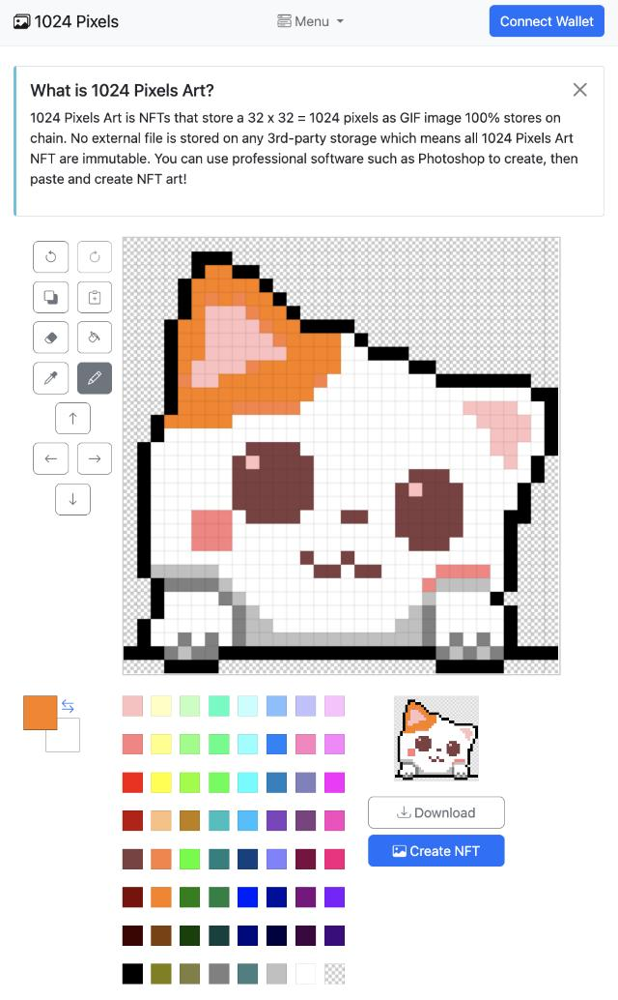

# 如何庆祝一个有意义的1024程序员节

今天是10月24日，也称1024程序员节。为什么1024是程序员节呢？我个人认为因为1024是计算机程序的一个重要数字，例如，1K=1024，1M=1024K，1G=1024M，等等。

既然1024这个数字非常特殊，为了纪念这个有意义的数字，我建议大家在10月24日利用摸鱼时间创作一幅1024像素的GIF图片，度过一个有意义的节日：



访问[1024pixels.art](https://1024pixels.art)即可创作并在Polygon区块链上永久留下一个1024像素的GIF图片，100%链上存储，永不丢失。

创作完毕后，点击`Create NFT`即可将32x32=1024像素的GIF图片存储到链上，并同时获得一个唯一ID，根据此唯一ID就可以访问图片：


HTML代码：

```html

```

点击[1024pixels.art](https://1024pixels.art)立刻开始创作！
