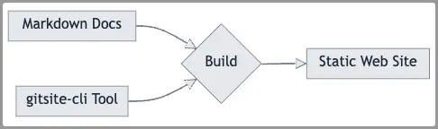
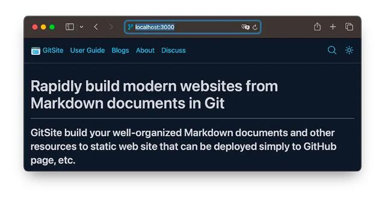
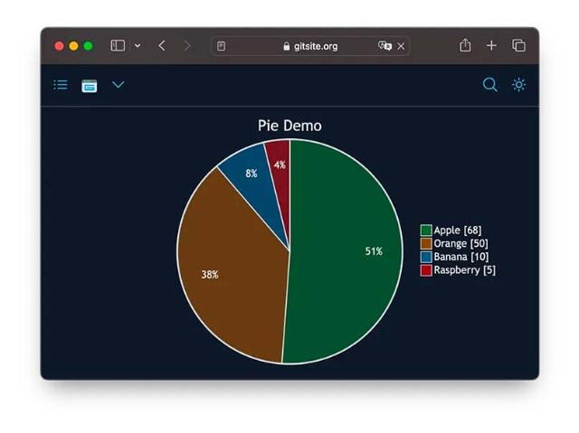
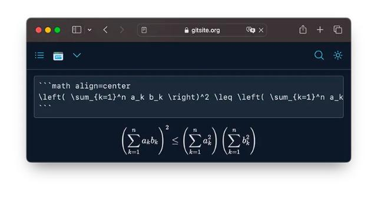
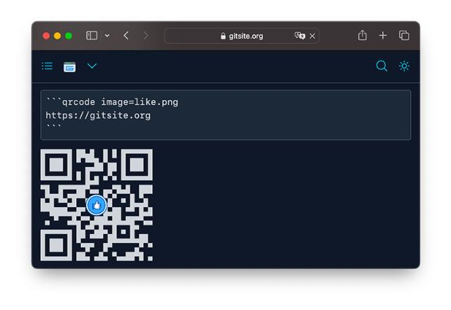
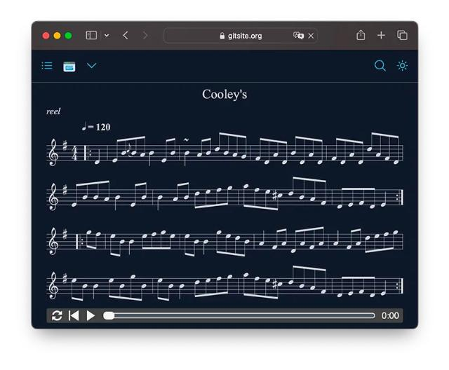
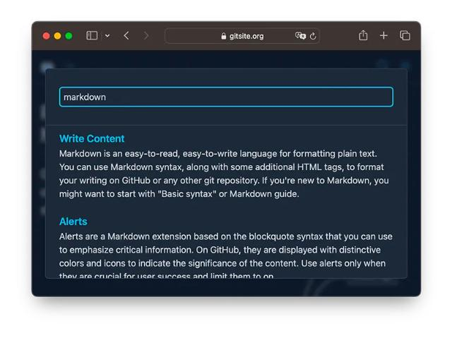

# 复古建站系统GitSite

[GitSite](https://gitsite.org)是一个复古建站系统，它可以将Git管理的Markdown文档转换为纯静态HTML网站，再非常便利地部署到GitHub Page、GitLab Page、CloudFlare Page、AWS S3、Vercel等。

为什么要用Git来管理Markdown文档呢？因为一个传统的CMS系统，例如WordPress，文档都是存储在数据库里的，因此，必须提供一个后台编辑系统，让用户能写文档 / 更新 / 发布，这就涉及到后台系统的增删改查、版本管理、权限管理、在线编辑器、图片上传……等等。

而Git天生就可以跟踪版本，本地可以用任何编辑器编写文档，也可以在GitHub上实时编辑，可以说直接替代了CMS的后台功能。

因为GitSite站点没有数据库，所以就不存在维护数据库/备份等问题了，Git仓库天生就是分布式备份。

因为是纯静态网站，所以也不存在搭建应用服务器的问题，不想自己维护可以扔到GitHub Page、S3上托管，想自己维护也就是一个Nginx就能跑起来。

通过Markdown扩展，GitSite目前支持图表，数学公式，二维码，甚至乐谱。

Markdown文本转图表：

Markdown文本转数学公式：

Markdown文本转二维码：

Markdown文本转乐谱：

为了解决搜索问题，GitSite直接用Flexsearch生成静态索引文件，在浏览器前端直接实现实时搜索：

当然，传统的CMS也是非常有用的，因为GitSite是专为开源站点设计的，它仅适合规模不大的文档 / 博客 / 书籍 / 公众号备份等。

访问GitSite → [https://gitsite.org](https://gitsite.org)
