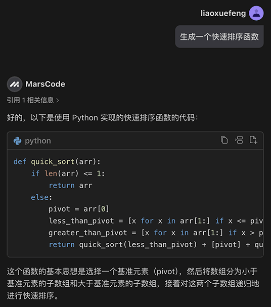
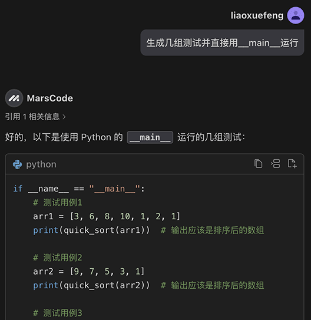
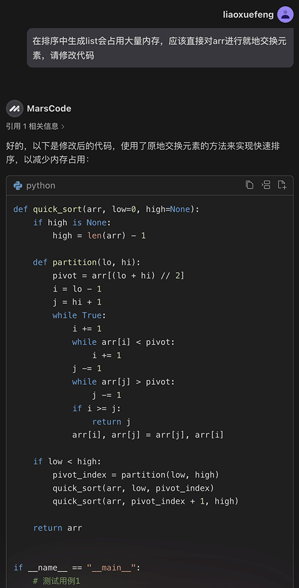
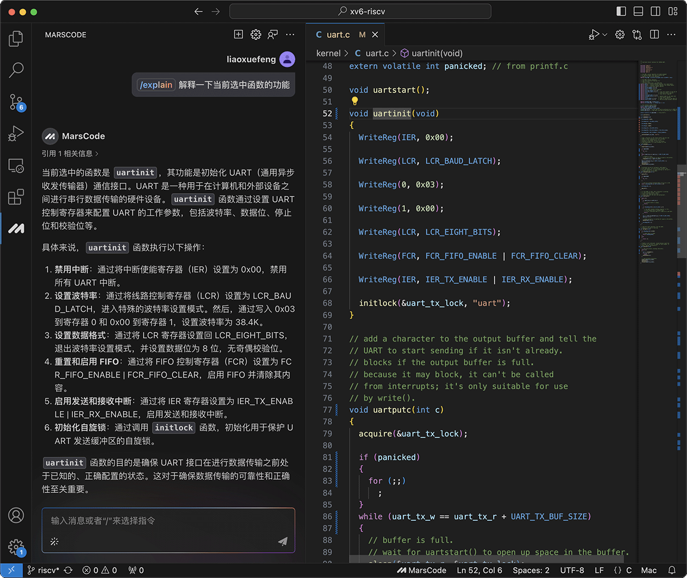
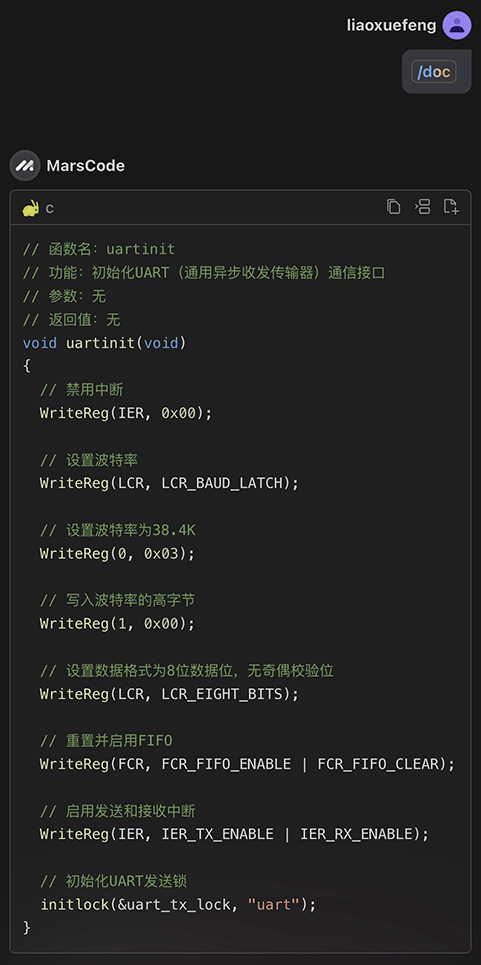
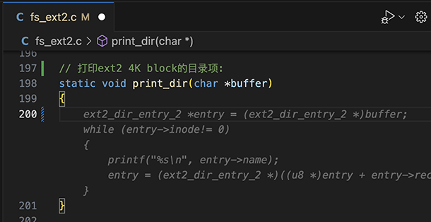
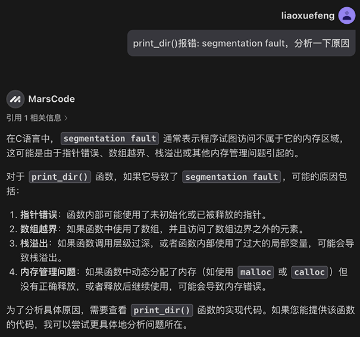
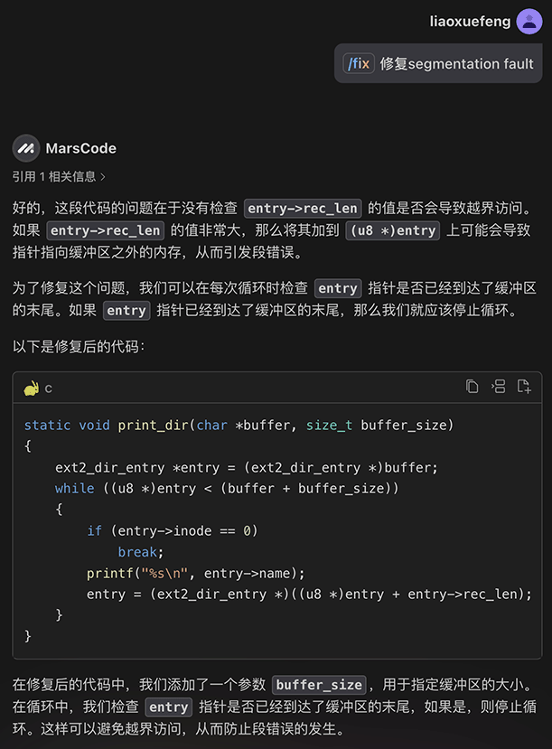
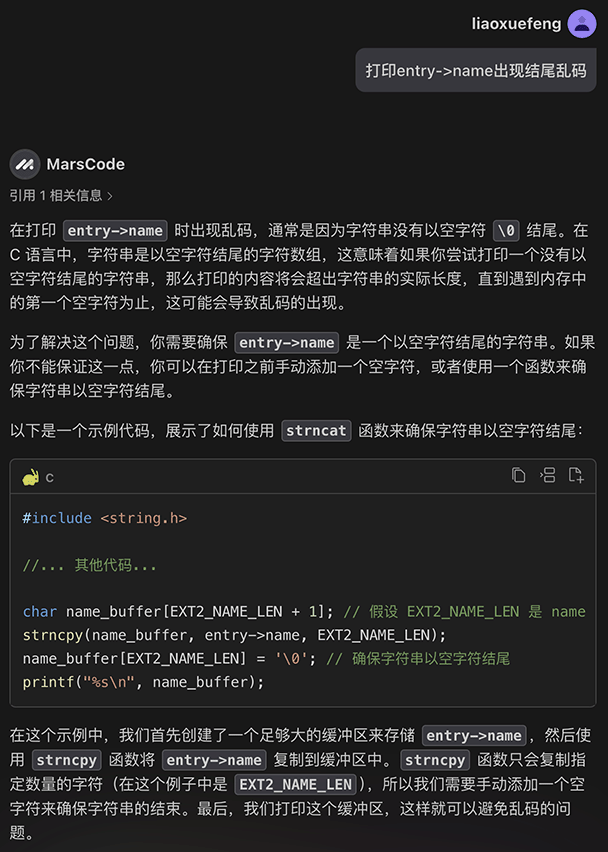

# 国产MarsCode AI编程助手不完全测评

AI编程，最近正在风靡全球。作为开发人员，使用AI编程，可以更快、更高效地生成代码。除了Copilot、Cursor等国外产品外，国产AI也正在快速发展。

本文对国产AI——豆包MarsCode AI做了一次不完全测评，希望能帮助大家更好地了解国产AI编程助手的特点和优势。

### 安装MarsCode AI

使用MarsCode AI，先从[官网](https://www.marscode.cn/home?utm_source=problemset&utm_medium=liaoxuefeng&utm_campaign=article)免费注册并登录。MarsCode AI提供了三种使用方式：集成到VS Code，集成到JetBrain的IDE，以及直接在浏览器中使用云IDE。这里我们以VS Code为例，看看MarsCode AI的表现。

在VS Code中安装MarsCode AI插件，只需要在插件市场中搜索`MarsCode`，点击安装，重启后在VS Code左侧面板找到MarsCode，设置语言为中文，登录后即可开始使用：


我们先来试试让MarsCode AI用Python写一个快速排序的代码：



这个快速排序内部生成了很多个list，效率不行。我们暂时不考虑优化，先让AI把测试写出来：



运行测试，从结果看是正确的。这个时候，我们可以让AI再优化一下代码。根据我们的提示，使用快速排序时，应该对数组进行就地交换元素，AI改写的代码最终如下：



对于常用的算法，完全可以让AI快速实现，并自动生成测试。


AI在训练时使用了大量的开源代码，从理论上说，针对某种编程语言学习的代码越多，则编写能力应该越强，因此，网上大量针对AI编写代码都集中在JavaScript领域，不是没有道理的。

这里我们就不测试编写JavaScript、CSS之类的Web网站，直接用操作系统内核代码来测试一下AI的编程能力。

首先打开MIT的教学操作系统XV6的源码，让AI读一下`uartinit()`函数并解释：



从AI的解释看，我认为它应该学习过Linux内核的源码，否则很难准确解释串口通信的初始化过程。

接着，可以让AI对函数进行注释：




接下来，针对ext2文件系统的驱动程序，我们让AI写一个读取ext2文件系统目录内容的函数，先定义函数如下：

```c
// 打印ext2 4K block的目录项:
static void print_dir(char *buffer)
{

}
```

在编写代码的过程中，MarsCode AI会自动猜测并给出代码：



我们按Tab键即可接受AI给出的代码，这样就直接在VS Code中生成了完整的函数代码，当然，某些地方仍然需要微调：

```c
// 打印ext2 4K block的目录项:
static void print_dir(char *buffer)
{
    ext2_dir_entry *entry = (ext2_dir_entry *)buffer;
    while (entry->inode != 0)
    {
        printf("%s\n", entry->name);
        entry = (ext2_dir_entry *)((u8 *)entry + entry->rec_len);
    }
}
```

上述代码有个严重的bug：在循环中，没有判断指针是否超出了4K的边界，因此，运行时会产生一个Segmentation fault错误。

我们让AI先分析一下这个错误的原因：



选择`print_dir()`函数代码，输入`/fix`，让AI修复：



修复后的代码就可以正常运行了，不过，打印的目录名结尾有乱码：

```plain
.
..
lost+found
bin??
docs??
resources
src
download??
```

这是因为在ext2文件系统中，一个目录项存储的名称并不会以`\0`结束，而是在`name_len`字段中指定长度。我们仍然先尝试让AI修复：



AI给出的方案是创建一个`char[]`缓冲区，复制`entry->name`，然后手动添加一个`\0`。这个逻辑是对的，但是我们还需要手动调整一下，最终版本的代码如下：

```c
// 打印ext2 4K block的目录项:
static void print_dir(char *buffer)
{
    ext2_dir_entry *entry = (ext2_dir_entry *)buffer;
    char name_buffer[256];
    while ((u8 *)entry < (buffer + BLOCK_SIZE_4K))
    {
        strncpy(name_buffer, entry->name, entry->name_len);
        name_buffer[entry->name_len] = '\0';
        printf("%s\n", name_buffer);
        entry = (ext2_dir_entry *)((u8 *)entry + entry->rec_len);
    }
}
```

可见，用AI辅助编程，可以快速实现原型，快速跑出结果，有问题还可以继续修改，对有经验的开发者来说，可以极大地提升开发效率。

### 小结

现阶段AI辅助编程可以很好地充当一个编程助手，它可以帮助我们理清思路，快速给出示例代码，但不要指望小白能依靠AI从零开始来完成编程任务，因为我们需要审核AI给出的代码，很多时候有必要再做一些修改和优化。此外，要让AI尽可能正确地理解和修改代码，开发者本身要有一定的编程能力，否则，即使AI的能力再强，无法准确地描述问题和出错原因，AI也有心无力。

因此，使用AI辅助编程，对于有经验的开发者来说，是非常有帮助的。正确评估AI的编程能力，充分发挥它的速度和效率优势，才是正确的使用方法。

如果你想现在就体验用MarsCode AI辅助编程，可以点这里开始，目前完全免费：

[https://www.marscode.cn](https://www.marscode.cn/home?utm_source=problemset&utm_medium=liaoxuefeng&utm_campaign=article)
